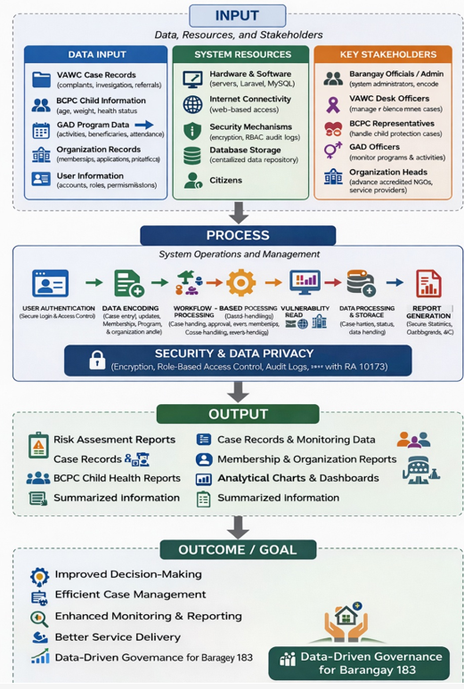
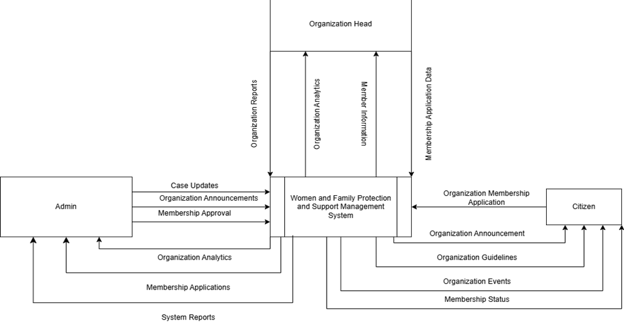

A Web-Based Women and Family Protection and Support Management System With Vulnerability Risk Assessment

A Capstone Project
Presented to
Institute of Computer Studies Department
National Aviation Academy of the Philippines
(Formerly Philippines State College of Aeronautics)

By

Adviser

CHAPTER 1
Introduction
The continuous advancement of information technology has transformed the way organizations manage information, deliver public services, and support decision-making processes. Government institutions, including local government units (LGUs), are increasingly adopting digital solutions to replace traditional paper-based operations with more efficient, secure, and accessible information management systems. These technological advancements play a significant role in improving public service delivery by streamlining administrative procedures, enhancing data accuracy, and providing timely access to critical information.
Barangay 183, Villamor Airbase, Pasay City, is responsible for implementing various protection-related programs and services through the Women and Children Protection Desk (VAWC), the Barangay Council for the Protection of Children (BCPC), the Gender and Development (GAD) program, and accredited community organizations. These offices manage sensitive records involving women, children, and families while also organizing community programs, monitoring organization memberships, generating reports, and coordinating protection-related activities. At present, many of these processes rely heavily on manual documentation, paper records, and fragmented record-keeping practices, resulting in slower transactions, increased risk of data loss, difficulty in monitoring ongoing cases, and challenges in producing timely reports for decision-making.
To address these challenges, this study presents the development of a Web-Based Women and Family Protection and Support Management System with Vulnerability Risk Assessment and Data Analytics specifically designed for Barangay 183, Villamor Airbase, Pasay City. The proposed system serves as a centralized digital platform that integrates case management, organization management, membership processing, program and seminar management, event scheduling, notification services, dashboard reporting, and data analytics into a single web-based environment. By centralizing these operations, the system aims to improve workflow efficiency, strengthen data security, reduce administrative workload, and support evidence-based decision-making through real-time information and automated reporting.
One of the major innovations of the proposed system is the integration of a Vulnerability Risk Assessment mechanism into the case management process. Rather than simply recording reported incidents, the system evaluates cases using predefined assessment criteria to identify their level of urgency and severity. This feature assists authorized personnel in prioritizing interventions, allocating appropriate resources, and ensuring that high-risk cases receive immediate attention. In addition, the system incorporates data analytics that transforms collected records into graphical reports, demographic summaries, trend analyses, and monitoring dashboards. These analytical capabilities enable barangay officials to identify recurring concerns, evaluate program effectiveness, monitor child welfare conditions, and formulate data-driven policies and community interventions.
The system also supports multiple user roles through role-based access control. Administrators are responsible for managing case records, user accounts, reports, and system operations; Organization Heads oversee membership applications, organization activities, and program performance; while citizens can access public information and submit membership applications for accredited organizations. Sensitive complaints and protection-related cases remain under the control of authorized barangay personnel to ensure confidentiality and compliance with the Data Privacy Act of 2012.
The proposed system was developed using the Research and Development (R&D) methodology together with the Waterfall Software Development Life Cycle (SDLC), providing a structured process from requirements analysis to system deployment and evaluation. Modern web technologies, including Laravel, MySQL, HTML, CSS, JavaScript, and Apache, were utilized to develop a scalable, secure, and maintainable web application following the Model–View–Controller (MVC) architectural pattern. The developed system was evaluated using the ISO/IEC 25010 Software Quality Model to assess its functionality, usability, reliability, performance efficiency, and security.
Overall, this project demonstrates how an integrated web-based information management system can modernize barangay operations by replacing fragmented manual procedures with an efficient, centralized, and data-driven platform. Through the integration of case management, vulnerability risk assessment, analytics, membership management, and organizational monitoring, the proposed system is expected to enhance service delivery, strengthen accountability, improve record management, and support informed decision-making for women and family protection services in Barangay 183, Villamor Airbase, Pasay City.

Project Context
Family protection and women protection remain a significant concern in many communities, especially at the barangay level where cases are first reported and handled. Incidents involving Violence Against Women and Children (VAWC), child abuse, neglect, and other family-related issues require urgent action, proper documentation, and coordinated response from local authorities and law enforcers. However, despite the increasing demand for efficient service delivery, many barangays still rely on manual or semi-digital processes, which often result in unorganized records, slow response times, and difficulty in determining the severity and priority of cases.
The Barangay Council for the Protection of Children (BCPC), together with Gender and Development (GAD) programs, plays an essential role in addressing issues related to women, children, and families. These sectors coordinate various programs and organizations such as KALIPI, ERPAT, Solo Parent groups, children’s organizations, and LGBTQ organizations like KABAHAGI. Although these sectors are important, they often lack an integrated system that can efficiently process cases, track beneficiaries, and organize programs within a unified platform, leading to fragmented operations and limited coordination.
Additionally, conventional systems are mainly focused on data recording and do not incorporate mechanisms to assess the vulnerability of individuals involved in reported cases. Without proper vulnerability risk assessment, it becomes difficult for authorities to determine the seriousness of each case and provide appropriate interventions. This limitation affects the effectiveness of handling sensitive cases and delays the delivery of necessary support services to affected individuals.
Moreover, the increasing volume of case data emphasizes the need for analytical tools that can provide insights into trends, patterns, and frequency of incidents. Data analytics can help authorities identify recurring issues, monitor high-risk populations, and support evidence-based decision-making. However, most existing systems lack these capabilities, making them less effective in long-term planning, monitoring, and evaluation.
Furthermore, current systems do not fully support structured workflow-based processing aligned with barangay procedures in handling VAWC cases. They also lack integrated membership management features for organizations, where citizens can apply, participate, and receive benefits. These limitations affect the consistency of case handling, approval processes, and monitoring of organizational participation, which are essential for efficient service delivery.
In response to these challenges, this study proposes the development of a web-based system that integrates case management, organization management, vulnerability risk assessment, data analytics, workflow-based processing, and membership management into a centralized platform. Through this approach, the system addresses the identified issues by improving data organization, enabling risk-based case evaluation, supporting structured workflows, and providing analytical insights. The proposed system aims to improve administrative efficiency, enhance coordination among sectors, and support informed and timely decision-making in handling women and family protection cases at the barangay level.
Project Purpose and Description
This study aims to develop a Web-Based Women and Family Protection and Support Management System to address the inefficiencies of manual and fragmented processes currently used in Barangay 183, Villamor, Pasay City. The project exists to provide a centralized and integrated platform that improves case handling, monitoring, and coordination among barangay officials, VAWC officers, BCPC members, and GAD coordinators. By digitalizing these processes, the system seeks to enhance accuracy, reduce delays, and support better decision-making in handling women and family protection services.
The proposed system is a web-based platform that integrates case management, program monitoring, and organization management into a single system. It allows authorized users to record, update, and monitor cases related to women and children, including incidents of abuse, neglect, and other family-related concerns. The system follows the standard barangay workflow in handling Violence Against Women and Children (VAWC) cases, where complaints are received by the barangay and encoded by the administrator to ensure proper validation and confidentiality. Cases are then processed through structured steps, including status tracking, monitoring, and reporting.
The system also supports organization management under GAD by maintaining records of members, activities, programs, and seminars. It includes a membership management feature where citizens can submit applications to join organizations, while administrators and organization heads review, approve, and manage membership requests. Approved membership data are automatically reflected in the system’s analytics and reporting features, allowing efficient monitoring of participation and engagement.
One of the key features of the system is the integration of a Vulnerability Risk Assessment mechanism, which evaluates the severity of each case based on predefined factors such as type of incident, presence of children, and recurrence of cases. This feature enables the system to classify cases into different risk levels, helping authorities prioritize actions and provide appropriate interventions.
Moreover, the system incorporates data analytics that allow users to generate reports, visualize trends, and analyze case data over time. These analytics provide insights into the frequency of incidents, common types of abuse, demographic distribution of victims, and case resolution status. In addition, the BCPC module supports child monitoring by recording and evaluating nutritional status based on age and weight, enabling the identification of malnourished and well-nourished children, which are also reflected in the analytics for health and demographic assessment.
The system will be evaluated using the ISO/IEC 25010 software quality model to ensure that it meets standards in functionality, usability, reliability, performance efficiency, and security. This evaluation ensures that the system is effective, reliable, and suitable for its intended users.
The system is intended to be implemented in Barangay 183, Villamor, Pasay City, where it will assist barangay officials and staff in improving administrative efficiency, strengthening case management processes, and enhancing overall service delivery for women and family protection services.
Conceptual Framework
This study is anchored on the concept of a Decision Support System (DSS) integrated within a web-based management platform designed to support women and family protection services. The suggested system adheres to an Input-Process-Output model, where different types of inputs, including case reports, victim data, organizational records, and program data, are gathered and entered into the system. Such inputs are after all processed by a set of systems functions such as data validation, vulnerability risk assessment computational, workflow-based processing in accordance with barangay procedures, and data analysis.
The Vulnerability Risk Assessment evaluates each case by assigning values to specific risk factors, enabling the system to classify cases based on their level of severity. In addition, data analytics features are incorporated to analyze stored data and generate meaningful insights such as trends, frequency of cases, demographic distributions, and summary reports. These processes also include membership management and approval workflows, as well as monitoring of child health information in the BCPC module through evaluation of age and weight to determine nutritional status. Such processes lead to the outputs in the form of categorized risk levels, analytic reports, visual charts, and organized records to aid in decision making. Within this framework, the system will improve the power of the barangay officials and other authorized parties to effectively handle cases, oversee activities taking place in the field of protection, and make sound decisions.
Furthermore, the integration of modules for Violence Against Women and Children (VAWC), the Barangay Council for the Protection of Children (BCPC), and Gender and Development (GAD), along with organization and membership management, ensures a centralized, automated, and coordinated approach in delivering protection services within Barangay 183, Villamor Airbase, Pasay City.

                                             Figure 1. Conceptual Framework
Figure 1 presents the conceptual framework of the study using the Input–Process–Output (IPO) model. The framework illustrates how the proposed Web-Based Women and Family Protection and Support Management System transforms various inputs into meaningful outputs to improve protection service delivery in Barangay 183, Villamor Airbase, Pasay City.
The input component consists of data, system resources, and key stakeholders involved in the system. The data inputs include VAWC case records, BCPC child information, GAD program data, organization records, and user information. System resources include hardware and software components such as servers, the Laravel framework, and MySQL database, as well as internet connectivity, security mechanisms, and centralized database storage. The key stakeholders include barangay officials, VAWC desk officers, BCPC representatives, GAD officers, organization heads, and citizens who interact with the system.
The process component represents the system operations and management. It begins with user authentication to ensure secure access through role-based control. This is followed by data encoding of cases, membership applications, programs, and organization information. The system then performs workflow-based processing aligned with barangay procedures, including case handling, membership approval, and event management. A vulnerability risk assessment mechanism is integrated to evaluate and classify cases based on severity and sensitivity, which supports prioritization and appropriate intervention.
Furthermore, the system performs data processing and storage to ensure validation, consistency, and secure management of records. Data analytics and aggregation are utilized to generate insights on case patterns, demographic distribution, membership statistics, and child health conditions. Dashboard visualization and alert features support monitoring and tracking, while report generation produces structured outputs such as GAD reports, case summaries, and analytical reports. Throughout the process, the system ensures security and data privacy through encryption, role-based access control, audit logging, and compliance with Republic Act 10173.
The output component includes organized case records, risk assessment results, membership and organization reports, BCPC child monitoring reports, and analytical dashboards. These outputs provide timely and accurate information that supports monitoring, reporting, and decision-making.
Finally, the outcome of the system is improved administrative efficiency, enhanced case management, better monitoring and reporting, and more informed decision-making. The conceptual framework demonstrates how the integration of case management, workflow processing, risk assessment, analytics, and membership management contributes to a more effective and responsive women and family protection system at the barangay level.

Research Questions
This study aims to answer the following research questions:
1.	How efficient is the existing manual protection-related case management process in Barangay 183, Villamor Airbase, Pasay City in terms of record retrieval, monitoring efficiency, report generation, and data confidentiality?
2.	How can a centralized web-based system be designed and developed to integrate Violence Against Women and Children (VAWC) case management, Barangay Council for the Protection of Children (BCPC) monitoring, Gender and Development (GAD) program tracking, accredited organization records, workflow-based processing, vulnerability risk assessment, and data analytics?
3.	How does the developed system perform in terms of functional suitability, reliability, usability, performance efficiency, and security based on the ISO/IEC 25010 software quality model?
4.	What is the difference in administrative efficiency, monitoring, reporting, and decision-making support between the existing manual system and the developed web-based system?
5.	What is the level of user satisfaction, usability, and acceptance of the developed system among authorized barangay personnel?

Objectives
General Objective
To develop and evaluate a web-based Women and Family Protection and Support Management System that enhances administrative efficiency, data confidentiality, monitoring accuracy, and decision-making in Barangay 183, Villamor Airbase, Pasay City through vulnerability risk assessment and data analytics.
Specific Objectives
1.	To determine the efficiency and limitations of the existing manual protection-related case management process in Barangay 183, Villamor Airbase, Pasay City in terms of record retrieval, monitoring efficiency, report generation, and data confidentiality.
2.	To design and develop a centralized web-based system that integrates Violence Against Women and Children (VAWC) case management, Barangay Council for the Protection of Children (BCPC) monitoring, Gender and Development (GAD) program tracking, organization and membership management, workflow-based processing, vulnerability risk assessment, and data analytics.
3.	To evaluate the developed system using the ISO/IEC 25010 software quality model in terms of functional suitability, reliability, usability, performance efficiency, and security.
4.	To determine the perceived usefulness and perceived ease of use of the developed web-based Women and Family Protection and Support Management System among authorized barangay personnel based on the Technology Acceptance Model (TAM).
5.	To determine the level of user acceptance and behavioral intention to use the developed system among authorized barangay personnel based on the Technology Acceptance Model (TAM).

Scope and Limitations 
Scope
This study focuses on the development of a web-based Women and Family Protection and Support Management System designed to manage protection-related services at the barangay level. The system is intended to support the handling of cases related to Violence Against Women and Children (VAWC) and other family-related concerns through an organized case management feature that follows standard barangay workflow procedures and incorporates vulnerability risk assessment.
The system enables authorized users to encode, update, and monitor case records, track case status, and generate reports. It includes a Vulnerability Risk Assessment mechanism that classifies cases based on predefined factors such as type of incident, presence of children, and recurrence of cases, to support prioritization and decision-making.
Additionally, the system includes a module for the Barangay Council for the Protection of Children (BCPC) to facilitate child monitoring, including the evaluation of nutritional status based on age and weight. It also includes a Gender and Development (GAD) module for managing programs, organizations, and membership applications. Citizens can apply for organization membership through the system, while administrators and organization heads can review, approve, and manage members.
The system provides dashboard and reporting functionalities, including data analytics features such as charts, case trends, demographic analysis, and health-related insights. It also implements user role management to ensure that only authorized personnel can access specific system functions.
The system is intended to be used by barangay officials, VAWC officers, BCPC members, GAD coordinators, and organization heads in Barangay 183, Villamor Airbase, Pasay City.
Limitations
Despite the capabilities of the proposed system, the study is subject to several limitations. The system is limited to web-based access only and does not include a mobile application, which may restrict accessibility for users who prefer mobile platforms.
The Vulnerability Risk Assessment mechanism is based on predefined rules and criteria and does not incorporate advanced machine learning techniques, which may limit its adaptability to more complex or dynamic case scenarios.
The system is designed specifically for Barangay 183, Villamor Airbase, Pasay City, and may require modifications for implementation in other barangays or locations with different processes and requirements.
Furthermore, the system requires a stable internet connection for access and operation. It does not support offline functionality, which may affect usability in areas with limited connectivity.
Lastly, the system does not integrate with external government databases or national systems, which may limit data sharing, interoperability, and real-time coordination with other agencies.

CHAPTER II
REVIEW OF RELATED LITERATURE AND STUDIES
This chapter presents a thematic review of recent related literature and studies (2022–2026) relevant to the development of the proposed Web-Based Women and Family Protection and Support Management System for Barangay 183, Villamor Airbase, Pasay City. The reviewed studies focus on barangay information systems, data privacy and security, role-based access control, digital governance, data analytics, social protection platforms, web-based case management systems, and vulnerability risk assessment.
The literature is organized into thematic sections to define key concepts, explain existing technologies, compare related studies, identify system limitations, and highlight the research gap addressed by the study.

A. Barangay Information Systems and Local Governance Platforms
Barangay Information Systems refer to digital platforms used by local government units to manage records, services, and administrative operations. These systems aim to improve efficiency, data organization, and accessibility of public services.
Barangay information systems have been widely implemented to improve data management, record organization, and administrative efficiency in local government units. Studies indicate that digital platforms enhance accessibility of records and support more efficient service delivery [3], [5]. These systems reduce manual workload and improve the accuracy and consistency of stored data. In addition, digital platforms enable faster retrieval of information and reduce reliance on paper-based records, which are prone to loss, damage, or misplacement.
However, existing barangay systems primarily focus on administrative functions such as resident profiling and document processing, with limited support for protection-related services. Studies highlight that systems often fail to integrate services such as Violence Against Women and Children (VAWC) case management, Barangay Council for the Protection of Children (BCPC) monitoring, and Gender and Development (GAD) program tracking [20], [21]. This results in fragmented systems where different services are handled separately.
As a result, barangays continue to rely on manual and fragmented processes, leading to inefficiencies in documentation, monitoring, and reporting [25]. These inefficiencies can delay decision-making, affect case prioritization, and reduce the effectiveness of service delivery.
In relation to the study, barangay information systems serve as the foundation of the proposed system by providing centralized data management and improved record accessibility. Similar to existing systems, the proposed system enhances efficiency and reduces manual workload. However, it differs by integrating protection-related services such as VAWC case management, BCPC monitoring, and GAD program tracking into a single platform, allowing better coordination, monitoring, and reporting.

B. Data Privacy and Security in Protection Systems
Data privacy refers to the protection of personal and sensitive information from unauthorized access, while data security involves the use of technologies and mechanisms to safeguard such data. These are essential in systems handling sensitive information, particularly those involving women and children.
Studies emphasize the importance of implementing authentication mechanisms, encryption techniques, and secure data handling practices in web-based systems to ensure confidentiality and integrity of information [11], [12]. These measures prevent unauthorized access and reduce the risk of data breaches.
Security frameworks also enhance system accountability through monitoring, logging, and audit mechanisms [13], [14]. In systems involving gender-based violence reporting, strict confidentiality measures are necessary to protect victims and maintain data integrity [15]. Any compromise in data privacy may lead to serious ethical and legal consequences.
Despite these advancements, many local government systems still lack comprehensive security implementations, highlighting the need for stronger data protection mechanisms in protection-related platforms.
In relation to the study, data privacy and security are essential components of the proposed system since it handles sensitive case records. The system incorporates secure authentication, encryption, and controlled access to ensure confidentiality and integrity of data, while also maintaining accountability through audit logging.
C. Role-Based Access Control in Web-Based Systems
Role-Based Access Control (RBAC) is a method of restricting system access based on assigned user roles. It ensures that users can only access data and perform actions relevant to their responsibilities.
RBAC is widely used in web-based systems to manage permissions and protect sensitive information. It allows administrators to assign roles such as barangay officials, VAWC officers, and organization heads, each with specific access privileges. This helps maintain confidentiality and prevents unauthorized access to sensitive data.
Without proper access control, systems are vulnerable to misuse, data manipulation, and unauthorized viewing of confidential records. Many existing systems either lack RBAC or implement it in a limited manner.
In relation to the study, the proposed system implements RBAC to ensure that users can only perform tasks based on their assigned roles. This strengthens security, supports workflow organization, and enhances accountability within barangay operations.
D. Digital Governance and Public Sector Modernization
Digital governance refers to the use of information and communication technologies to improve government processes, transparency, and service delivery.
Digital governance systems have significantly improved efficiency, transparency, and accountability in public institutions. Centralized digital platforms enhance data management, reduce administrative delays, and support evidence-based decision-making [1], [2], [4]. These systems enable faster communication and coordination among government units.
Automation and system integration improve coordination and reduce duplication of records, resulting in more efficient workflows [3], [5]. However, most digital governance platforms focus on general administrative services and provide limited support for specialized protection-related functions.
In relation to the study, digital governance concepts are applied to improve barangay-level service delivery. The proposed system differs by focusing specifically on protection-related services, integrating case management, monitoring, and analytics into one platform.
E. Data Analytics in Case Management and Decision Support Systems
Data analytics refers to the process of analyzing data to extract meaningful insights that support decision-making.
Studies show that integrating analytics into case management systems enables organizations to identify trends, monitor performance, and support evidence-based decision-making [9], [26], [27]. Analytical tools such as charts, dashboards, and reports help identify recurring cases, high-risk groups, and service effectiveness.
Despite its benefits, many barangay systems do not incorporate analytics capabilities, limiting their ability to support strategic planning and monitoring.
In relation to the study, data analytics is integrated into the proposed system to provide insights such as case trends, demographic analysis, and program effectiveness. This supports better decision-making and improves service delivery.

F. Digital Social Protection Platforms
Digital social protection platforms are systems designed to support services for vulnerable populations, including women and children.
Studies show that centralized platforms improve coordination and monitoring of services [16], [17], while real-time tracking enhances response time [18]. These systems help ensure that beneficiaries receive appropriate support.
However, many systems lack integration and are not tailored for local implementation, limiting their effectiveness.
In relation to the study, the proposed system enhances coordination and monitoring while being specifically designed for barangay-level implementation, ensuring relevance and usability.

G. Modern Software Evaluation and System Quality
Software evaluation refers to assessing system performance using standardized criteria.
ISO/IEC 25010 is a widely used model that evaluates system quality in terms of functionality, usability, reliability, performance efficiency, and security [19], [23]. This ensures that systems meet user requirements and quality standards.
In relation to the study, the ISO/IEC 25010 model is used to evaluate the developed system, ensuring that it meets quality standards and user expectations.
H. Web-Based Case Management Systems
Web-based case management systems are platforms used to record, track, and manage cases through centralized databases.
Studies show these systems improve efficiency, documentation accuracy, and monitoring [6], [7], [8]. They allow better tracking of case progress and support structured reporting.
However, many systems lack integration with analytics and risk assessment features.
In relation to the study, the proposed system improves upon these by integrating workflow-based processing, analytics, and risk assessment into a single platform.

I. Vulnerability Risk Assessment in Protection Systems
Vulnerability risk assessment is the process of evaluating case severity based on predefined factors such as type of incident and frequency.
Studies show that risk assessment improves prioritization and decision-making [9], [25], [30]. It helps identify high-risk cases and ensures appropriate intervention.
However, many barangay systems lack structured risk assessment mechanisms.
In relation to the study, the proposed system integrates vulnerability risk assessment to classify cases and support better decision-making.

Synthesis
The reviewed literature provided a comprehensive understanding of existing systems and technologies related to digital governance, case management, data analytics, and protection services. It was observed that while current systems improve efficiency and data management, they are mostly limited to administrative functions and lack integration of protection-related services.
Furthermore, many systems do not incorporate data analytics and vulnerability risk assessment, which are essential in identifying trends and prioritizing cases. Existing systems are also not specifically designed for barangay-level implementation, resulting in fragmented processes and inefficiencies.
The proposed study addresses these gaps by developing a centralized web-based system that integrates case management, workflow-based processing, vulnerability risk assessment, data analytics, and membership management into a single platform.
This study contributes by providing a comprehensive, secure, and data-driven solution specifically designed for women and family protection services at the barangay level.

CHAPTER III
SYSTEM ANALYSIS AND DESIGN
Technical Background
This chapter presents the technical foundation of the system, including the development methodology, system architecture, system framework, and evaluation of the existing system. It explains how the Web-Based Women and Family Protection and Support Management System was designed and developed to address the limitations of the current manual processes in Barangay 183, Villamor Airbase, Pasay City.
Specifically, this chapter discusses the Research and Development methodology used in building the system, the Software Development Life Cycle (SDLC) model applied, and the system development framework based on web-based architecture. It also includes the analysis of the existing manual system, feasibility study, and project timeline to show how the proposed system is implemented in a structured and systematic manner.

Research and Development Methodology
This study applied the Research and Development (R&D) approach to design, develop, and evaluate the Web-Based Women and Family Protection and Support Management System in Barangay 183, Villamor Airbase, Pasay City.
The R&D methodology is appropriate because the study does not only analyze a problem but also produces a functional system as a solution. It is used to address real-world operational challenges in managing protection-related services such as VAWC case documentation, BCPC child monitoring, and GAD program tracking.
In this study, the R&D approach was implemented through the following stages: (1) analysis of the existing manual system to identify problems and limitations, (2) system design based on identified requirements, (3) system development using appropriate technologies, and (4) system evaluation using ISO/IEC 25010 quality standards.
This methodology enabled the researchers to systematically transform manual processes into a digital system and evaluate its effectiveness based on measurable criteria such as functionality, usability, efficiency, and security.

Software Development Life Cycle Model
The Waterfall Software Development Life Cycle (SDLC) model was selected for this study due to its structured and sequential approach. It is suitable for government-based systems where requirements are stable and proper documentation is required. The Waterfall model consists of several phases, namely: Requirements Analysis, System Design, System Development (Implementation), Testing and Evaluation, and Deployment and Maintenance.
In the Requirements Analysis phase, the researchers gathered system requirements through observation, interviews, and document analysis. This includes identifying user needs such as case management, organization management, and reporting. In the System Design phase, the system architecture, database structure, and user interface were designed based on the gathered requirements, including the development of workflows aligned with barangay procedures.
In the System Development (Implementation) phase, the system was developed using Laravel, MySQL, and other web technologies. Core modules such as VAWC case management, BCPC monitoring, GAD programs, and data analytics were implemented. 
In the Testing and Evaluation phase, the system was tested to ensure that it meets both functional and non-functional requirements. Evaluation was conducted using the ISO/IEC 25010 software quality model to measure system performance and quality.
Finally, in the Deployment and Maintenance phase, the system was deployed for use in Barangay 183, Villamor Airbase, Pasay City, and provisions for maintenance and future improvements were considered. Each phase is completed before proceeding to the next, ensuring that system requirements are clearly defined and properly implemented.
The use of the Waterfall model is justified because the system requirements are well-defined, and it supports compliance with relevant laws such as Republic Act 9262 and Republic Act 10173. It also ensures proper documentation and structured development aligned with system evaluation standards.

Project Timeline (Gantt Chart)
 
Figure 2. Gantt Chart
This presents the project timeline for the development of the Web-Based Women and Family Protection and Support Management System. It outlines the major phases of the Software Development Life Cycle, including requirements analysis, system design, system development, testing and evaluation, and deployment.
Each phase is assigned a specific time frame to ensure that the project is completed in a systematic and organized manner. The timeline reflects the sequential nature of the Waterfall model, where each phase is completed before proceeding to the next.
System Development Framework
The proposed system follows a web-based client–server architecture combined with the Model–View–Controller (MVC) framework using Laravel.
The Model component handles database operations and data management, the View component manages the user interface, and the Controller processes system logic and user requests. This separation of concerns improves system organization and maintainability.
The system is accessible through web browsers, allowing multiple users such as administrators, VAWC officers, BCPC members, and organization heads to access the system simultaneously.
This framework supports role-based access control, ensuring that users can only perform tasks based on their assigned roles. It also enhances scalability, security, and centralized data processing, making the system suitable for barangay-level implementation.

Analysis of the Existing System
The current system used by Barangay 183, Villamor Airbase, Pasay City relies on manual and paper-based processes in handling protection-related services.
In the existing setup, complaints are reported by citizens directly to barangay personnel. The information is manually recorded on paper forms and stored in physical files. Case monitoring is done using logbooks, and report generation is performed manually by compiling records. Similarly, organization membership and BCPC monitoring are handled through manual documentation.
This manual process is time-consuming and prone to errors. It results in slow retrieval of records, difficulty in tracking case progress, risk of data loss or misplacement, and lack of data confidentiality due to unsecured storage.
Furthermore, the absence of a centralized system limits the ability to monitor cases efficiently and affects decision-making. There is also no integration of data analytics and vulnerability risk assessment, making it difficult to identify trends and prioritize cases.
A requirements gap analysis shows that the current system lacks automation, real-time monitoring, data security, vulnerability risk assessment, data analytics, and efficient reporting tools.
Alternative solutions such as improving manual processes or using commercial systems were considered; however, these were not suitable due to limited flexibility, high cost, and lack of customization. Therefore, a custom web-based system was selected as the most appropriate solution.
Feasibility Study
The feasibility of the proposed Web-Based Women and Family Protection and Support Management System was evaluated in terms of technical, operational, economic, and schedule feasibility to determine its practicality and suitability for implementation in Barangay 183, Villamor Airbase, Pasay City.
In terms of technical feasibility, the proposed system is considered viable because the barangay has the necessary hardware, software, and network infrastructure required to support a web-based application. The system can operate using standard desktop computers or laptops with internet connectivity and access through commonly used web browsers. The development tools utilized in the system, including Laravel, MySQL, CSS, and JavaScript, are widely supported, reliable, and compatible with modern web environments. Furthermore, the system follows a client–server architecture, allowing centralized data storage and multi-user access. Security mechanisms such as user authentication, role-based access control, and data encryption are also incorporated, ensuring that sensitive information related to women and family protection cases is handled securely.
In terms of operational feasibility, the system is deemed practical since the intended users, including barangay officials, VAWC desk officers, BCPC representatives, GAD coordinators, administrative staff, and organization heads, possess basic computer literacy and are capable of adapting to the system with minimal training. The system is designed with a user-friendly interface that simplifies tasks such as case recording, monitoring, report generation, and membership management. Compared to the existing manual process, the proposed system improves workflow efficiency, reduces paperwork, and enables faster retrieval of records. This enhances the overall efficiency of barangay operations and supports better service delivery. Necessary orientation and training can be conducted to ensure proper system usage.
In terms of economic feasibility, the system is considered financially viable based on the conducted Cost–Benefit Analysis. The results indicate that the long-term benefits of the system outweigh the costs associated with its development, implementation, and maintenance. The system reduces expenses related to paper-based documentation, printing, and manual record-keeping. It also improves staff productivity by minimizing time spent on administrative tasks. Additionally, the integration of data analytics supports better decision-making, which contributes to efficient allocation of resources. These benefits justify the investment in developing and maintaining the system over time.
In terms of schedule feasibility, the system is feasible as it was developed within the planned project timeline from December 2025 to May 2026. The development process followed the structured phases of the Waterfall Software Development Life Cycle, including requirements analysis, system design, system development, testing and evaluation, and deployment. The project timeline, as presented in the Gantt chart, demonstrates that each phase was completed within the allotted time frame, ensuring systematic and organized development without significant delays.
Overall, the findings indicate that the proposed system is feasible in terms of technical capability, operational usability, economic value, and project timeline. These results confirm that the system is practical, sustainable, and suitable for implementation in Barangay 183, Villamor Airbase, Pasay City.

Cost–Benefit Analysis
Development Costs
The development of the system follows a Waterfall SDLC approach, where each phase occurs sequentially. The labor distribution reflects the intensity of involvement in each phase: Project Manager (PM) in planning phases, Developer during design and coding, and QA during testing.
Phase 1: Requirements Analysis and Planning
In this initial phase, the Project Manager dedicates most of their time to coordinating meetings and gathering requirements from stakeholders, ensuring alignment with organizational objectives. Developer and QA provide minimal support for documentation and review.
Activity	Role	Persons	Hourly Rate (₱)	Hours	Cost (₱)
Stakeholder Meetings	Project Manager	1	500	5	2,500
Stakeholder Meetings	Developer	1	350	4	1,400
Requirement Documentation	Developer	1	350	4	1,400
Requirement Review	Quality Assurance	1	300	3	900
Planning Documentation	Project Manager	1	500	3	1,500

Phase 1 Total Labor Cost: ₱7,700

Phase 2: System Design
System design focuses on translating requirements into technical architecture, database schemas, and UI/UX wireframes. Developer dominates the workload, Project Manager supervises, and QA provides early review.
Activity	Role	Persons	Hourly Rate (₱)	Hours	Cost (₱)
Architecture Design	Project Manager	1	500	3	1,500
Architecture Design	Developer	1	350	6	2,100
Database Schema	Developer	1	350	6	2,100
UI/UX Wireframe	Quality Assurance	1	300	3	900
Design Review	Project Manager	1	500	2	1,000

Phase 2 Total Labor Cost: ₱7,600

Phase 3: Development
During development, coding, integration, and unit testing are the primary activities. Developer has the heaviest workload, supported by Project Manager supervision and QA testing.
Activity	Role	Persons	Hourly Rate (₱)	Hours	Cost (₱)
Module Coding	Developer	1	350	24	8,400
Database Integration	Developer	1	350	8	2,800
System Testing	Quality Assurance	1	300	5	1,500
Supervision	Project Manager	1	500	4	2,000

Phase 3 Total Labor Cost: ₱14,700

Phase 4: Deployment & Testing
This QA-heavy phase includes unit testing, system testing, deployment, bug fixes, and user training. QA is the primary contributor, with developer supporting fixes and PM coordinating the deployment.
Activity	Role	Persons	Hourly Rate (₱)	Hours	Cost (₱)
Unit Testing	Quality Assurance	1	300	8	2,400
System Testing	Quality Assurance	1	300	10	3,000
Bug Fixes & Adjustments	Developer	1	350	6	2,100
Deployment Coordination	Project Manager	1	500	3	1,500
User Training & Documentation	Quality Assurance	1	300	4	1,200

Phase 4 Total Labor Cost: ₱10,200

Phase 5: Maintenance & Continuous Support
The final phase is balanced; both developer and QA handle updates and monitoring, while PM oversees performance evaluation and reporting.
Activity	Role	Persons	Hourly Rate (₱)	Hours	Cost (₱)
Bug Fixes & Updates	Developer	1	350	8	2,800
System Monitoring	Quality Assurance	1	300	5	1,500
Performance Review	Project Manager	1	500	3	1,500

Phase 5 Total Labor Cost: ₱5,800

Material & Hardware Costs
The system requires a server, three desktop PCs meeting minimum specifications, network setup, software, and miscellaneous documentation.
Category	Description	Cost (₱)
Hardware	Server	35,000
Hardware	Desktop Computers (3 pcs, minimum spec)	45,000
Hardware	Network Setup	5,000
Software	Domain + SSL	5,000
Miscellaneous	Documentation, Cloud Storage	5,000
Material & Hardware Subtotal: ₱95,000

Operational and Maintenance Costs
The system requires annual maintenance of ₱15,000, covering minor updates, bug fixes, and support.
Total Cost Over 3 Years
●	Total Development Cost: ₱140,900 
●	Annual Maintenance (3 years): ₱15,000 × 3 = ₱45,000 
●	Total 3-Year Cost: ₱185,900
Benefits Analysis 
Tangible Benefits (Annual) 
          By automating manual tasks, the system reduces expenditures on logbooks, paper, inks, envelopes, and office supplies.
Item	Quantity	Annual Savings(₱)
Logbooks	7 pcs	3,500
A4 Bond Paper	20 boxes	20,000
SignPen Panda Elite	10 boxes	12,000
Paper Clips	4 boxes	900
Epson Ink Black	5 refills	2,500
Photocopy Ink	3 refills	32,400
Highlighter	35 pcs	1,750
Correction Tape	30 pcs	1,500
Long/Short Envelope & Folder	16 packs	3,800
Pink / Purple Cartolina	2 rolls	400
Plastic Cover Folder	12 packs	2,400

Total Tangible Benefits (Annual): ₱82,450

Total Tangible Benefits (3 Years): ₱247,350
Intangible Benefits
Other than financial savings, the system will provide non-quantifiable operational benefits. It enhances the accuracy of the data, quicker service delivery, accountability and security, productivity of the staff, and scalability of the system in the future. Reporting is transparent and efficient, thus making the stakeholders more satisfied.
Financial Evaluation
The Net Benefit (Tangible Only) = Total Benefits over 3 Years - Total Cost over 3 Years. In this project, the Total Benefits will be 247,350 and the Total Cost in the same period is 185,900. The difference of the two values will be a Net Benefit of ₱61,450.
The Benefit-Cost Ratio (BCR) provides insight into the financial efficiency of the system. It is calculated, dividing the Total Benefits: 247,350 by the Total Cost: 185,900.
= 1.33: 1. This implies that 1 peso invested in the system is equivalent to about 1.33 pesos in real benefits. Such a ratio demonstrates a positive return on investment, suggesting that the web-based system for Women and Family Protection and Support Management is financially advantageous for Barangay 183, Villamor, Pasay City.

Interpretation:
           A ratio greater than 1 indicates the project is financially viable. Combined tangible and intangible benefits justify implementation, providing efficiency, security, and operational excellence.
Cost Advantage Justification (Waterfall Model):
          The Waterfall SDLC allows for structured phase completion, ensuring that requirements are thoroughly gathered, designs carefully reviewed, and QA-focused testing occurs before deployment. This structured approach minimizes rework and ensures predictable cost allocation, particularly during QA-heavy phases.

Cost–Benefit Summary
The proposed system requires a 3-year investment of ₱185,900. Tangible savings in office materials alone over 3 years total ₱247,350, producing a net benefit of ₱61,450. The non-tangible benefits, including improved efficiency, accountability, and stakeholder satisfaction, further reinforce the value of the system. Given a Benefit-Cost Ratio of 1.33, the project is feasible, financially justified, and strategically beneficial for Barangay 183, Villamor Airbase, Pasay City.

System Requirements Specification
The system provides functional capabilities such as secure login authentication, case management, workflow-based case tracking aligned with barangay procedures, monitoring of protection-related services, vulnerability risk assessment, automated report generation, dashboard visualization, and data analytics reporting.
It also includes organization membership management, where citizens can submit application forms and administrators can approve and manage members, with data automatically reflected in analytics. Additional features include program and seminar management, event calendar management with approval, rescheduling, and rejection functionality, and email notification features that provide updates and alerts to users.
The system also supports BCPC monitoring, including child data recording and evaluation of nutritional status based on age and weight, as well as analytics features for identifying malnourished cases and demographic trends.
Non-functional requirements include system security, reliability, usability, performance efficiency, and compliance with the Data Privacy Act of 2012.

Proposed System Architecture and Design
The system follows a three-tier architecture consisting of the presentation layer, application layer, and data layer. The presentation layer handles user interaction through web interfaces, the application layer processes system logic using Laravel controllers, and the data layer manages database operations using MySQL.
The system consists of several integrated modules, including case management, vulnerability risk assessment, data analytics, GAD monitoring, organization management, membership management, program and seminar management, event calendar module, notification system, user management, and audit logging. The case management module integrates risk assessment and analytics for identifying case severity and trends, while the BCPC module supports child monitoring and nutritional assessment. These modules are connected to the analytics component for real-time data visualization and reporting, supporting decision-making processes within the barangay.

Process Modeling and System Workflow
The system processes are represented using diagrams such as the context diagram, data flow diagram (Level 0 and Level 1), and procedural workflow. These models illustrate how data flows within the system and how users interact with different modules.
The procedural workflow varies depending on user roles. The administrator is responsible for encoding and managing case records, while organization heads manage membership and monitor activities. Citizens interact indirectly by providing information that is encoded by authorized personnel to ensure data confidentiality.
The system also supports workflow-based processes such as case handling procedures aligned with barangay standards, membership approval processes, and event scheduling workflows. Transactions may go through different statuses such as pending, approved, rejected, or rescheduled based on administrative actions. The VAWC workflow incorporates risk assessment and case prioritization, while BCPC processes include monitoring child health indicators such as age and weight to determine nutritional status.

 
Figure 3. Context Diagram
Figure 3 shows the context diagram of the Web-Based Women and Family Protection and Support Management System. It illustrates the interaction between the system and its external entities, which include the administrator, organization head, and citizen. The administrator interacts with the system by encoding case records, managing users, processing membership applications, handling approvals, and generating reports. The organization head monitors organization-related activities, membership data, and program participation. Citizens provide information that is encoded into the system and may submit membership applications for organizations.
The system processes these inputs and produces outputs such as updated case records, membership status, notifications, analytics reports, and program monitoring data. This diagram highlights the system boundaries and shows how data flows between users and the system.

 
Figure 4: Data Flow Diagram Level 0
Figure 4 presents the Data Flow Diagram (DFD) Level 0 of the proposed Web-Based Women and Family Protection and Support Management System. This diagram illustrates the overall system boundary and the interaction between external entities and the system.
The system involves three primary external entities: the Public User or Citizen, the Admin, and the Organization President or Head. Each entity interacts with the system by providing inputs and receiving outputs based on their respective roles and responsibilities.
The Public User or Citizen interacts with the system primarily by viewing organization-related information such as events, guidelines, announcements, and membership forms. Citizens can also submit organization membership applications through the system. However, complaints or case-related concerns are not directly encoded into the system by citizens. Instead, these are reported to the barangay and received by the administrator, who is responsible for encoding and validating the information to ensure accuracy, confidentiality, and compliance with data privacy policies.
The Admin serves as the central user of the system and is responsible for managing core system functions. These include encoding case records based on reported complaints, managing announcements, handling organization data, processing membership applications, and maintaining system records. The administrator also performs case monitoring and evaluation, which includes vulnerability risk assessment to determine the severity and priority of cases. The system provides outputs to the admin such as case reports, membership application data, and dashboard analytics that support monitoring, evaluation, and decision-making.
The Organization President or Head interacts with the system by receiving membership application data related to their organization. They are responsible for reviewing applications and making decisions such as approval or rejection. Additionally, they access organization analytics, which provide insights into membership statistics, participation levels, and program performance.
The system processes all incoming data and generates outputs such as membership application status, announcements, case records, and analytics reports. These outputs are distributed to the appropriate users based on their roles.
Overall, the DFD Level 0 demonstrates the high-level data flow within the system, emphasizing the centralized role of the administrator in handling sensitive data such as case records, while supporting membership management, workflow-based processing, vulnerability risk assessment, and data analytics for improved decision-making and service delivery.

 
Figure 5: Data Flow Diagram Level 1
Figure 5 presents the Data Flow Diagram (DFD) Level 1 of the proposed Web-Based Women and Family Protection and Support Management System. This diagram provides a detailed representation of the internal processes of the system and how data flows between users, processes, and data stores.
The system involves three main external entities: the Public User or Citizen, the Admin, and the Organization President or Head. The Public User interacts with the system by viewing content such as announcements, events, and organizational information, as well as submitting membership applications. However, complaint or case-related concerns are not directly encoded into the system by the public user. Instead, these are reported to the barangay and handled by the administrator, who encodes the case data into the system.
The Admin is responsible for managing core system processes, including membership application management, organization management, announcement management, and case monitoring. The case monitoring process includes vulnerability risk assessment, which evaluates the severity of cases and supports proper decision-making. The admin also generates reports and analytics, which provide insights into case trends, membership data, and organizational performance.
The Organization President or Head is responsible for reviewing and processing membership applications specific to their organization. They receive membership application data from the system and provide decisions such as approval or rejection. These updates are stored in the membership applications data store.
The system includes several data stores such as membership_applications, announcements, gad_events, organizations, agencies, and case_reports. These data stores ensure that information is properly recorded, stored, and retrieved for system processes.
Additionally, the system includes a process for generating analytics, which produces outputs such as reports and dashboard visualizations. These outputs are provided to the admin and organization head to support monitoring, evaluation, and data-driven decision-making.
Overall, the DFD Level 1 illustrates the detailed flow of data within the system, highlighting key processes such as membership management, case handling, content management, risk assessment, and analytics, ensuring an integrated and efficient system operation.

 
Figure 6: Procedural Workflow
(Admin)
Figure 6 presents the procedural workflow of the administrator in the system. The process begins with user login and authentication, where the system verifies if the user is authorized, such as an admin, VAWC desk officer, BCPC officer, or other authorized personnel. Once authenticated, the user gains access to the system modules.
The administrator proceeds with encoding or updating records, including case information, organization data, and program details. The system then performs case evaluation and monitoring, which includes tracking case progress and integrating vulnerability risk assessment to determine the severity of cases.
After processing, the system generates reports and dashboard analytics that provide insights into case trends, demographics, and system activities. The administrator then checks whether the case is resolved. If the case is not yet closed, monitoring continues. If the case is resolved, it proceeds to secure record archiving to ensure data confidentiality and proper storage.
Finally, the system performs data analysis and generates report summaries to support decision-making. The workflow ends after all processes are completed, ensuring efficient and secure handling of protection-related services.

 
 

Figure 6.1 Procedural Workflow (Organization Head)

          
Figure 6.1 illustrates the procedural workflow of the organization head within the system. The process begins with user login and authentication, allowing the organization head to securely access the system.
Once logged in, the organization head views the dashboard overview and alerts, which provide real-time updates on organization activities, membership status, and program notifications. The user then reviews reports and analytics, enabling them to analyze data such as membership statistics, participation rates, and program performance.
The workflow continues with tracking program progress, where the organization head monitors ongoing activities, events, and seminars under their organization. The system also allows monitoring of performance and updates, ensuring that all activities are properly managed and aligned with organizational objectives.
The process ends after reviewing and monitoring all necessary information, allowing the organization head to make informed decisions based on system-generated data and analytics.

Figure 6.2 Procedural Workflow
(Citizen)
Figure 6.2 presents the procedural workflow of the citizen in relation to barangay services. The process begins when the citizen seeks assistance from the barangay regarding concerns such as VAWC cases, child protection, or other family-related issues.
The barangay conducts an initial interview and documentation, where relevant information is gathered and recorded by authorized personnel. Based on the assessment, the case undergoes a decision process to determine whether it requires referral or mediation.
If referral is needed, the case is directed to the appropriate barangay office or relevant authority. If mediation is applicable, the citizen participates in a mediation session facilitated by barangay officials. After either process, the citizen receives feedback and guidance based on the outcome of the case.
The workflow ends once the appropriate action has been taken and the citizen has been assisted. In the system context, all information gathered during this process is encoded by the administrator to ensure proper documentation, confidentiality, and accurate record management.

3.9 Data Modeling and Database Design
The data structure of the system is represented through conceptual data models, entity relationship diagrams, and logical database design. These models define the relationships between system entities such as users, cases, organizations, membership records, programs, event schedules, notifications, and reports. Additional entities related to risk assessment, child monitoring, and approval processes are included to support workflow operations and analytics integration.
The database is implemented using MySQL and follows relational database principles to ensure data consistency, integrity, and efficient retrieval of records.

 
Figure 7: Conceptual Data Model

Figure 7 presents the conceptual data model of the proposed system. This model provides a high-level representation of the major entities involved in the system and the relationships among them.
The conceptual data model includes key entities such as users, cases, organizations, membership, programs, and reports. These entities represent the core components of the system that support functionalities such as case management, membership processing, and program monitoring.
The users entity represents individuals who interact with the system, including administrators and organization heads. The cases entity represents VAWC-related records, while the organizations entity manages data about accredited organizations. The membership entity connects users to organizations, representing approved members, while membership applications represent pending requests.
Additional entities such as programs and reports support the management of GAD activities and system-generated outputs. These entities are interconnected to allow efficient data flow and processing within the system.
Overall, the conceptual data model provides a simplified view of the system’s data structure, serving as the foundation for the detailed database design and ensuring that all system components are logically connected.

 

Figure 8: Entity Relationship Diagram
(VAWC Module)

 

Figure 8.1: Entity Relationship Diagram
(BCPC Module)

 

Figure 8.2: Entity Relationship Diagram
(GAD Module)
Figure 8 presents the Entity Relationship Diagram (ERD) of the proposed Web-Based Women and Family Protection and Support Management System. The ERD illustrates the conceptual structure of the system by identifying the major entities, their attributes, and the relationships among them.
The system is composed of several core entities that support its major functionalities. The users entity stores information about system users, including administrators, organization heads, and authorized personnel, along with their assigned roles. The organizations entity contains data about accredited organizations within the barangay.
The membership_applications entity manages applications submitted by citizens who wish to join organizations. Once approved, these records are transferred to the members entity, which stores active members linked to their respective organizations. This relationship supports membership management and participation tracking.
For case management, the vawc_cases entity serves as the central table, storing key details such as case status, intake type, and closure information. Each case is associated with a case_reports entity that contains detailed descriptions of incidents. The case_abuse_types entity is used to classify cases based on the type of abuse, enabling structured categorization and analysis.
The system also includes the vawc_assessments entity, which supports vulnerability risk assessment by identifying whether a case requires medical assistance, alternative housing, or referrals. This entity is directly linked to the vawc_cases entity, ensuring that each case has a corresponding assessment for proper evaluation.
The vawc_involved_parties entity records individuals related to each case, including victims, respondents, and their relationships. This enables comprehensive documentation of all parties involved in a case.
In addition, the vawc_protection_orders and vawc_legal_escalations entities manage legal actions associated with cases. These entities track protection orders issued and escalation processes, ensuring proper legal documentation and monitoring.
The relationships among entities are established through primary and foreign keys. For example, one organization can have multiple members, one case can have multiple involved parties, and each case is linked to a single assessment record. These relationships ensure data integrity and consistency across the system.
Overall, the ERD provides a comprehensive view of how data is structured and interconnected within the system. It supports core functionalities such as case management, membership processing, risk assessment, and legal monitoring, while also enabling efficient data retrieval and analysis.

Figure 9: Logical Database Diagram

             Figure 9 presents the logical database design of the proposed Web-Based Women and Family Protection and Support Management System. This diagram illustrates the structured organization of the database tables, including their attributes and relationships, based on relational database principles.
The design is composed of several core entities that support the major functionalities of the system. The users table manages user accounts and roles, including administrators and organization members, while the organizations table stores information about accredited organizations within the barangay.
The membership_applications and members tables handle the organization membership process. Citizens submit applications through the membership applications table, and once approved, they are recorded as members linked to specific organizations. This structure supports workflow-based membership approval and allows tracking of organizational participation.
For case management, the system includes the vawc_cases table, which stores the main case records, including intake type, status, and closure details. The case_reports table contains detailed descriptions of reported incidents and is linked to abuse types through the case_abuse_types table. This enables classification of cases based on the type of abuse.
The system also incorporates vawc_assessments, which support vulnerability risk assessment by indicating whether a case requires medical attention, alternative housing, or referrals to agencies such as DSWD. This allows the system to evaluate case severity and prioritize actions.
Additional tables such as vawc_involved_parties store information about individuals related to each case, including victims, respondents, and their relationships. The vawc_legal_escalations and vawc_protection_orders tables manage legal actions, including referrals and protection orders issued for cases.
The relationships between these tables are established using primary and foreign keys. For example, a single VAWC case may have multiple involved parties and is linked to one assessment record. Membership applications are linked to organizations, and approved applications are reflected in the members table.
Overall, the logical database design ensures data consistency, integrity, and efficient retrieval of records. It supports the system’s workflow-based processes, vulnerability risk assessment, membership management, and case monitoring, while also enabling data analytics for reporting and decision-making.

3.10 System Security and Data Privacy Design
The system implements multiple security measures to protect sensitive data. These include role-based access control, secure authentication, password hashing using bcrypt, and HTTPS encryption. Audit logging is implemented to track user activities and ensure accountability. The system enforces controlled access to processes such as case handling, membership management, approval workflows, and notifications through role-based authorization to maintain data integrity and confidentiality.
The system complies with Republic Act 10173 (Data Privacy Act of 2012) by ensuring that only authorized users can access sensitive information and that all data is handled securely and ethically.
3.11 Implementation Environment and Technology Stack
The system was developed using modern web technologies, including the Laravel PHP framework, MySQL database, and Apache web server. Development tools include Visual Studio Code and standard web technologies such as HTML, CSS, and JavaScript.
The hardware requirements include a server with sufficient memory and storage, desktop computers, and a stable internet connection. The system is deployed in a web-based environment, allowing users to access it through standard web browsers without installation.

CHAPTER IV
RESEARCH METHODOLOGY, RESULTS AND DISCUSSION

Research Design
This study utilized a descriptive-developmental research design to evaluate the developed Web-Based Women and Family Protection and Support Management System for Barangay 183, Villamor Airbase, Pasay City. The descriptive approach focuses on assessing the performance and effectiveness of the system based on user perceptions and actual system usage, while the developmental aspect refers to the systematic design and creation of the system using appropriate software development methodologies.
Specifically, the study followed a two-phase approach. The first phase involved the use of the Research and Development (R&D) approach, where the system was designed, developed, and implemented based on identified problems in the existing manual processes. The second phase involved a descriptive evaluation method, where the developed system was assessed by users after actual interaction with the system.
The evaluation aimed to determine whether the system improves administrative efficiency, enhances the accuracy of monitoring and reporting procedures, and supports effective service delivery in women and family protection services. It also evaluates the system’s capability in improving workflow efficiency, ensuring accurate vulnerability risk assessment, and utilizing data analytics to identify case trends, demographic distributions, and child health conditions.
Furthermore, this research design is appropriate because it focuses on evaluating a functional system based on real-world usage and user feedback rather than testing experimental variables. This allows the researchers to measure the system’s practical effectiveness in an actual barangay setting.

Data Gathering Technique
Data were collected using a structured survey questionnaire based on the ISO/IEC 25010 software quality model, which is widely used for evaluating software systems. The questionnaire was administered to selected respondents after they interacted with and used the developed system, ensuring that the responses were based on actual user experience and system usage.
The survey evaluated the system in terms of key software quality characteristics, including functional suitability, reliability, usability, performance efficiency, and security. 
Functional suitability refers to the ability of the system to provide functions that meet user requirements, such as case management, monitoring, and reporting. 
Reliability pertains to the system’s capability to perform consistently and accurately under specified conditions without failure. 
Usability focuses on the ease of use of the system, including user interface design, accessibility, and overall user experience. 
Performance efficiency measures how well the system performs in terms of response time, processing speed, and resource utilization. 
Security refers to the system’s ability to protect sensitive data through authentication, access control, and data protection mechanisms.
In addition to these characteristics, user satisfaction and system acceptance were included to assess how well the system meets user expectations and operational needs. These factors help determine whether the users are comfortable using the system and whether it effectively supports their tasks in handling women and family protection services.
A five-point Likert scale was used to measure the respondents’ level of agreement regarding the system’s performance and quality. This scale allows the respondents to express their perception ranging from strong agreement to strong disagreement. The assigned numerical values and their corresponding verbal interpretations are presented in Table 1.
Scale Value	Verbal Interpretation
5	Strongly Agree
4	Agree
3	Neutral
2	Disagree
1	Strongly Disagree

Table 1. Likert Scale for Respondent’s Level of Agreement

Statistical Treatment of Data
The collected data were analyzed using descriptive statistical methods to interpret the evaluation results of the developed system. Descriptive statistics were utilized to summarize, organize, and present the responses of the participants in a meaningful way.
The primary statistical tool used in this study is the weighted mean, which determines the overall evaluation score for each system quality characteristic. The weighted mean was used to measure the respondents’ level of agreement and to provide a numerical representation of their perception regarding the system’s performance. It is computed using the formula:

                                                          WM=Σfx/N
          where WM represents the weighted mean, f denotes the frequency of responses, x refers to the rating value, and N represents the total number of respondents. The computed weighted mean reflects the overall assessment of the system based on the responses gathered.
In addition, frequency distribution was used to present the number of responses for each rating scale. This method provides a clear view of how the respondents rated each criterion and helps identify patterns in their responses. It also supports the interpretation of the weighted mean by showing the distribution of answers across the Likert scale.
For comparison purposes, the weighted mean scores of the existing manual system and the developed web-based system were analyzed to determine improvements in administrative efficiency, monitoring, and reporting. The comparison was interpreted descriptively based on the differences in mean scores, allowing the researchers to evaluate whether the proposed system provides significant improvements over the current system.
The interpretation of the computed weighted mean values is based on the following scale, which provides the corresponding verbal meaning of each rating:

Weighted Mean Range	Verbal Interpretation
4.21 – 5.00	Excellent
3.41 – 4.20	Very Good
2.61 – 3.40	Good
1.81 – 2.60	Fair
1.00 – 1.80	Poor

Table 2. Interpretation of Weighted Mean Scores

Population and Sampling Technique
The respondents of the study consisted of authorized personnel involved in handling women and family protection services in Barangay 183, Villamor Airbase, Pasay City. These include barangay officials, VAWC desk officers, BCPC representatives, GAD coordinators, administrative staff, and organization heads.
A purposive sampling technique was used in selecting respondents. This method was chosen because it allows the researchers to intentionally select individuals who have direct knowledge, experience, and involvement in both the existing manual system and the developed web-based system.
The sampling process was conducted by identifying key personnel actively participating in case management, monitoring, reporting, and program implementation. These individuals were invited to use the system and subsequently evaluate it using the survey questionnaire.
This approach ensures that the data collected are relevant, reliable, and reflective of actual system usage, as the respondents are capable of providing informed and accurate evaluations regarding the system’s functionality, usability, and effectiveness.

REFERENCES 
[1] Organisation for Economic Co-operation and Development (OECD), *Building Digital Government Trust Frameworks*. Paris, France: OECD Publishing, 2023.
[2] World Bank, *Digital Government and Service Delivery: Pathways for Public Sector Modernization*. Washington, DC, USA: World Bank Publications, 2022.
[3] N. A. Barrios and F. Moreno, “E-government initiatives in local governance: Improving transparency and service efficiency,” Munich Personal RePEc Archive, 2024.
[4] Y. Chen, “E-government online services and governance performance,” *Digital Government: Research and Practice*, 2024.
[5] M. N. Islam, “Adoption of e-governance in local government,” *European Proceedings of Social and Behavioural Sciences*, 2023.
[6] A. P. M. D. Rosa, “Web-based management information system of cases filed with the National Labor Relations Commission,” *International Journal of Computing Sciences*, 2023.
[7] I. Djurajev, A. Baratov, and S. Khujayev, “The impact of digitization on legal systems in developing countries,” Qubah Academic Publishing, 2025.
[8] J-CIMS Study, “Judicial court information management system,” ResearchGate, 2025.
[9] S. Jana et al., “Decision support systems for case data analytics,” *International Journal of Information Systems and Technology*, 2022.
[10] Department of Justice, “Digital justice platforms and case management improvements,” Government Publication, 2024.
[11] O. Lo, W. J. Buchanan, S. Sayeed, P. Papadopoulos, N. Pitropakis, and C. Chrysoulas, “GLASS: A citizen-centric distributed data-sharing model within an e-governance architecture,” *Sensors*, vol. 22, no. 15, p. 5760, 2022.
[12] Y. Zhang, J. Chen, and X. Li, “Secure web-based information systems,” *IEEE Access*, 2022.
[13] A. M. G. Espiel, “E-government implementation and public trust,” *Philippine Social Science Journal*, 2024.
[14] Organisation for Economic Co-operation and Development (OECD), *Digital Trust Framework for Public Governance*. Paris, France: OECD Publishing, 2023.
[15] UN Women, *Technology-Facilitated Gender-Based Violence and Digital Reporting Systems*, 2022.
[16] UNICEF, *Digital Child Protection Systems Report*, 2023.
[17] World Bank, *Digital Social Protection Systems in Developing Countries*, 2023.
[18] Asian Development Bank, *Digital Transformation and Public Service Delivery in Asia*, 2023.
[19] B. Behkamal, M. Kahani, and M. K. Akbari, “Software quality evaluation in web-based systems,” *Information and Software Technology*, 2022.
[20] J. Aliling, B. B. Santa Ana, and P. D. Soberano, “Digitalizing governance: A transformation on the processes of one community in the Philippines,” *International Journal of Multidisciplinary Research Analysis*, 2025.
[21] J. P. Lim, “Barangay integrated management system with mobile support,” *International Journal of Computer Science and Mobile Computing*, 2022.
[22] Cangbagsa Digital Barangay Information System, 2026.
[23] B. Behkamal, M. Kahani, and M. K. Akbari, “Application of ISO-based quality models in software evaluation,” *Information and Software Technology*, 2023.
[24] S. Jakaria, “The Philippine digital paradox: Challenges, opportunities, and the way forward,” *Asian Review*, 2025.
[25] E. Rivano and R. Rivano, “Cases of domestic violence against women in one municipality in the Philippines,” *International Journal of Scientific Research and Management*, 2022.
[26] K. Sharma, “Data analytics in public service systems,” *Journal of Data Science*, 2024.
[27] L. Wang, “Predictive analytics in case management systems,” *IEEE Systems Journal*, 2023.
[28] R. Gupta, “Data-driven decision making in governance systems,” *International Journal of Information Management*, 2025.
[29] P. Singh, “Software quality evaluation models in web systems,” *Software Engineering Journal*, 2024.
[30] J. Lee, “Risk assessment models in social protection systems,” *Journal of Social Computing*, 2023.
[31] M. Santos, “Digital risk assessment in community-based systems,” *Philippine IT Journal*, 2024.
[32] R. K. Rainer and B. Prince, Introduction to Information Systems. Wiley, 2022.
[33] ISO, ISO/IEC 25010: Systems and Software Quality Models, 2022.
[34] NIST, Guide to Data Security and Privacy, 2023.
[35] A. Kumar, “Role-based access control in web systems,” Journal of Cybersecurity, 2023.
[36] D. Brown, “Data analytics in decision support systems,” Information Systems Review, 2024.

