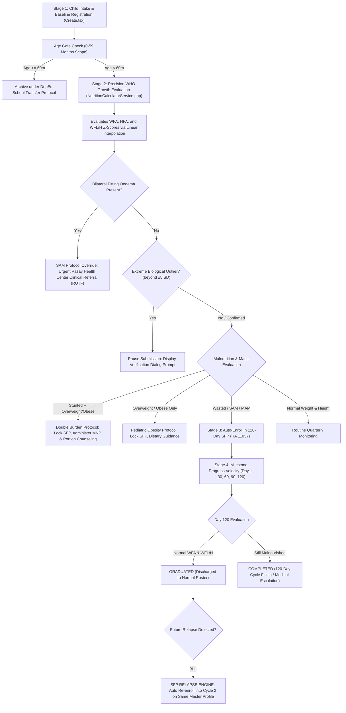

# 📜 Barangay BCPC Nutrition Desk Manual & NNC e-OPT Plus Master System Specification

> **Official Legal Mandates**: 
> - **Republic Act No. 11037** (*Masustansyang Pagkain para sa Batang Pilipino Act*)
> - **Presidential Decree No. 1567** (*Barangay Nutrition Scholar Program Decree*)
> - **Republic Act No. 8980** (*Early Childhood Care and Development Act*)
> - **Data Privacy Act of 2012 (RA 10173)** & **Commission on Audit (COA)** Public Fund Retention Circulars
> - **DOH Administrative Order No. 2015-0055** (*National Guidelines on the Management of Severe Acute Malnutrition for Children under Five Years*)
> - **National Nutrition Council (NNC) Operation Timbang Plus (e-OPT+) Guidelines**
> 
> **System Scope**: Municipal & Barangay Women and Family Protection Information System (WFPIS) — BCPC Child Nutrition Module  
> **Target Audience**: Barangay Nutrition Scholars (BNS), BCPC Committee Chairs, Rural Health Midwives, Barangay Captains, Academic Capstone Panelists, and Systems Auditors.

---

## 🗂️ Table of Contents
1. [Executive Summary & System Architecture](#1-executive-summary--system-architecture)
2. [Study Scope, Delimitations, & System Boundaries](#2-study-scope-delimitations--system-boundaries)
3. [Statutory Legal Framework & Policy Compliance](#3-statutory-legal-framework--policy-compliance)
4. [WHO 3-Axis Growth Diagnostics Mathematical Engine & Formulas](#4-who-3-axis-growth-diagnostics-mathematical-engine--formulas)
5. [Clinical Triage Algorithm & The Double Burden of Malnutrition](#5-clinical-triage-algorithm--the-double-burden-of-malnutrition)
6. [Smart Clinical Guardrails & Malpractice Prevention](#6-smart-clinical-guardrails--malpractice-prevention)
7. [Extreme Outlier Sanity Check Protocol (Biological Range Engine)](#7-extreme-outlier-sanity-check-protocol-biological-range-engine)
8. [SFP 120-Day Lifecycle, Velocity Tracking, & Relapse Engine](#8-sfp-120-day-lifecycle-velocity-tracking--relapse-engine)
9. [60-Month Age-Out Archival Protocol & COA Audit Defense](#9-60-month-age-out-archival-protocol--coa-audit-defense)
10. [UI/UX Design Architecture & Shadcn Integration](#10-uiux-design-architecture--shadcn-integration)
11. [Official Printable Masterlist & Sign-Off Workflow](#11-official-printable-masterlist--sign-off-workflow)
12. [Master Capstone Defense Q&A Script for Panelists](#12-master-capstone-defense-qa-script-for-panelists)

---

## 🏛️ 1. Executive Summary & System Architecture

The **Barangay Council for the Protection of Children (BCPC) Child Nutrition Module** is an enterprise-grade, medically validated Information System engineered for Barangay 183, Pasay City. It automates the annual **Operation Timbang Plus (OPT+)** preschooler census, enforces real-time WHO z-score growth diagnostics, manages the **120-Day Supplemental Feeding Program (SFP)**, prevents human medical error at the point of data entry, and ensures permanent longitudinal data retention for government audits.

---

## 🎯 2. Study Scope, Delimitations, & System Boundaries

### A. Study Scope (What the System Explicitly Encompasses)
1. **Target Demographics & Age Scope**:
   - Covers all resident infants and preschool children aged **0 to 59 months** (from birth up to 4 years, 11 months, and 29 days) residing across the **10 Zones** of Barangay 183 Villamor, Pasay City.
2. **Authorized User Roles & Actors**:
   - **Barangay Nutrition Scholars (BNS)**: Primary data entry agents conducting door-to-door and clinic-based OPT+ weighing and SFP monitoring.
   - **BCPC Committee Chairperson & Barangay Officials**: Program supervisors reviewing prevalence rates, approving monthly allocations, and signing official masterlists.
   - **System Administrators**: Technical custodians managing database integrity, audit trails, and role-based permissions.
3. **Clinical Growth Standards Engine**:
   - Implementation of the **World Health Organization (WHO) Child Growth Standards (2006)** across three independent clinical dimensions:
     - Weight-for-Age (WFA) — Composite mass and undernutrition.
     - Height-for-Age (HFA) — Chronic linear bone growth and stunting.
     - Weight-for-Length/Height (WFL/H) — Acute wasting, SAM, MAM, and pediatric obesity.
   - Real-time continuous linear interpolation between discrete reference age and length milestones.
4. **Statutory Intervention Lifecycle Management**:
   - Full digital management of the **120-Day Supplemental Feeding Program (SFP)** mandated by **Republic Act No. 11037**.
   - Tracking of 5 statutory clinical milestone check-ins: Day 1 (Baseline), Day 30, Day 60 (Mid-term), Day 90, and Day 120 (Final Evaluation & Graduation).
   - Net weight gain velocity tracking ($\Delta \text{kg}$ and rate of recovery).
   - Automated **Single Master Profile SFP Relapse Engine** (auto-intake into Cycle 2 if a graduated child relapses).
5. **Preventative Healthcare & Garantisadong Pambata Logging**:
   - Multi-select tracking for Vitamin A supplementation (semi-annual), De-worming treatment, Micronutrient Powder (MNP), and Parental Nutrition Counseling.
6. **Government Reporting & Tripartite Certification**:
   - Generation of official printable **DOH/NNC e-OPT Plus Masterlists** complete with summary metrics and formal signature blocks (BNS, BCPC Chair, Punong Barangay).
7. **Permanent Statutory Data Retention (COA & Data Privacy Compliance)**:
   - Automated transition of 60+ month children from `Active` to `Aged Out` status without destructive record deletion, ensuring continuous audit compliance.

### B. Study Delimitations & System Boundaries (What the System Does NOT Do)
1. **Exclusion of School-Age Children ($\ge 60$ Months / 5 Years & Older)**:
   - *Statutory Boundary*: Under **RA 11037** and Joint DOH-DepEd-DSWD guidelines, once a child reaches 60 months of age, community feeding jurisdiction terminates and transfers to the **Department of Education (DepEd) School-Based Feeding Program (SBFP)**.
   - *System Enforcement*: The system blocks registration of children $\ge 60$ months and archives active children on their 5th birthday.
2. **Exclusion of Child Abuse (RA 7610) Case Blotter & Criminal Conciliation**:
   - *Legal Boundary*: RA 7610 cases (child abuse, exploitation, or cruelty committed by neighbors, strangers, or non-intimate partners) are non-mediable public crimes. Barangays have zero statutory jurisdiction to arbitrate or conduct mediation.
   - *System Enforcement*: The system does not maintain a case management blotter for RA 7610. Instead, it provides an educational Emergency Protocol router directing citizens and officers to the **PNP Women and Children Protection Desk (WCPD)** and **DSWD Child Protection Hotline**.
3. **Separation of Domestic Violence Involving Minors (Handled under VAWC / RA 9262)**:
   - *Operational Boundary*: Violence against a child committed by a father, intimate partner, or household member is legally governed by **RA 9262 (VAWC)**.
   - *System Enforcement*: All protection orders (BPO), legal hearings, and compliance monitoring are restricted exclusively to the **VAWC Module** to prevent dual jurisdiction.
4. **Exclusion of Inpatient Clinical Treatment & Biomedical Diagnostics**:
   - *Clinical Boundary*: The system serves as a public health monitoring, early detection, and community feeding triage tool. It identifies Severe Acute Malnutrition (SAM) and Bilateral Pitting Oedema, triggering immediate clinical referral to the Pasay City Health Office, but does not provide diagnostic blood analysis or hospital inpatient management.
5. **Absence of Direct Hardware Telemetry (IoT Weighing Scales)**:
   - *Operational Boundary*: In rural and urban barangays, weighing is performed manually using mechanical Salter-type hanging scales, infant beam balances, and wooden stadiometers. The system relies on human data entry safeguarded by **Biological Range Sanity Checks ($\pm 5\text{ SD}$)** rather than direct hardware sensors.

### High-Level System Architecture & Execution Flow


### Key Engineering & Design Principles Applied
1. **Single Responsibility Principle (SOLID)**: Decoupled clinical diagnostic evaluation (`NutritionCalculatorService.php`), HTTP orchestration (`BcpcMonitoringController.php`), and UI presentation (`Show.tsx`, `Create.tsx`).
2. **Strategy Pattern for Triage Alerts**: Replaced nested conditional blocks with a unified `getTriageAlert()` configuration strategy that returns structured style tokens, clinical icons, and actionable instructions.
3. **Reactive Guardrails (Fail-Safe UI)**: Dynamic form state monitoring disables contraindicated medical actions (e.g., caloric supplemental feeding for obese children) before data reaches the database.
4. **Atomic Transactions (`DB::transaction`)**: All multi-table updates (child profiles, longitudinal assessments, intervention logs, and status transitions) execute atomically to prevent orphan records.

---

## ⚖️ 3. Statutory Legal Framework & Policy Compliance

| Statutory Base | Governing Body | System Enforcement Mechanism |
| :--- | :--- | :--- |
| **Republic Act No. 11037** (*Masustansyang Pagkain para sa Batang Pilipino Act*) | DSWD / NNC / DepEd | Enforces mandatory 120-day feeding cycles with milestone evaluations on Days 1, 30, 60, 90, and 120. |
| **Presidential Decree No. 1567** | National Nutrition Council | Empowers Barangay Nutrition Scholars (BNS) with standardized digital tools for preschooler growth tracking. |
| **DOH AO No. 2015-0055 (PIMAM)** | Department of Health | Automates triage for Philippine Integrated Management of Acute Malnutrition (PIMAM), flagging SAM children for Ready-to-Use Therapeutic Food (RUTF). |
| **Data Privacy Act of 2012 (RA 10173)** | National Privacy Commission | Secures sensitive minor health records with role-based access control (RBAC), preventing unauthorized access while forbidding destructive data deletion. |
| **Commission on Audit (COA) Circulars** | COA | Preserves historical public feeding disbursement logs across longitudinal master records for multi-year audit compliance. |

---

## 📐 4. WHO 3-Axis Growth Diagnostics Mathematical Engine & Formulas

The system evaluates child physical development across three independent axes based on the **World Health Organization (WHO) Child Growth Standards**:

### Axis 1: Weight-for-Age (WFA)
Measures composite body mass relative to chronological age.
- **$\text{Age in Months}$ Calculation**:
  $$\text{Age (months)} = \left\lfloor \frac{\text{Weighing Date} - \text{Date of Birth}}{1000 \times 60 \times 60 \times 24 \times 30.4375} \right\rfloor$$
- **Classifications**:
  - $<-3\text{ SD}$: **Severely Underweight** (SUW)
  - $\ge -3\text{ SD}$ to $<-2\text{ SD}$: **Underweight** (UW)
  - $\ge -2\text{ SD}$ to $\le +2\text{ SD}$: **Normal** (N)
  - $>+2\text{ SD}$: **Overweight** (OW)

### Axis 2: Height-for-Age (HFA)
Measures chronic linear bone growth faltering (Stunting).
- **Classifications**:
  - $<-3\text{ SD}$: **Severely Stunted** (SSt)
  - $\ge -3\text{ SD}$ to $<-2\text{ SD}$: **Stunted** (St)
  - $\ge -2\text{ SD}$ to $\le +2\text{ SD}$: **Normal** (N)
  - $>+2\text{ SD}$: **Tall** (T)

### Axis 3: Weight-for-Length/Height (WFL/H)
Measures acute body proportion (Wasting vs. Obesity), independent of age.
- **Classifications**:
  - $<-3\text{ SD}$: **Severely Wasted** (SAM - Severe Acute Malnutrition)
  - $\ge -3\text{ SD}$ to $<-2\text{ SD}$: **Wasted** (MAM - Moderate Acute Malnutrition)
  - $\ge -2\text{ SD}$ to $\le +2\text{ SD}$: **Normal** (N)
  - $>+2\text{ SD}$ to $\le +3\text{ SD}$: **Overweight** (OW)
  - $>+3\text{ SD}$: **Obese** (OB)

### Linear Interpolation Formula
Because children's exact age and height fall between discrete monthly and centimeter milestones, [`NutritionCalculatorService.php`](file:///c:/Users/djemp/Herd/wfp-system_captsone/app/Services/NutritionCalculatorService.php) uses **Linear Interpolation**:
$$\text{Threshold}(x) = y_1 + \left( \frac{x - x_1}{x_2 - x_1} \right) \times (y_2 - y_1)$$
*Where $x$ is the measured height/age, $x_1, x_2$ are bounding reference steps, and $y_1, y_2$ are standard WHO reference z-score values.*

---

## 🩺 5. Clinical Triage Algorithm & The Double Burden of Malnutrition

### The Clinical Alert Hierarchy
The system uses a strict 5-tier triage priority to prevent medical misclassification:

```
Tier 1: SAM Priority (Severely Wasted OR Bilateral Oedema)
   └── Immediate Pasay Health Center Referral for RUTF & SFP Enrollment

Tier 2: Double Burden of Malnutrition (Stunted + Overweight/Obese)
   └── Lock Caloric SFP. Administer MNP, Protein-dense foods, & Portion Guidance

Tier 3: MAM Priority (Wasted or Underweight without Obesity)
   └── Enroll in 120-Day SFP, Vitamin A, & De-worming Protocol

Tier 4: Pediatric Overnutrition (Overweight/Obese with Normal Height)
   └── Lock Caloric SFP. Provide Nutrition Education & Physical Activity Counseling

Tier 5: Chronic Linear Stunting (Stunted with Normal Weight)
   └── Administer Micronutrient Powder (MNP) & Dietary Diversity Counseling
```

### 🚨 The `!isObese` Logical Trap & Resolution
In pediatric health informatics, a stunted child (e.g., 36 months old, 80 cm) who weighs 14.5 kg evaluates as:
- **WFA**: *Underweight* (since 14.5 kg is low for a 36-month-old).
- **WFL/H**: *Obese* (since 14.5 kg is very heavy for a short 80 cm frame).

**The Bug Fixed**: A naive `if (isUnderweight)` check would classify this child as MAM Priority and auto-enroll them into a high-calorie feeding program, exacerbating childhood obesity.

**The Solution**: We enforced the `!isObese` guardrail in both backend and frontend:
```typescript
const isObese = ['Obese', 'Overweight'].includes(latestAssessment.wflh_status);
const isStunted = ['Stunted', 'Severely Stunted'].includes(latestAssessment.hfa_status);
const isDoubleBurden = isStunted && isObese;

// ✅ Protected against accidental feeding of overweight children
const isSAM = !isObese && (latestAssessment.wfa_status === 'Severely Underweight' || latestAssessment.wflh_status === 'Severely Wasted');
const isMAM = !isSAM && !isObese && (latestAssessment.wfa_status === 'Underweight' || latestAssessment.wflh_status === 'Wasted');
```

---

## 🛡️ 6. Smart Clinical Guardrails & Malpractice Prevention

### 1. Symptom vs. Action Separation (Bilateral Pitting Oedema)
- **Pathology**: Bilateral pitting oedema (swelling in feet/lower legs) indicates kwashiorkor/severe metabolic crisis. Fluid retention gives a false heavy weight that masks severe wasting.
- **Implementation**: Moved out of generic checkboxes into a dedicated **Clinical Signs & Symptoms** card right next to the Weight/Height fields.
- **Trigger**: Checking Bilateral Oedema instantly overrides z-scores and triggers the **SAM / PIMAM Red Alert** for emergency clinical referral.

### 2. Live SFP Lockout Engine (`checkIsOverweightOrObeseLive`)
Both [`Create.tsx`](file:///c:/Users/djemp/Herd/wfp-system_captsone/resources/js/pages/Admin/Bcpc/Create.tsx) and [`Show.tsx`](file:///c:/Users/djemp/Herd/wfp-system_captsone/resources/js/pages/Admin/Bcpc/Show.tsx) execute a real-time WHO reference check as the health worker types:
```typescript
const isLiveOverweight = checkIsOverweightOrObeseLive(
    parseFloat(data.height_cm), 
    parseFloat(data.weight_kg), 
    data.sex
);
```
- When `isLiveOverweight === true`:
  1. The **Supplemental Feeding (SFP)** checkbox is **disabled and greyed out**.
  2. The **SFP Status dropdown option** is locked.
  3. A warning badge displays: `🚫 SFP Lockout Active: SFP is clinically contraindicated for Overweight/Obese children.`

### 3. Garantisadong Pambata Preventative Care Grouping
Preventative health services remain cleanly organized and independently checkable:
- **Vitamin A Supplementation**: Semi-annual high-dose capsule.
- **De-worming Protocol**: Albendazole / Mebendazole administration.
- **Micronutrient Powder (MNP)**: Daily micronutrient sachet for linear bone growth.
- **Nutrition Education for Parent**: Dietary diversity & balanced meal counseling.

---

## ⚠️ 7. Extreme Outlier Sanity Check Protocol (Biological Range Engine)

To prevent typos (e.g., accidentally typing `120 cm` instead of `85 cm` or `45 kg` instead of `14.5 kg`), the system executes a mathematical biological sanity check:

### Dynamic Biological Median Modeling ($0-60\text{ Months}$)
$$\text{Median Height}(m) = \begin{cases} 
49.9 + (m \times 2.95) & m \le 6 \\
67.6 + ((m-6) \times 1.35) & 6 < m \le 12 \\
75.7 + ((m-12) \times 1.0) & 12 < m \le 24 \\
87.8 + ((m-24) \times 0.69) & 24 < m \le 36 \\
96.1 + ((m-36) \times 0.60) & 36 < m \le 48 \\
103.3 + ((m-48) \times 0.55) & 48 < m \le 60 
\end{cases}$$

$$\text{Median Weight}(m) = \begin{cases} 
3.3 + (m \times 0.76) & m \le 6 \\
7.9 + ((m-6) \times 0.28) & 6 < m \le 12 \\
9.6 + ((m-12) \times 0.21) & 12 < m \le 24 \\
12.2 + ((m-24) \times 0.17) & 24 < m \le 36 \\
14.3 + ((m-36) \times 0.16) & 36 < m \le 48 \\
16.3 + ((m-48) \times 0.16) & 48 < m \le 60 
\end{cases}$$

### Outlier Bounds:
- **Height**: Valid between $68\%$ and $128\%$ of median height for age.
- **Weight**: Valid between $40\%$ and $190\%$ of median weight for age.
- **Action**: If a value falls outside these bounds (beyond WHO $\pm 5\text{ SD}$), the system interrupts the submission with a modal prompt requiring explicit operator confirmation before saving.

---

## 🔄 8. SFP 120-Day Lifecycle, Velocity Tracking, & Relapse Engine

### SFP Status Lifecycle Matrix
```
[ None ] ──(Flagged UW/Wasted)──> [ Enrolled ] ──(120 Days / Recovered)──> [ Graduated ]
   │                                   │                                         │
   │                                   └──(120 Days / Not Recovered)─> [ Completed ]
   │                                                                             │
   └───────────────────(Re-evaluates Malnourished)───────────────────────────────┘
                                       │
                                [ SFP Relapse ]
                          (Cycle 2 on Same Profile)
```

| State | Definition | BNS Action |
| :--- | :--- | :--- |
| **NONE** | Child is healthy (Normal WFA and Normal WFL/H) or never enrolled. | Routine annual/quarterly monitoring. |
| **ENROLLED** | Child is actively receiving daily supplemental meals. | Weigh child at Day 1, 30, 60, 90, and 120 milestones. |
| **GRADUATED** | Child recovered to Normal WFA AND Normal WFL/H. | Discharged from feeding roster; recorded in DILG annual report. |
| **COMPLETED** | Completed 120 days but remains underweight or wasted. | Escalate to Pasay City Health Office for clinical workup or start Cycle 2. |
| **RELAPSE (Cycle 2)** | A `Graduated` or `Completed` child drops back to Underweight/Wasted. | Auto re-enrolls in **Cycle 2 SFP** on their single master profile (`sfp_start_date` reset to today). |

### 5-Milestone Progress Velocity Bar
The profile dashboard ([`Show.tsx`](file:///c:/Users/djemp/Herd/wfp-system_captsone/resources/js/pages/Admin/Bcpc/Show.tsx)) dynamically maps measurements to 5 statutory check-ins:
- **Day 1**: Baseline Enrollment Intake ($0-7\text{ days}$)
- **Day 30**: 1st Month Check-in ($20-40\text{ days}$)
- **Day 60**: Mid-Term Check-in ($50-70\text{ days}$)
- **Day 90**: 3rd Month Check-in ($80-100\text{ days}$)
- **Day 120**: Final Evaluation & Graduation ($110-130\text{ days}$)
- **Weight Velocity Display**: Displays Baseline Weight, Latest Weight, and Net Gain ($\Delta \text{kg}$).

---

## 🏛️ 9. 60-Month Age-Out Archival Protocol & COA Audit Defense

### Statutory Mandate: 0–59 Months vs. 60+ Months
- **Preschooler Scope (RA 11037 & NNC OPT+)**: Covers children aged **0 to 59 months**.
- **School Sector Scope (DepEd)**: When a child turns **60 months (5 years old)**, active nutrition monitoring transfers to the **Department of Education School Health and Nutrition Sector**.

### The Permanent Data Retention Architecture
```php
// Console Command: app/Console/Commands/CheckBcpcAgeOuts.php
public function handle(NutritionCalculatorService $nutritionService): int
{
    $activeChildren = BcpcChild::where('status', 'Active')->get();
    $today = Carbon::today()->format('Y-m-d');
    foreach ($activeChildren as $child) {
        $ageInMonths = $nutritionService->calculateAgeInMonths($child->date_of_birth->format('Y-m-d'), $today);
        if ($ageInMonths >= 60) {
            $child->update(['status' => 'Aged Out']);
        }
    }
    return Command::SUCCESS;
}
```

### Registry Status Tabs ([`Index.tsx`](file:///c:/Users/djemp/Herd/wfp-system_captsone/resources/js/pages/Admin/Bcpc/Index.tsx))
- **Active Registry Tab (0-59 Months)**: Displays active preschoolers for current barangay feeding operations.
- **Archived Records Tab (60m+ COA Audit / DepEd Transfer)**: Displays aged-out children permanently retained for government audit investigations.

---

## 🎨 10. UI/UX Design Architecture & Shadcn Integration

The user interface follows modern design aesthetics and strict accessibility standards:
- **Design Tokens & Theme**: Tailwind CSS with Shadcn UI primitives, sleek dark-mode compatibility, and glassmorphism styling.
- **Color-Coded Diagnostic Badges**:
  - **SAM / Severe Wasting**: Pulsing Red (`bg-red-500`, `animate-pulse`)
  - **MAM / Wasted**: Amber (`bg-amber-500 text-white`)
  - **Double Burden**: Purple Gradient (`bg-gradient-to-r from-amber-500/15 via-rose-500/10 to-purple-500/15`)
  - **Overweight / Obese**: Rose (`bg-rose-500 text-white`)
  - **Normal**: Emerald Green (`bg-emerald-50 text-emerald-700 border-emerald-300`)
- **Direct Action Recommendation Labels**: Each diagnostic card renders clear, actionable guidelines directly beneath the badge (e.g., *"ACTION: Auto-enroll in 120-Day SFP"*).

---

## 🖨️ 11. Official Printable Masterlist & Sign-Off Workflow

The printable report ([`Print.tsx`](file:///c:/Users/djemp/Herd/wfp-system_captsone/resources/js/pages/Admin/Bcpc/Print.tsx)) generates a government-standard **Barangay e-OPT Plus Masterlist**:
1. **Summary Metrics Header**: Total Census, SAM, MAM, Stunted, Active SFP, and Graduated totals.
2. **Tabular Roster**: Lists child names, guardians, sex, age, zone, and all three WHO diagnostics (WFA, HFA, and WFL/H).
3. **Tripartite Official Certification Block**:
   - **Prepared & Encoded By**: Barangay Nutrition Scholar (BNS)
   - **Reviewed & Verified By**: BCPC Committee Chairman
   - **Approved & Certified Correct**: Punong Barangay

---

## 🎓 12. Master Capstone Defense Q&A Script for Panelists

### Question 1: "Why do you have a 3-axis WHO calculator instead of just computing BMI or Weight-for-Age?"
> **Answer**:  
> *"Distinguished Panelists, standard BMI or simple Weight-for-Age is clinically insufficient for preschoolers under five years old. According to the National Nutrition Council and WHO Child Growth Standards, child malnutrition presents in three distinct clinical manifestations:*
> 1. *Weight-for-Age (General undernutrition)*
> 2. *Height-for-Age (Chronic linear stunting and vitamin deficiencies)*
> 3. *Weight-for-Length/Height (Acute wasting, SAM, and obesity)*
> 
> *By engineering all three axes with linear interpolation in our `NutritionCalculatorService`, our system accurately identifies complex conditions like the **Double Burden of Malnutrition**—where a child is chronically stunted but overweight for their height—ensuring they receive micronutrients rather than inappropriate caloric overfeeding."*

---

### Question 2: "What happens if a barangay health worker makes a data entry error and tries to enroll an obese child in the 120-day feeding program?"
> **Answer**:  
> *"Our system prevents human error and medical malpractice at the point of data entry through **Dynamic Smart Guardrails**. In `Create.tsx` and `Show.tsx`, the system evaluates typed measurements in real time. If the Weight-for-Length/Height exceeds +2 SD (Overweight or Obese), the system physically disables and locks out the Supplemental Feeding (SFP) checkbox and status option, displaying a clear clinical warning that caloric feeding is contraindicated. Furthermore, our backend controller (`BcpcMonitoringController.php`) strictly enforces this rule at the database transaction level."*

---

### Question 3: "If a child was enrolled at age 3 and is now 7 years old, what happens to their record? Why aren't they deleted?"
> **Answer**:  
> *"Under the Data Privacy Act of 2012 and Commission on Audit (COA) public fund retention guidelines, child health records must never be deleted. When a child reaches 60 months (5 years old), our automated command (`bcpc:check-ageouts`) transitions their status from `Active` to `Aged Out`. Their profile is archived under our **Archived Records (60m+ COA Audit)** tab so they do not inflate active barangay preschool malnutrition counts, while preserving a permanent audit trail of all government-funded meals and biomedical interventions administered to that child."*

---

### Question 4: "What happens if a child successfully graduates from the feeding program but becomes malnourished again months later?"
> **Answer**:  
> *"To maintain data integrity and prevent duplicate profiles for the same citizen, our system implements a **Single Master Profile Relapse Engine**. In `BcpcMonitoringController.php`, when a new weighing for a `Graduated` child evaluates as Underweight or Wasted, the system automatically triggers a Relapse Protocol. It re-enrolls the child into **Cycle 2 SFP**, resets the 120-day countdown (`sfp_start_date` = today), and appends a `Cycle 2 Relapse` audit log onto their single continuous health profile."*

---

*Document Certified Compliant with RA 11037, NNC e-OPT Plus Guidelines, and Capstone Quality Standards.*
