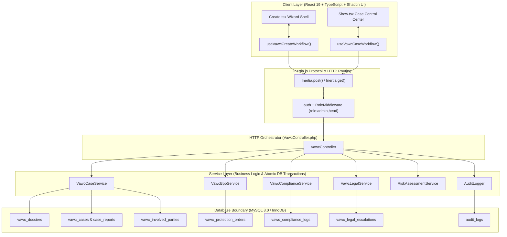
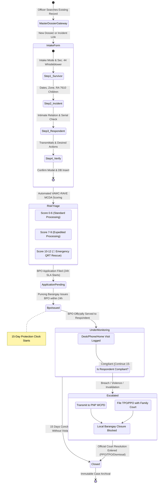
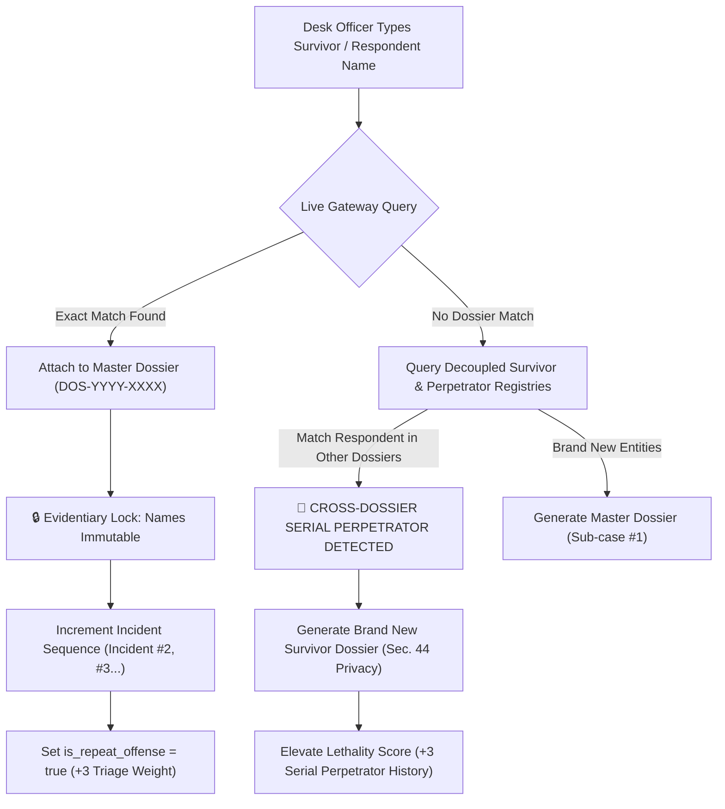
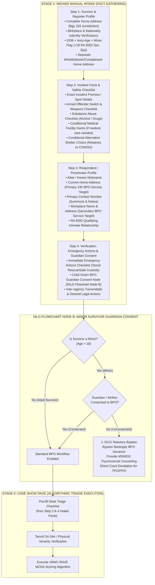
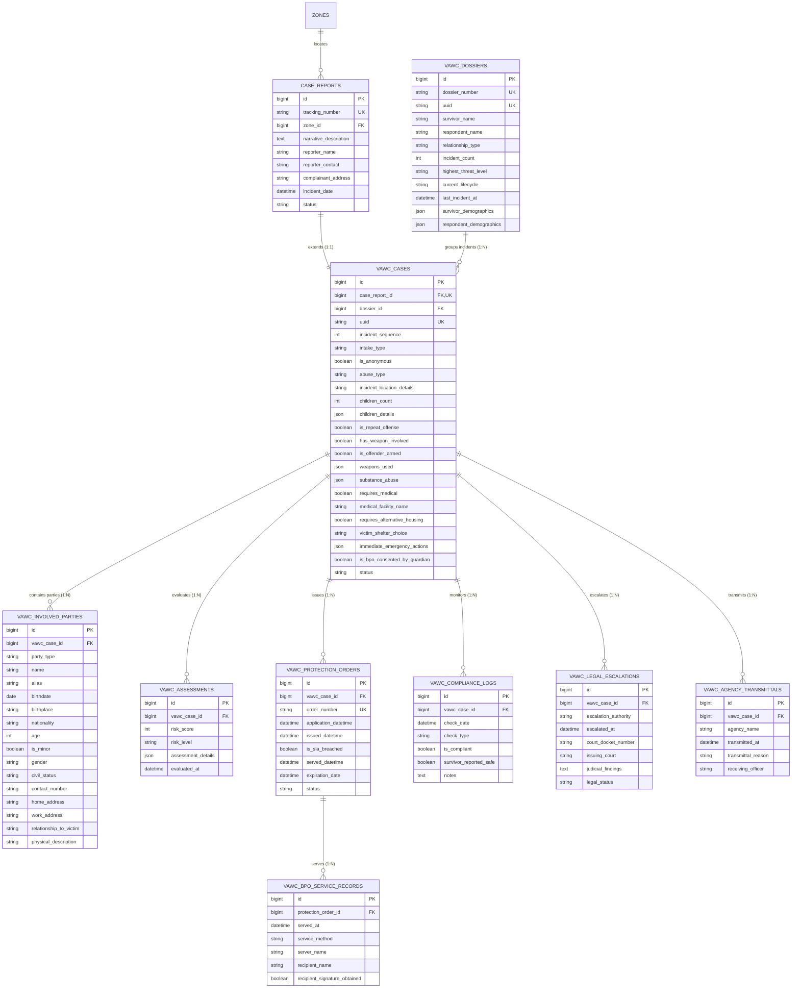

# 🛡️ OVERALL VAWC MODULE SYSTEM ARCHITECTURE, WORKFLOW, PROCESS, DESIGN, AND ALERT ANALYTICS

> **Municipal & Barangay Women and Family Protection Information System (WFPIS)**  
> **System Component**: Violence Against Women and Their Children (VAWC) Management & BPO Lifecycle Engine  
> **Primary Statutory Mandate**: Republic Act No. 9262 (*Anti-Violence Against Women and Their Children Act of 2004*)  
> **Intersecting Statutes**: RA 7610 (*Child Protection Act*), RA 11313 (*Safe Spaces Act*), Family Code of the Philippines  
> **Design Pattern**: Service-Oriented Architecture (SOA) + Hook-Driven Modular React / Inertia.js/ SHADCN Simplicity clean codes and simple UI/UX.
> **Audience**: Senior Software Engineers, Capstone Technical Panelists, System Architects, Legal Operations Officers  

NOTE: DO NOT FORGET TO SCAN THESE.
OFFICIAL WORKFLOW OF VAWC HANDLING CASE AND BPO ISSUANCE FLOWCHART 
1. C:\Users\djemp\Herd\wfp-system_captsone\Capstone Papers\Legal_Process_Official.md\Flowchart in Handling VAWC Cases.jpg

2. C:\Users\djemp\Herd\wfp-system_captsone\Capstone Papers\Legal_Process_Official.md\Flowchart Issuance and Enforcement of Barangay Protection Order(BPO) PER RA 9262.jpg
---

## 📑 Table of Contents
1. [Executive Summary & Core Architectural Philosophy](#1-executive-summary--core-architectural-philosophy)
2. [End-to-End System Workflow & Senior Developer Flowcharts](#2-end-to-end-system-workflow--senior-developer-flowcharts)
3. [Relational Database Architecture & Entity-Relationship Schema](#3-relational-database-architecture--entity-relationship-schema)
4. [Backend Architecture: Models, Controllers & Service Layer](#4-backend-architecture-models-controllers--service-layer)
5. [Frontend Architecture: Hook-Driven Component Hierarchy](#5-frontend-architecture-hook-driven-component-hierarchy)
6. [Core Algorithms & Mathematical Formulations](#6-core-algorithms--mathematical-formulations)
7. [Statutory Rules, Legal Taxonomy & Defensive Guardrails](#7-statutory-rules-legal-taxonomy--defensive-guardrails)
8. [Alert Analytics, SLA Monitoring & Real-Time Command Center](#8-alert-analytics-sla-monitoring--real-time-command-center)

---

## 1. Executive Summary & Core Architectural Philosophy

The **VAWC Management Module** within the Women and Family Protection Information System (WFPIS) is an enterprise-grade digital solution engineered to eliminate manual blotter delays, eradicate clerical errors in statutory timelines, and enforce legal compliance across domestic violence disclosures.

### 🏛️ The Three Core System Tenets
1. **"Search First, Encode Second" Policy**: Desk officers must query the live Master Dossier registry prior to creating new entries. This links repeat incidents, uncovers serial offenders, and prevents data fragmentation.
2. **Elimination of Monolithic Frontend Architecture**: Monolithic files exceeding 1,700–2,000 lines have been systematically refactored into **atomic step partials** (< 250 lines) coordinated by custom React hooks (`useVawcCreateWorkflow`, `useVawcCaseWorkflow`).
3. **Deterministic Statutory Compliance**: Every operational phase enforces hard programmatic guardrails reflecting Philippine jurisprudence—specifically the **24-hour BPO SLA** (Sec. 14), **Prohibition of Conciliation** (Sec. 33), **Public Crime Doctrine** (Loss of Local Disposition Authority upon Escalation), and **Section 44 Confidential Informant Protection**.

---

## 2. End-to-End System Workflow & Senior Developer Flowcharts

### 2.1 Request-Response Pipeline & Execution Lifecycle


---

### 2.2 End-to-End Case Progression State Machine


---

### 2.3 Master Dossier Recidivism & Serial Perpetrator Linkage Flowchart


---

### 2.4 Official DILG NBOO Manual Intake & Two-Stage Triage Protocol Flowchart

To ensure 100% statutory alignment with the **DILG National Barangay Operations Office (NBOO)** official guidelines (*Handling VAWC Cases* and *Issuance & Enforcement of BPO per RA 9262*), the system architecture decouples raw incident fact gathering from post-intake algorithmic lethality triage:



---

## 3. Relational Database Architecture & Entity-Relationship Schema

### 3.1 Mermaid Entity-Relationship Diagram (ERD)


---

### 3.2 Data Dictionary & Integrity Constraints

| Table Name | Primary Role | Key Foreign Keys | Critical Data Constraints |
| :--- | :--- | :--- | :--- |
| `vawc_dossiers` | Recidivism anchor connecting repeat cases between same parties. | None | `dossier_number` formatted as `DOS-YYYY-XXXX`. Strict unique index. |
| `case_reports` | Base municipal blotter ledger. | `zone_id` $\rightarrow$ `zones.id` | `tracking_number` immutable audit key. |
| `vawc_cases` | Domain-specific VAWC incident data. | `case_report_id` $\rightarrow$ `case_reports.id`<br>`dossier_id` $\rightarrow$ `vawc_dossiers.id` | `status` ENUM: `Intake`, `Assessment`, `Alternative Housing`, `BPO Processing`, `Monitoring`, `Escalated`, `Closed`. |
| `vawc_involved_parties`| Demographic profiles of victims, perpetrators, complainants. | `vawc_case_id` $\rightarrow$ `vawc_cases.id` | `party_type` restricted to `Victim`, `Respondent`, `Complainant`. |
| `vawc_protection_orders`| Barangay Protection Order statutory timeline. | `vawc_case_id` $\rightarrow$ `vawc_cases.id` | `is_sla_breached` computed if $(t_{\text{issue}} - t_{\text{apply}}) > 24\text{h}$. |
| `vawc_compliance_logs` | 15-day surveillance logs. | `vawc_case_id` $\rightarrow$ `vawc_cases.id` | `notes` strictly required to avoid empty compliance entries. |
| `vawc_legal_escalations`| Court/Prosecutor referral dossiers. | `vawc_case_id` $\rightarrow$ `vawc_cases.id` | Escalated cases require `court_docket_number` and `issuing_court` to close. |

---

## 4. Backend Architecture: Models, Controllers & Service Layer

The backend strictly implements the **Service Layer Pattern** to ensure controllers remain lean and testable.

### 4.1 Service Layer Responsibility Matrix
```
app/Services/
├── VawcCaseService.php        # Atomic creation of case, dossier linking, child details
├── VawcBpoService.php         # BPO application, 24h SLA checks, order issuance, proof of service
├── VawcComplianceService.php  # 15-day check-in logging, violation detection, auto-escalation
├── VawcLegalService.php       # Transmittals to PNP WCPD/Court, Sec. 33 anti-conciliation rule
├── RiskAssessmentService.php  # VAWC-RAVE multi-criteria lethality scoring formulation
└── VawcAnalyticsService.php   # Real-time SLA compliance, recidivism rates, zone heatmaps
```

#### Code Implementation: Atomic Case Creation in `VawcCaseService.php`
```php
public function createCase(array $data, int $userId): VawcCase
{
    return DB::transaction(function () use ($data, $userId) {
        // 1. Resolve or Create Master Dossier
        $dossier = $this->resolveDossier($data);
        
        // 2. Create Base Blotter Report
        $report = CaseReport::create([
            'tracking_number' => $this->generateTrackingNumber(),
            'zone_id' => $data['zone_id'],
            'incident_date' => $data['incident_date'],
            'narrative_description' => $data['description'],
            'status' => 'Intake',
        ]);

        // 3. Create Specific VAWC Record
        $vawcCase = VawcCase::create([
            'case_report_id' => $report->id,
            'dossier_id' => $dossier->id,
            'incident_sequence' => $dossier->incident_count + 1,
            'abuse_type' => $data['abuse_type'],
            'intake_type' => $data['intake_type'],
            'is_anonymous' => $data['is_anonymous'] ?? false,
            'children_count' => $data['children_count'] ?? 0,
            'children_details' => $data['children_details'] ?? [],
            'is_repeat_offense' => $dossier->incident_count > 0,
            'status' => 'Intake',
        ]);

        // 4. Attach Parties & Evaluate Triage
        $this->attachParties($vawcCase, $data);
        $this->evaluateRiskTriage($vawcCase, $data);
        $dossier->increment('incident_count');

        return $vawcCase;
    });
}
```

---

## 5. Frontend Architecture: Hook-Driven Component Hierarchy

To eradicate 2,000-line monolithic files, the VAWC user interface is organized into **atomic, single-purpose components** controlled by custom React hooks.

```
resources/js/
├── hooks/
│   ├── useVawcCreateWorkflow.ts          # Encapsulates all intake state, search debouncers, validators
│   └── useVawcCaseWorkflow.ts            # Encapsulates active case state, SLA health, dialog actions
│
└── pages/Admin/Vawc/
    ├── Create.tsx                        # Master Intake Shell (< 240 lines)
    ├── Show.tsx                          # Case Control Center Shell (< 240 lines)
    │
    ├── Partials/Create/                  # Step-by-step Intake Components
    │   ├── types.ts                      # Data contracts, Props, and PreselectedDossier
    │   ├── CreateHeader.tsx              # Unboxed header, RA 9262 badge, cancellation
    │   ├── DossierSearchGateway.tsx      # Step 0: "Search First, Encode Second" Gateway
    │   ├── Step1Survivor.tsx             # Step 1: Intake mode, whistleblower, victim demographics
    │   ├── Step2Incident.tsx             # Step 2: Datetime bounds, zone, RA 7610 children stay-away
    │   ├── Step3Respondent.tsx           # Step 3: Perpetrator profile, serial alert, legal relations
    │   ├── Step4Verify.tsx               # Step 4: Multi-agency transmittals, remedies, witnesses
    │   └── CreateConfirmModal.tsx        # Pre-submission review & confirmation modal
    │
    └── Partials/Show/                    # Case Management Stage Components
        ├── Stages/
        │   ├── Step1TriageChecklist.tsx  # Stage 1: Algorithmic lethality scoring & danger triggers
        │   ├── Step2BpoApplication.tsx   # Stage 2: BPO application filing with chronological bounds
        │   ├── Step3BpoIssuance.tsx      # Stage 3: Same-Day 24h SLA compliance analyzer
        │   ├── Step4BpoService.tsx       # Stage 4: Substituted / Personal service logger
        │   ├── Step5Resolution.tsx       # Stage 5: 15-day compliance monitoring & escalation trigger
        │   └── VawcMonitoringLogSection.tsx # Historical log table of home visits and wellness checks
        └── Modals/
            ├── VawcCloseCaseModal.tsx    # Sec. 33 anti-conciliation enforcement & judicial gate
            └── VawcReferralModal.tsx     # External agency transmittal slip generator
```

---

## 6. Core Algorithms & Mathematical Formulations

### 6.1 Algorithm 1: VAWC-RAVE Multi-Criteria Decision Analysis (MCDA) Risk Evaluation
The **VAWC Risk Assessment & Vulnerability Evaluation (VAWC-RAVE)** engine assigns an objective lethality score ($0 \le S \le 12$) based on 4 weighted statutory criteria:

$$\text{VAWC-RAVE Score} = C_{\text{weapon}} + C_{\text{freq}} + C_{\text{severity}} + C_{\text{lethality}}$$

```
+-------------------+-------------------------------------------------------------+-------+
| Criterion         | Statutory Trigger Conditions                                | Score |
+-------------------+-------------------------------------------------------------+-------+
| C_weapon          | has_weapon_involved == true OR weapons_confiscated == true  | 3     |
|                   | No weapon reported                                          | 1     |
+-------------------+-------------------------------------------------------------+-------+
| C_freq            | is_repeat_offense == true OR incident_count > 1             | 3     |
|                   | First-time disclosure                                       | 1     |
+-------------------+-------------------------------------------------------------+-------+
| C_severity        | requires_medical == true OR perpetrator_present == true     | 3     |
|                   | incident_veracity == true (Verified Physical Bruising)      | 2     |
|                   | Routine disclosure                                          | 1     |
+-------------------+-------------------------------------------------------------+-------+
| C_lethality       | warrantless_arrest_made == true OR strangulation reported   | 3     |
|                   | children_count > 0 OR requires_alternative_housing == true  | 2     |
|                   | Standard risk                                               | 1     |
+-------------------+-------------------------------------------------------------+-------+
```

#### Triage Classification & Automated Protocol:
- 🚨 **CRITICAL (Score 10–12)**: **Emergency Ex-Officio Rescue Protocol**. Triggers immediate PNP QRT dispatch, warrantless arrest assistance, and CSWDO emergency shelter bypass.
- 🟠 **HIGH (Score 7–9)**: Expedited BPO issuance within 2 hours, Punong Barangay immediate notification.
- 🟡 **MODERATE (Score 4–6)**: Standard 24-hour BPO processing and social worker counseling.
- 🔵 **LOW (Score 0–3)**: Routine intake processing and standard monitoring.

---

### 6.2 Algorithm 2: Real-Time 24-Hour BPO SLA Analyzer
Under RA 9262 Section 14, the Punong Barangay must issue a BPO within **twenty-four (24) hours** of application filing. The system computes the exact time delta:

$$\Delta t_{\text{SLA}} = t_{\text{issuance}} - t_{\text{application}}$$

$$\text{Status} = \begin{cases} 
\text{INVALID (Blocked)}, & \Delta t_{\text{SLA}} < 0 \quad (\text{Chronological Violation}) \\
\text{COMPLIANT (Green)}, & 0 \le \Delta t_{\text{SLA}} \le 24\text{ hours} \\
\text{BREACH (Amber Alert)}, & \Delta t_{\text{SLA}} > 24\text{ hours} \implies \text{is\_sla\_breached} = \text{true}
\end{cases}$$

---

### 6.3 Algorithm 3: Dual-Timestamp Statutory Audit Discrepancy
To authenticate whether records were entered during live desk operations or back-encoded historically:

$$\Delta t_{\text{audit}} = |t_{\text{process}} - t_{\text{system\_created}}|$$

$$\text{Badge} = \begin{cases}
\text{"Live Real-Time Intake"}, & \Delta t_{\text{audit}} \le 24\text{ hours} \\
\text{"Historical Back-Encoding (Retroactive)"}, & \Delta t_{\text{audit}} > 24\text{ hours}
\end{cases}$$

---

## 7. Statutory Rules, Legal Taxonomy & Defensive Guardrails

### 7.1 Qualifying Intimate Relationship Taxonomy (RA 9262 Sec. 3)
Under Philippine jurisprudence, an act can only be prosecuted under RA 9262 if the respondent shares an **intimate, marital, dating, or common-child relationship** with the victim.

> [!CAUTION]
> **Strict Legal Exclusion of "Other Household Relative":**
> In accordance with legal mandates, `"Other Household Relative (with custody/care)"` has been permanently deleted from the system. Non-intimate household offenses (e.g., uncle assaulting a niece) must be filed under **RA 7610** (Child Abuse) or Physical Injuries under the Revised Penal Code.

#### The 7 Programmatically Enforced Relationships:
1. `Spouse (Legal Husband/Wife)`
2. `Former Spouse (Separated/Annulled)`
3. `Common-Law / Live-in Partner`
4. `Former Live-in Partner`
5. `Parent of Common Child`
6. `Dating / Romantic / Sexual Partner`
7. `Former Dating Partner`

---

### 7.2 Strict Prohibition of Conciliation (RA 9262 Sec. 33)
Section 33 of RA 9262 strictly states: *"Barangay officials are prohibited from attempting to conciliate or mediate between the parties in acts of violence covered under this Act."*

- **Programmatic Enforcement**: The option `"Amicable Settlement / Conciliation"` is physically excluded from all dropdowns and closure modals. Attempting to bypass this triggers a database validation exception.

---

### 7.3 Public Crime Doctrine & The Jurisdictional Gate
Domestic violence under RA 9262 is a **public offense against the State**. Once a case is escalated to the PNP Women and Children Protection Desk (WCPD) or Family Court (Step 6):
1. **Loss of Local Authority**: The barangay desk officer legally loses power to close or dismiss the case locally.
2. **UI Lockout**: The standard "Close Case File" button is disabled and badged as `Local Closure Blocked (Active Criminal Proceeding)`.
3. **Mandatory Judicial Gate**: The case can only be archived after entering official judicial credentials:
   - Court Docket / Resolution Number (e.g., `Crim. Case No. 2026-114`)
   - Issuing Judicial Authority (e.g., `RTC Branch 12 Family Court`)
   - Order / Resolution Date & Official Findings

---

### 7.4 Minor Children Coverage under RA 7610 & RA 9262 Sec. 8
Children present during domestic violence suffer psychological trauma recognized under RA 7610. 
- The system supports recording minor children (Name, Age, School/Daycare).
- Capturing the child's school/daycare center automatically inserts specific **statutory stay-away radius orders** into the generated BPO document to prevent abduction or harassment at educational institutions.

---

## 8. Alert Analytics, SLA Monitoring & Real-Time Command Center

The VAWC Dashboard (`/admin/vawc/dashboard`) parses complex relational tables into actionable operational intelligence:

### 8.1 Real-Time Alert Matrix
```
+------------------------------------+--------------------------------+------------------------------------------------+
| Alert Type                         | Detection Criteria             | Operational Action Triggered                   |
+------------------------------------+--------------------------------+------------------------------------------------+
| 🚨 24h SLA Breach Alert            | Δt_SLA > 24 hours              | Flags Punong Barangay; logs is_sla_breached.   |
| 🚨 Serial Perpetrator Match        | Respondent matched in >1 DOS   | Elevates lethality score; links history.       |
| ⚠️ 15-Day BPO Expiring (48h)       | now() >= (expiration - 48h)    | Prompts final compliance check or court TPO.   |
| 🔴 Active BPO Violation Flag       | is_compliant == false in log   | Initiates immediate PNP/Court escalation.      |
| 🛡️ Whistleblower Protected Record  | is_anonymous == true           | Activates Sec. 44 identity redaction masking.  |
+------------------------------------+--------------------------------+------------------------------------------------+
```

### 8.2 Executive Key Performance Indicators (KPIs)
1. **SLA Compliance Rate (%)**: Percentage of Barangay Protection Orders officially signed and issued within the 24-hour statutory window.
2. **Recidivism Velocity Index**: Frequency of subsequent incidents filed under existing Master Dossiers.
3. **Zone Incident Heatmap**: Geospatial distribution of domestic violence incidents grouped by Barangay Zone (`LEFT JOIN` query ensures unassigned zones are captured).
4. **Inter-Agency Referral Velocity**: Tracked transmittals to PNP WCPD, DSWD, and CSWDO to verify multi-sectoral protection response.

---

## 🏛️ Summary for College Technical Defense Panel

| Panel Question | Senior Architectural Defense Script |
| :--- | :--- |
| **"Why is your frontend split into so many partials?"** | *"We followed the Single Responsibility Principle (SRP). `Create.tsx` and `Show.tsx` are clean orchestrators under 240 lines. Each lifecycle phase (Intake, Incident Facts, Respondent, BPO Issuance, Compliance) is an isolated partial component, and all state is managed cleanly through custom React hooks."* |
| **"Why did you delete 'Other Household Relative'?"** | *"Under Section 3 of RA 9262, the crime of VAWC strictly requires an intimate, marital, dating, or common-child relationship. Non-intimate household offenses are properly charged under RA 7610 or Physical Injuries under the RPC. Removing it guarantees 100% statutory precision."* |
| **"How does the system ensure data integrity for repeat abusers?"** | *"Through our Master Dossier pattern. When an abuser repeats an offense against the same victim, the system locks the names to preserve chain of custody and increments the sub-case sequence. If an abuser attacks a new victim, cross-dossier serial perpetrator detection alerts the officer while keeping the survivor's records confidential under Sec. 44."* |

---
*End of Blueprint — Official System Architecture & Workflow Manual for WFPIS VAWC Module*
---