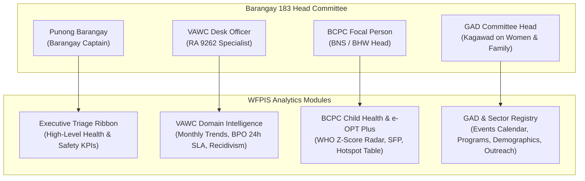
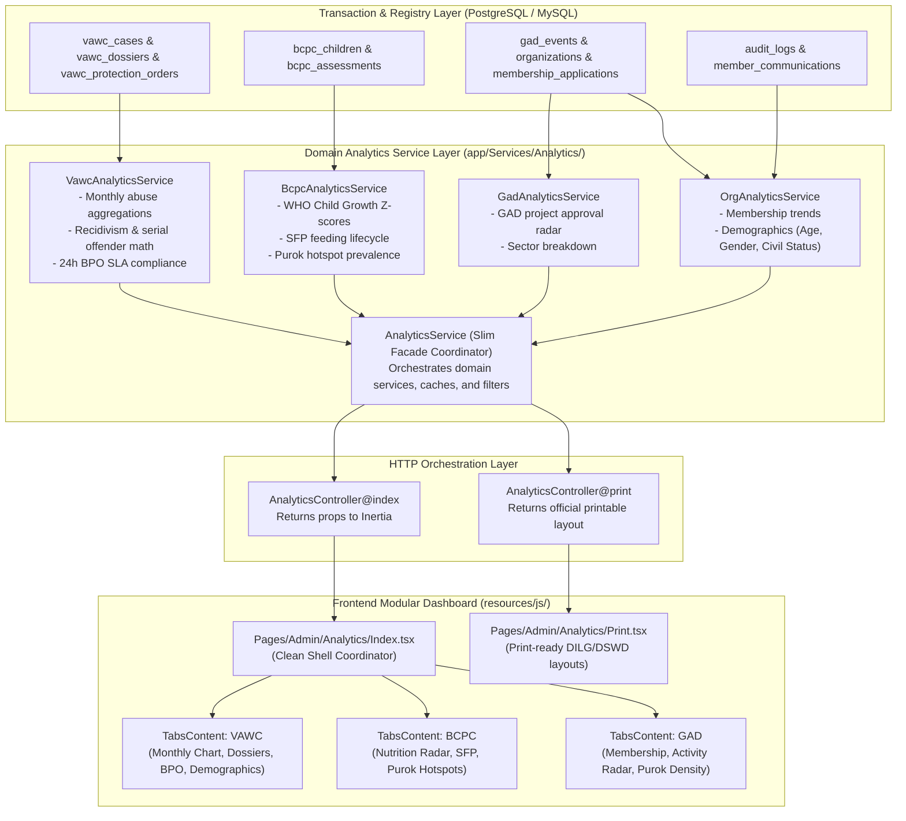

# 📊 OVERALL SYSTEM ANALYTICS & REPORTING ARCHITECTURE, WORKFLOW, AND PROCESS SPECIFICATION

> **Barangay 183, Pasay City — Women and Family Protection Information System (WFPIS)**  
> **System Modules Covered**: Violence Against Women and Their Children (VAWC), Barangay Council for the Protection of Children (BCPC), and Gender and Development (GAD)  
> **Key Stakeholders**: Punong Barangay, VAWC Desk Officer, BCPC Nutrition Focal Person, GAD Committee Head, Sangguniang Barangay Kagawad on Women and Family  
> **Primary Statutory Mandates**: Republic Act No. 9262 (Anti-VAWC Act of 2004), Republic Act No. 11037 (Masustansyang Pagkain para sa Batang Pilipino Act), PCW Guidelines on GAD Advocacy Programs & Community Events, Republic Act No. 11313 (Safe Spaces Act)  
> **Architectural Pattern**: Service-Oriented Domain Layer (SOA) + Atomic React/Inertia.js Widgets + Golden Rule of Clean Maintainability  

---

## 📑 Table of Contents
1. [Executive Summary & Core Architectural Tenets](#1-executive-summary--core-architectural-tenets)
2. [Barangay 183 Head Committee Decision-Support Matrix](#2-barangay-183-head-committee-decision-support-matrix)
3. [End-to-End Analytics & Reporting Pipeline](#3-end-to-end-analytics--reporting-pipeline)
4. [Statutory Domain Analytics Specifications](#4-statutory-domain-analytics-specifications)
   - [4.1 VAWC Intelligence (RA 9262 & RAVE Framework)](#41-vawc-intelligence-ra-9262--rave-framework)
   - [4.2 BCPC Child Health & e-OPT Plus Triage (RA 11037)](#42-bcpc-child-health--e-opt-plus-triage-ra-11037)
   - [4.3 GAD Program Impact & Sector Demographics (PCW Guidelines)](#43-gad-program-impact--sector-demographics-pcw-guidelines)
5. [Core Mathematical Formulations & Algorithms](#5-core-mathematical-formulations--algorithms)
6. [Backend Service Layer Architecture & Directory Structure](#6-backend-service-layer-architecture--directory-structure)
7. [Frontend Atomic Component Hierarchy & UI/UX Standards](#7-frontend-atomic-component-hierarchy--uiux-standards)
8. [Statutory Reporting & Official Print Engine](#8-statutory-reporting--official-print-engine)
9. [Golden Rules for Code Cleanliness & Maintenance](#9-golden-rules-for-code-cleanliness--maintenance)

---

## 1. Executive Summary & Core Architectural Tenets

The **System Analytics & Reporting Engine** of WFPIS is the central intelligence hub for Barangay 183. Rather than functioning as a passive data dump or basic CRUD counter, the analytics engine converts raw case blotters, child health assessments, and community program records into **actionable executive intelligence**.

### 🏛️ The Three Golden Architectural Tenets
1. **The Golden Rule of Structural Cleanliness**: No monolithic files exceeding 300 lines. The previously monolithic `AnalyticsService.php` (1,431 lines) and `Index.tsx` (560 lines) are decomposed into single-responsibility domain services and atomic visual widgets.
2. **Statutory Preservation ("Women Abuse by Month")**: The multi-category longitudinal chart tracking Physical, Sexual, Psychological, and Economic violence over 12 calendar months is strictly preserved as the primary indicator required by the Philippine National Police Women and Children Protection Center (PNP-WCPC) and DILG.
3. **Role-Based Scoped Intelligence**: 
   - **Barangay Administrators & Committee Heads**: Full cross-sectional access to VAWC case dossiers, child malnutrition registries, and community-wide GAD metrics.
   - **Accredited Organization Presidents**: Scoped strictly to their accredited entity's member demographics, applications, and proposed GAD initiatives.

---

## 2. Barangay 183 Head Committee Decision-Support Matrix

The dashboard is engineered specifically to answer the high-stakes statutory questions faced by Barangay 183's leadership:



| Stakeholder | Key Questions Addressed | Visual Component | Operational Action Trigger |
| :--- | :--- | :--- | :--- |
| **Punong Barangay** | Are statutory deadlines being breached? Are child malnutrition rates declining? | Top Executive Ribbon & Printable Statutory Report | Any BPO exceeding 24h SLA or Purok with >10% acute malnutrition triggers emergency coordination. |
| **VAWC Desk Officer** | Which abuse types are spiking this month? Who are our repeat offenders? Are BPOs being served on time? | `VawcMonthlyAbuseChart`<br/>`VawcDossierRecidivismCard`<br/>`VawcBpoMilestonesChart` | Multiple incidents under one dossier flag immediate safety planning and police coordination. |
| **BCPC Focal Person** | Which Puroks have the highest concentration of SAM/MAM children? How are children progressing in SFP? | `BcpcNutritionalRadarChart`<br/>`BcpcSfpOutcomesChart`<br/>`BcpcPurokHotspotsTable` | Any Purok flagged with Severe Acute Malnutrition receives immediate Supplementary Feeding enrollment. |
| **GAD Committee Head** | Are GAD advocacy events and community programs actively reaching and engaging accredited marginalized sectors (PWD, Solo Parents, Elderly)? | `GadMembershipTrendsChart`<br/>`GadMemberDemographicsChart`<br/>`GadActivityStatusCard` | Unrepresented sectors trigger community mobilization campaigns. |

---

## 3. End-to-End Analytics & Reporting Pipeline



---

## 4. Statutory Domain Analytics Specifications

### 4.1 VAWC Intelligence (RA 9262 & RAVE Framework)
The VAWC analytics module is designed to fulfill mandatory quarterly and annual reporting requirements for the **DILG Local Government Operations Officer (LGOO)** and **Philippine National Police Women and Children Protection Center (PNP-WCPC)**.

#### 1. Women Abuse by Month (Client Mandatory Core Feature)
- **Granularity**: 12 calendar months (Jan–Dec) filtered by active Year.
- **Categorization**: 
  - **Physical Violence**: Bodily harm, battery, physical intimidation.
  - **Sexual Violence**: Rape, sexual assault, unwanted touching, degradation.
  - **Psychological Violence**: Intimidation, emotional abuse, stalking, public ridicule.
  - **Economic Abuse**: Financial deprivation, denial of child support, asset withholding.
- **Visual Presentation**: High-contrast stacked/grouped bar chart (`VawcMonthlyAbuseChart.tsx`) with category toggle and monthly drilldown.

#### 2. Master Dossier Recidivism & Serial Offender Tracking
- **Total Dossiers**: Unique victim-perpetrator relationship files.
- **Recidivism Rate**: Percentage of dossiers having $>1$ recorded incidents.
- **Serial Perpetrators**: Offenders tied to multiple distinct survivors.
- **Compound Survivors**: Survivors who have reported abuse across multiple distinct relationships.

#### 3. Statutory BPO 24-Hour SLA Monitoring (RA 9262 Sec. 14)
- Tracks the statutory mandate that all BPO applications must be resolved (Issued or Referred) within **24 hours** of receipt.
- Monitors active 15-day efficacy periods, peace officer service confirmations, and violation incidents triggering court escalations (Temporary Protection Orders / Permanent Protection Orders).

---

### 4.2 BCPC Child Health & e-OPT Plus Triage (RA 11037)
Conforms strictly to National Nutrition Council (NNC) standards and Department of Health (DOH) guidelines for **Operation Timbang Plus (e-OPT Plus)**.

#### 1. WHO Child Growth Standards (Z-Score Distribution)
- **Weight-for-Age (WFA)**: Identifies Underweight and Severely Underweight children.
- **Height-for-Age (HFA)**: Identifies Stunted and Severely Stunted children.
- **Weight-for-Length/Height (WFL/H)**: Identifies Wasted, Severely Wasted, and Overweight/Obese children.
- **Double Burden of Malnutrition**: Flags children concurrently suffering from Stunting and Overweight/Obesity.

#### 2. Supplementary Feeding Program (SFP) Outcomes
- Tracks cohort progression across 120-day feeding cycles:
  - `Enrolled`: Currently receiving dietary supplementation.
  - `Graduated`: Attained normal weight and height for age.
  - `Completed`: Completed cycle awaiting endline measurement.
  - `Terminated`: Relocated or dropped out.

#### 3. Purok Malnutrition Hotspot Ranking
- Aggregates child assessment outcomes by Barangay 183 Puroks/Zones to identify geographic clusters requiring mobile kitchen deployments.

---

### 4.3 GAD Program Impact & Sector Demographics (PCW Guidelines)
Ensures structured tracking of the barangay's **Gender and Development (GAD) Calendar of Events**, community training programs, and accredited sector organizations.

#### 1. Accredited Organization Performance
- Active member counts, pending membership applications, and accreditation renewal statuses.
- Member demographic distributions: Age brackets (Youth 15–30, Adult 31–59, Senior 60+), Gender identity, and Civil Status.

#### 2. GAD Project Status Radar
- Tracks proposed, approved, and completed advocacy seminars, livelihood trainings, and health screenings.
- Member geographical density mapped across Puroks to ensure balanced community participation.

---

## 5. Core Mathematical Formulations & Algorithms

### 5.1 Recidivism Rate Formulation
$$\text{Recidivism Rate} = \left( \frac{\sum \text{Dossiers with Incident Count} > 1}{\text{Total Active Dossiers}} \right) \times 100$$

### 5.2 24-Hour BPO Statutory SLA Compliance Rate
$$\text{BPO SLA Compliance Rate} = \left( \frac{\text{Issued BPOs within 24 Hours}}{\text{Total BPO Applications Received}} \right) \times 100$$
*Where an application is considered breached if:*
$$\Delta t = (\text{issued\_datetime} - \text{created\_at}) > 86,400\text{ seconds}$$

### 5.3 Purok Malnutrition Prevalence Rate
$$\text{Purok Prevalence Rate} = \left( \frac{\text{Children with MAM or SAM or Stunted}}{\text{Total Monitored Children in Purok}} \right) \times 100$$

### 5.4 WHO Child Growth Z-Score Calculation (Weight-for-Age)
For child weight $W$, reference median $M$, coefficient of variation $S$, and Box-Cox power $L$:
$$Z = \frac{\left( \frac{W}{M} \right)^L - 1}{L \cdot S}$$
- **Normal**: $-2 \le Z \le +2$
- **Underweight**: $-3 \le Z < -2$
- **Severely Underweight**: $Z < -3$

---

## 6. Backend Service Layer Architecture & Directory Structure

To uphold the **Golden Rule of Software Cleanliness**, the backend architecture transitions from a single monolithic file to dedicated domain services under `app/Services/Analytics/`:

```
app/
├── Http/Controllers/Admin/
│   └── AnalyticsController.php           <-- Thin HTTP Orchestrator (<130 lines)
└── Services/
    ├── AnalyticsService.php              <-- Facade Coordinator (<120 lines)
    └── Analytics/
        ├── VawcAnalyticsService.php      <-- VAWC & RA 9262 Data Engine
        ├── BcpcAnalyticsService.php      <-- BCPC & e-OPT Plus Data Engine
        ├── GadAnalyticsService.php       <-- GAD Events & Programs Engine
        └── OrgAnalyticsService.php       <-- Member Demographics & Sector Engine
```

### Coordinator Interface Pattern (`AnalyticsService.php`)
```php
class AnalyticsService
{
    public function __construct(
        protected VawcAnalyticsService $vawc,
        protected BcpcAnalyticsService $bcpc,
        protected GadAnalyticsService $gad,
        protected OrgAnalyticsService $org
    ) {}

    public function getRibbonStats(int $year): array
    {
        return [
            'total_vawc'      => $this->vawc->getTotalCases($year),
            'total_dossiers'  => $this->vawc->getTotalDossiers(),
            'active_bpos'     => $this->vawc->getActiveBposCount(),
            'recidivism_rate' => $this->vawc->getRecidivismRate(),
            'total_bcpc'      => $this->bcpc->getTotalChildrenCount(),
            'total_gad'       => $this->gad->getEventsCount($year),
            'total_orgs'      => $this->org->getTotalOrgsCount(),
            'resolution_rate' => $this->vawc->getResolutionRate($year),
            'sla_rate'        => $this->vawc->getSlaRate($year),
        ];
    }
    // Direct delegators to preserve 100% backward compatibility
}
```

---

## 7. Frontend Atomic Component Hierarchy & UI/UX Standards

The frontend dashboard (`resources/js/pages/Admin/Analytics/Index.tsx`) follows the **Atomic Design Philosophy**, limiting any single file to under 200 lines and grouping components strictly by domain:

```
resources/js/components/Admin/Analytics/
├── Shared/
│   ├── AnalyticsHeader.tsx          // Year filter, Org selector, Print action
│   ├── AnalyticsRibbon.tsx          // 4-card high level executive metric ribbon
│   └── MetricStatCard.tsx           // Styled atomic card with badges & subtext
├── Vawc/
│   ├── VawcStatutoryKpis.tsx        // 6-Card Executive Ribbon for VAWC
│   ├── VawcMonthlyAbuseChart.tsx    // [CLIENT MANDATORY] Women Abuse by Month
│   ├── VawcDossierRecidivismCard.tsx// Dossier recidivism & serial perpetrator list
│   ├── VawcBpoMilestonesChart.tsx   // 24-hr SLA & 15-day expiration tracker
│   ├── VawcRiskDistributionChart.tsx// RAVE High/Medium/Low severity chart
│   ├── VawcThreatIndicatorsChart.tsx// Specific lethal threat factors
│   ├── VawcGeographicalDensityChart.tsx // Purok VAWC incident density
│   ├── VawcVictimDemographicsChart.tsx  // Age brackets & vulnerability metrics
│   └── VawcRelationshipProtocolChart.tsx // Perpetrator relation matrix
├── Bcpc/
│   ├── BcpcNutritionalRadarChart.tsx// WHO z-score multi-axis radar chart
│   ├── BcpcSfpOutcomesChart.tsx     // SFP feeding cycle graduation funnel
│   └── BcpcPurokHotspotsTable.tsx   // Purok Malnutrition ranking table
└── Gad/
    ├── GadMembershipTrendsChart.tsx // Monthly application approval trend
    ├── GadMemberDemographicsChart.tsx // Age, Gender, Civil Status donuts
    ├── GadPurokDistributionChart.tsx // Member Purok density bar chart
    └── GadActivityStatusCard.tsx    // GAD project approvals & sector status
```

---

## 8. Statutory Reporting & Official Print Engine

The system features a dedicated, print-optimized reporting view accessible via `/admin/analytics/print?year={year}`:
- **Format**: Letter / A4 with clean paginated headers, Philippine Republic official seals, and Barangay 183 insignia.
- **Sections**:
  1. **Executive Summary & Ribbon Overview**
  2. **Statutory RA 9262 Report** (including the official table of **Women Abuse by Month** across Physical, Sexual, Psychological, and Economic categories).
  3. **Master Dossier Recidivism & BPO SLA Compliance Audit**.
  4. **RA 11037 Child Nutrition & e-OPT Plus Assessment Summary**.
  5. **GAD Calendar of Events, Community Programs & Organization Accomplishments**.
  6. **Sign-off Block**: Prepared by VAWC/BCPC/GAD Focal Persons; Noted and Approved by the Punong Barangay.

---

## 9. Golden Rules for Code Cleanliness & Maintenance

1. **Max 250 Lines Per File**: Any React component or PHP service exceeding 250 lines must be split into atomic sub-partials.
2. **Zero Code Duplication**: Calculations such as BPO SLA, Recidivism, and Malnutrition rates are defined once in their respective domain service and reused across both Web and Print layouts.
3. **No Placeholders or Dummy Fallbacks**: When real data exists in the database, queries reflect true live state. When counts are zero, clean empty states ("0 recorded cases") are rendered rather than arbitrary mock data.
4. **Accessible, High-Contrast UI/UX**: Dark and light mode compatibility with accessible font sizing, clear tooltips on chart data points, and descriptive semantic tags for screen readers.
