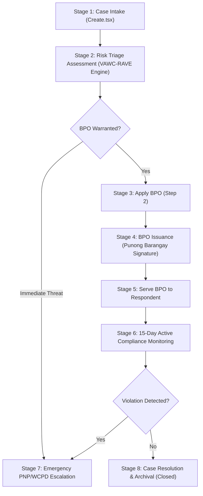

# 📜 Barangay VAWC Desk System Manual & RA 9262 Statutory Operational Guide

> **Legal Mandate**: Republic Act No. 9262 (*Anti-Violence Against Women and Their Children Act of 2004*)  
> **System Scope**: Municipal & Barangay Women and Family Protection Information System (WFPIS)  
> **Target Audience**: Barangay VAWC Desk Officers, Punong Barangays, Social Workers, System Administrators, Capstone Review Panel  

---

## 🏛️ Executive Summary & Statutory Alignment

The **Barangay Violence Against Women and Children (VAWC) Desk System** is an enterprise-grade digital management platform designed to automate, streamline, and enforce statutory compliance for domestic violence case intake, risk triage assessment, Barangay Protection Order (BPO) issuance, service delivery, compliance monitoring, and inter-agency escalation.

---

## 📋 End-to-End Case Progression Lifecycle

### Stage 1: Case Intake (`Create.tsx`)
- **Purpose**: Record incoming survivor disclosures or third-party reports.
- **Intake Modes**:
  - **Direct Intake**: Survivor personally files the report.
  - **Third-Party Intake**: Neighbor, relative, or barangay official reports on survivor's behalf.
- **Key Data Elements**:
  - **Survivor Profile**: Full Name, Age, Gender, Civil Status, Contact, Address, Occupation.
  - **Respondent (Perpetrator) Profile**: Full Name, Age, Relationship to Victim, Physical Marks & Description (*John Doe Protocol fallback supported for unknown respondents*).
  - **Incident Metadata**: Exact Date/Time (PST UTC+8), Location (Zone ID), Type of Abuse (Physical, Sexual, Psychological, Economic).
  - **Threat Risk Signals**: Children Present Count, Weapons Confiscated/Involved, History of Repeat Abuse.
- **User Actions**:
  1. Complete multi-step form fields.
  2. Click **Save Case**.
  3. System prompts confirmation dialog: *"Are you sure you want to save case?"*
  4. Upon confirmation, system generates a unique Case Number (e.g. `VAWC-2026-0190`) and redirects to **Triage Action Center** with a success notification.

---

### Stage 2: Triage Assessment (`Show.tsx` / `Dashboard.tsx`)
- **Purpose**: Execute real-time risk assessment algorithm (**VAWC-RAVE Engine**).
- **Risk Score Algorithm (0–12 Points)**:
  - **High Risk Triggers**: Weapon threats (+3), Repeat domestic violence history (+3), Children present (+2), Physical injuries (+2), Perpetrator present at scene (+2).
- **Risk Level Triage Categories**:
  - 🚨 **CRITICAL / HIGH (Score 8–12)**: Immediate rescue priority; automatic red highlight badge.
  - ⚠️ **MODERATE (Score 5–7)**: Expedited BPO processing and counseling referral.
  - 🛡️ **LOW (Score 0–4)**: Standard intervention and monitoring.
  - ⏳ **PENDING**: Initial intake awaiting risk calculation.

---

### Stage 3: BPO Application (`Step 2: Apply BPO`)
- **Purpose**: Formally log a request for a Barangay Protection Order under RA 9262 Section 14.
- **System Action**:
  - Updates `vawc_protection_orders.status` to `Applied`.
  - Updates `vawc_cases.status` to `BPO Processing`.
  - Starts the statutory **Same-Day Issuance SLA Timer**.

---

### Stage 4: BPO Issuance & Same-Day SLA (`Step 3: BPO Issued`)
- **Purpose**: Official approval and signature by the Punong Barangay or designated Kagawad.
- **Statutory Requirement**:
  - RA 9262 mandates that BPOs **must be issued on the same day** of application.
- **System Action**:
  - Updates `vawc_protection_orders.status` to `Issued`.
  - Calculates 15-day expiration timer (`issued_datetime + 15 days`).
  - Flags `is_sla_breached = true` if issued date differs from application date.
  - Updates master case status to `BPO Processing` with BPO sub-badge `BPO ISSUED`.

---

### Stage 5: BPO Service Delivery (`Step 4: Serve BPO`)
- **Purpose**: Officially serve the BPO to the respondent (perpetrator).
- **Service Methods**:
  - **Personal Service**: Delivered in person by Barangay Tanod / Desk Officer.
  - **Substituted Service**: Received by a family member or posted at respondent's residence.
- **System Action**:
  - Records Server Officer ID, Recipient Name, Service Method, and Timestamp.
  - Updates `vawc_protection_orders.status` to `Served`.
  - Updates master case status to `BPO Processing` with BPO sub-badge `BPO SERVED`.

---

### Stage 6: Active Compliance Monitoring (`Step 5: Monitoring`)
- **Purpose**: Track respondent compliance during the mandatory 15-day BPO protection period.
- **Desk Officer Check-Ins**:
  - Officer logs periodic compliance sessions (`VawcComplianceLog`).
  - Records survivor safety status, counseling needs, and DSWD referrals.
- **System Action**:
  - Advance `vawc_cases.status` to **`Monitoring`**.

---

### Stage 7: Legal Escalation / Transmittal (`Step 6: Escalated`)
- **Purpose**: Mandatory escalation to law enforcement if BPO terms are breached.
- **Statutory Protocol**:
  - Breach of BPO constitutes a criminal offense under RA 9262 Section 15.
- **System Action**:
  - Transmits electronic referral log to **PNP Women and Children Protection Desk (WCPD)** or Municipal Prosecutor.
  - Updates `vawc_cases.status` to **`Escalated`**.

---

### Stage 8: Case Archival & Closure (`Step 7: Closed`)
- **Purpose**: Formal archival of resolved cases.
- **Closure Reasons**:
  - *15-Day BPO Period Lapsed Without Incident*, *Court Protection Order (TPO/PPO) Issued*, *Amicable Settlement (Non-violent disputes only)*.
- **System Action**:
  - Updates `vawc_cases.status` to **`Closed`**.
  - Case moves from **Active Registry** to **Closed / Archived Records** view in `Index.tsx`.

---

## 📊 Dual-Status Architecture Reference Table

To prevent confusion between overall case stages and protection order milestones, the system uses a **Dual-Status Model**:

| Workflow Stage | Master Case Status (`vawc_cases.status`) | BPO Sub-Status (`vawc_protection_orders.status`) | Registry Visual Badge |
| :--- | :--- | :--- | :--- |
| **Intake / Assessment** | `Intake` | *None* | `INTAKE` |
| **BPO Application** | `BPO Processing` | `Applied` | `BPO PROCESSING` · `BPO FILED` |
| **BPO Issuance** | `BPO Processing` | `Issued` | `BPO PROCESSING` · `BPO ISSUED` |
| **BPO Service** | `BPO Processing` | `Served` | `BPO PROCESSING` · `BPO SERVED` |
| **Active Monitoring** | `Monitoring` | `Served` | `MONITORING` · `BPO SERVED` |
| **PNP Escalation** | `Escalated` | `Served` / `Revoked` | `ESCALATED` |
| **File Archival** | `Closed` | `Expired` | `CLOSED` |

---

## 🎓 Capstone Panel Defense Q&A Reference

### Q1: "How does the system enforce RA 9262 statutory compliance?"
> *"The system enforces RA 9262 by tracking same-day BPO issuance SLAs, logging 15-day expiration boundaries, enforcing John Doe perpetrator descriptions for unknown offenders, and providing direct escalation paths to the PNP WCPD upon BPO breach."*

### Q2: "Why are victim names prominent (16px) in the Triage Action Center?"
> *"Desk officers operating in high-stress crisis centers need immediate visual recognition of survivors. Using a 16px font hierarchy (`text-base font-extrabold`) alongside 24px risk scores reduces cognitive load and accelerates emergency response."*

### Q3: "How does the registry handle database filtering without visual conflicts?"
> *"The Master Registry uses eager-loaded polymorphic queries (`orWhereHas('protectionOrders')`) to filter across both master case stages and protection order sub-statuses, displaying dual badges (`MONITORING` + `BPO SERVED`) so officers have complete visual clarity."*
