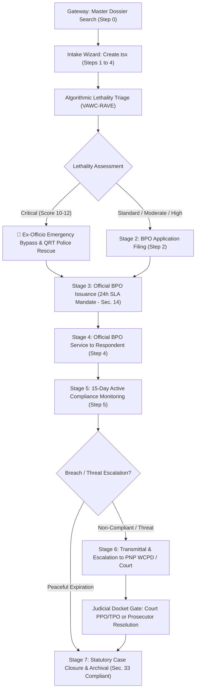

# 📜 Barangay VAWC Desk System Manual & RA 9262 Statutory Operational Guide

> **Legal Mandate**: Republic Act No. 9262 (*Anti-Violence Against Women and Their Children Act of 2004*)  
> **Implementing Guidelines**: DILG-DSWD-DOH-DepEd-PCW Joint Memorandum Circular on Barangay VAW Desk Operations  
> **Child Welfare Intersections**: Republic Act No. 7610 (*Special Protection of Children Against Abuse, Exploitation and Discrimination Act*)  
> **System Scope**: Municipal & Barangay Women and Family Protection Information System (WFPIS)  
> **Target Audience**: Barangay VAWC Desk Officers, Punong Barangays, Social Workers, System Administrators, Defense Review Panel  

---

## 🏛️ Executive Summary & Statutory Architecture

The **Barangay Violence Against Women and Children (VAWC) Desk System** is an enterprise-grade digital platform engineered to automate, monitor, and enforce strict statutory compliance across domestic violence case intake, algorithmic risk triage, Barangay Protection Order (BPO) processing, service delivery, compliance monitoring, and inter-agency escalation.



---

## 🏗️ Clean Modular Frontend System Architecture

To guarantee code maintainability, testability, and high-performance execution, monolithic files (`Create.tsx` 1,700+ lines, `Show.tsx` 2,000+ lines) have been decomposed into a **Hook-Driven Component Hierarchy**:

### 1. New Incident Intake Architecture (`pages/Admin/Vawc/Create.tsx`)
The intake system operates under the **"Search First, Encode Second"** rule, organized into distinct sub-components coordinated by the `useVawcCreateWorkflow` custom hook:

```
resources/js/
├── hooks/
│   └── useVawcCreateWorkflow.ts          # State management, Inertia useForm, debounced searches, validation
└── pages/Admin/Vawc/
    ├── Create.tsx                        # Master Orchestrator Shell (< 240 lines)
    └── Partials/Create/
        ├── types.ts                      # Interfaces, Props, PreselectedDossier contract
        ├── CreateHeader.tsx              # Unboxed header, RA 9262 badge, cancellation link
        ├── DossierSearchGateway.tsx      # Step 0: Real-time Master Dossier live search
        ├── Step1Survivor.tsx             # Step 1: Intake mode, Sec. 44 anonymity, victim demographics
        ├── Step2Incident.tsx             # Step 2: Datetime boundary, zone, abuse type, RA 7610 children
        ├── Step3Respondent.tsx           # Step 3: Perpetrator profile, serial match banner, legal relations
        ├── Step4Verify.tsx               # Step 4: Multi-agency transmittals, remedies sought, witnesses
        └── CreateConfirmModal.tsx        # Statutory pre-submission review & confirmation dialog
```

### 2. Case Management & BPO Control Center Architecture (`pages/Admin/Vawc/Show.tsx`)
The post-intake lifecycle is managed through modular stage cards coordinated by `useVawcCaseWorkflow`:

```
resources/js/
├── hooks/
│   └── useVawcCaseWorkflow.ts            # Form states, API post handlers, SLA timer watchers
└── pages/Admin/Vawc/
    ├── Show.tsx                          # Case Control Center Orchestrator (< 240 lines)
    └── Partials/Show/
        ├── Stages/
        │   ├── Step1TriageChecklist.tsx  # Stage 1: Algorithmic lethality scoring & danger indicators
        │   ├── Step2BpoApplication.tsx   # Stage 2: BPO application filing with chronological checks
        │   ├── Step3BpoIssuance.tsx      # Stage 3: Same-Day 24h SLA compliance analyzer
        │   ├── Step4BpoService.tsx       # Stage 4: Substituted/Personal service recording
        │   ├── Step5Resolution.tsx       # Stage 5: 15-day compliance monitoring & escalation trigger
        │   └── VawcMonitoringLogSection.tsx # Log entries for tanod visits and compliance checks
        └── Modals/
            ├── VawcCloseCaseModal.tsx    # Sec. 33 anti-conciliation enforcement & judicial gate
            └── VawcReferralModal.tsx     # External agency transmittal slip generator
```

---

## ⚖️ Legal Bases & Qualifying Relationship Taxonomy (RA 9262 Sec. 3)

### The Legal Gate for Intimate Relationships
Under Section 3 of Republic Act 9262, the crime of Violence Against Women and Their Children can **only** be committed against a woman who is the offender's wife, former wife, or with whom the offender has or had a sexual or dating relationship, or with whom he has a common child.

> [!IMPORTANT]
> **Strict Statutory Exclusion:**
> The option `"Other Household Relative (with custody/care)"` has been **completely removed** from the system. If a relative (e.g., uncle, cousin, in-law) abuses a woman or child without an intimate/marital relationship, the offense does **NOT** fall under RA 9262. It must be encoded under **RA 7610** (Child Abuse) or Physical Injuries under the Revised Penal Code.

### Preserved Qualifying Categories in System Dropdown:
1. **Spouse (Legal Husband/Wife)**: Current legal marriage.
2. **Former Spouse (Separated/Annulled)**: Legally separated or annulled marriage.
3. **Common-Law / Live-in Partner**: Cohabiting without legal marriage.
4. **Former Live-in Partner**: Past cohabitation.
5. **Parent of Common Child**: Shared biological or legally acknowledged child regardless of past marriage or cohabitation.
6. **Dating / Romantic / Sexual Partner**: Current dating relationship as defined in RA 9262 Sec. 3(e).
7. **Former Dating Partner**: Past dating relationship.

---

## 📋 Comprehensive Case Progression Lifecycle

### Step 0 & Step 1: Master Dossier Gateway & Survivor Registration
- **"Search First, Encode Second" Policy**: Before typing new data, desk officers query the live Master Dossier registry (`/admin/vawc/dossiers/search`).
- **Chain of Custody Lock**: When an incident is linked to an existing Master Dossier (`DOS-YYYY-XXXX`), the survivor's legal name and perpetrator's name are **read-only and locked** to preserve legal evidence integrity across repeat offenses.
- **Decoupled Registry Live Searches**:
  - Independent live searches for survivors (`/admin/vawc/survivors/search`) and perpetrators (`/admin/vawc/respondents/search`) allow auto-populating historical demographics even when creating a brand new dossier.
- **Cross-Dossier Serial Perpetrator Alert**:
  - If a respondent's name matches past domestic abuse cases under *other* survivor dossiers, the system displays a prominent warning banner and automatically links the perpetrator's history, elevating the triage lethality score while maintaining victim privacy.
- **Section 44 Confidential Informant Protection**:
  - Whistleblower switch (`is_anonymous`) shields third-party reporting neighbors or barangay officials from retaliatory violence.

### Step 2: Incident Facts & Minor Children Safeguards
- **Chronological Boundary Limit**:
  - Incident datetime cannot exceed current server time (`max = now()`).
  - Datetimes older than 30 days trigger an informative **Historical Incident Advisory** referencing RA 9262 Section 24 (10 to 20-year prescriptive period).
- **Minor Children Coverage (RA 7610 & RA 9262 Sec. 8)**:
  - Supports dynamic registration of all children present during the incident (Full Name, Age, School or Daycare).
  - Listing the child's school/daycare center ensures specific statutory stay-away radius orders are automatically inserted into the Barangay Protection Order (BPO).

### Step 3: Respondent Profile & Intimate Qualification
- Enforces strict selection from the 7 statutory RA 9262 intimate relationship categories.
- Records physical descriptions (height, build, tattoos, distinct scars) for enforcement and tanod surveillance.

### Step 4: Verification, Inter-Agency Transmittals & Statutory Remedies
- **Inter-Agency Referral Transmittal Matrix**:
  - Immediate formal transmittals can be checked:
    1. **DSWD / MSWDO**: Social welfare, temporary protective custody, shelter placement.
    2. **PNP WCPD**: Women & Children Protection Desk criminal investigation.
    3. **Hospital / Medico-Legal**: Formal clinical examination & injury documentation.
    4. **PAO / Legal Aid**: Free legal counseling and court TPO/PPO petition filing.
    5. **Barangay VAW Desk**: Community surveillance & perimeter patrols.
    6. **LGU Crisis Center**: Emergency shelter accommodation.
- **Survivor Remedies Sought**: Immediate relief checklist (BPO, Temporary Custody, Medico-Legal, Criminal Prosecution, Tanod Security, Psychosocial Counseling).
- **Corroborating Witness Statements**: Direct recording of neighbor, official, or eyewitness testimonies to solidify BPO issuance.

---

## 🛡️ BPO Processing, Service, and Monitoring

### Stage 2: BPO Application Filing
- **Application Datetime Presets**: `[+30m from Incident]`, `[Same as Incident]`, `[Current Time]`.
- **Status State**: Transitions to **`Application Pending`** (prevents premature "Under Monitoring" designation). Starts the statutory 24-hour SLA timer.

### Stage 3: Official BPO Issuance (24-Hour SLA Mandate - Sec. 14)
- **Legal Rule**: Punong Barangay or designated Kagawad must issue the BPO within **24 hours** of application.
- **Real-Time SLA Health Analyzer**:
  - 🟢 **Green (Compliant)**: Issued within 0 to 24 hours of application filing.
  - 🟡 **Amber (Breach Warning)**: Displays official statutory warning if issuance exceeds 24 hours; permanently records `is_sla_breached = true` in the audit database.
  - 🔴 **Red (Chronological Error)**: Blocks issuance if dated prior to application filing.
- **Order Validity**: Strictly fixed to **15 calendar days** from issuance datetime.

### Stage 4: Service of BPO to Respondent
- Executed via **Personal Service** or **Substituted Service** (left at residence with person of sufficient age/discretion).
- Datetime validation: Service must be dated at or after BPO issuance.
- Transitions status to **`Under Monitoring`**.

### Stage 5: 15-Day Active Compliance Monitoring
- Desk officers log continuous check-ins (home visit, phone check, desk interview).
- Every log captures: `is_compliant`, `survivor_reported_safe`, detailed notes, and referral status.

---

## 🛑 The Jurisdictional Gate & Case Closure Rules

### Strict Prohibition of Conciliation (RA 9262 Section 33)
> Under Section 33 of RA 9262, **conciliation and amicable settlement are strictly prohibited**. Barangay officials who attempt to reconcile the parties face administrative sanctions. Consequently, `"Amicable Settlement"` is physically excluded from all system closure options.

### The Two Legally Recognized Closure Routes:
1. **Administrative Expiration Path (Unviolated 15-Day BPO)**:
   - Permitted only if the 15-day BPO has lapsed peacefully with zero reported violations, and survivor confirms safety or case is transferred to CSWDO.
2. **Judicial Resolution Gate (Escalated Path)**:
   - Once a case is escalated to the PNP WCPD or Family Court due to BPO violation or high lethality, **the barangay loses local disposition authority** under the Public Crime Doctrine.
   - The standard "Close Case" button is locked. Archival requires recording mandatory judicial credentials:
     - **Court Docket / Resolution Number** (e.g., `Crim. Case No. 2026-8812`)
     - **Issuing Court / Prosecutor Entity** (e.g., `RTC Branch 11 Family Court`)
     - **Resolution Date & Judicial Findings**
     - Permitted grounds: Court Issued Permanent Protection Order (PPO), Court Issued Temporary Protection Order (TPO), Prosecutor Formal Information Filed, or Judicial Dismissal.

---

## 🛡️ Dual-Timestamp Statutory Audit Standard

| Timestamp Attribute | System Column | Legal Purpose |
| :--- | :--- | :--- |
| **Process Datetime** | `process_timestamp` | The true historical occurrence date (crime date, filing date, service date). Drives SLA calculations and legal prescriptive periods. |
| **System Audit Datetime** | `created_at` | Immutable server timestamp recording the exact second the officer persisted the record. Proves chain of custody in court. |

**Audit Badge Logic**:
- **Retroactive Log**: Displayed when $| \text{Process Datetime} - \text{System Datetime} | > 24\text{ hours}$.
- **Live Intake**: Displayed when record is saved concurrently with desk interview.

---

## 🎓 Quick Panel Defense Talking Points

1. **"Why was 'Other Household Relative' deleted?"**
   > *"Under Section 3 of RA 9262, VAWC crimes strictly require an intimate, marital, dating, or common-child relationship. Offenses by non-intimate relatives against household members are properly prosecuted under RA 7610 or Physical Injuries under the RPC. Removing this option ensures our system strictly complies with the statutory definition of VAWC."*

2. **"Why are Create.tsx and Show.tsx decomposed into partials?"**
   > *"We adhered to the Single Responsibility Principle (SRP) and custom React hooks. `Create.tsx` and `Show.tsx` act as clean orchestrators (< 240 lines), while individual steps (demographics, incident facts, BPO issuance, compliance monitoring) are encapsulated in isolated components under `Partials/Create/` and `Partials/Show/` with dedicated hooks managing business logic."*

3. **"How does the system ensure chain of custody for repeat offenders?"**
   > *"Through our Master Dossier pattern. Once a dossier is established, subsequent incidents are indexed sequentially (Incident #2, #3). When a Master Dossier is attached, survivor and respondent identities are legally locked to preserve evidentiary integrity across repeated disclosures."*
