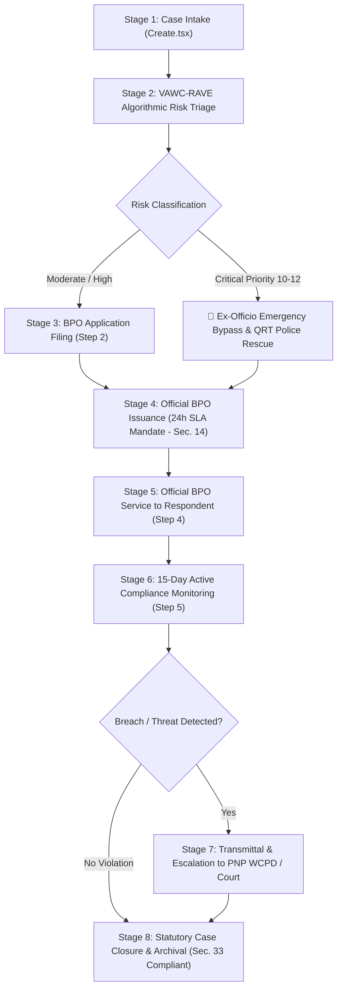

# 📜 Barangay VAWC Desk System Manual & RA 9262 Statutory Operational Guide

> **Legal Mandate**: Republic Act No. 9262 (*Anti-Violence Against Women and Their Children Act of 2004*)  
> **Implementing Guidelines**: DILG-DSWD-DOH-DepEd-PCW Joint Memorandum Circular on Barangay VAW Desk Operations  
> **System Scope**: Municipal & Barangay Women and Family Protection Information System (WFPIS)  
> **Target Audience**: Barangay VAWC Desk Officers, Punong Barangays, Social Workers, System Administrators, Capstone Review Panel  

---

## 🏛️ Executive Summary & Statutory Framework

The **Barangay Violence Against Women and Children (VAWC) Desk System** is an enterprise-grade digital platform engineered to automate, monitor, and enforce strict statutory compliance across domestic violence case intake, algorithmic risk triage, Barangay Protection Order (BPO) processing, service delivery, compliance monitoring, and inter-agency escalation.

---

## 📋 End-to-End Case Progression Lifecycle

### Stage 1: Case Intake & Registration (`Create.tsx`)
- **Statutory Authority**: RA 9262 Section 14 (Applications for BPO) and Barangay VAW Desk Intake Protocols.
- **Intake Modes**:
  - **Direct Intake**: Survivor personally files the disclosure at the VAW Desk.
  - **Ex-Officio / Third-Party Intake**: Authorized under RA 9262 Sec. 14 when the victim is incapacitated or in acute peril. Filed by a Barangay Kagawad, Social Worker, Police Officer, or Guardian.
- **Survivor & Respondent Profile**:
  - Full demographics, contact details, physical description, relationship to respondent.
  - *Confidentiality Protocol (RA 9262 Sec. 44)*: Client-side identity redaction (`isRedacted`) masks sensitive names and addresses to unauthorized viewers while maintaining legal auditability.
  - *Anonymous / Whistle-Blower Shield*: Supports anonymous reporting (`is_anonymous = true`) for vulnerable complainants.
- **Master Dossier Pattern (Recidivism Engine)**:
  - Automatically identifies repeat offenders and recurrent survivor victimization, assigning persistent Master Dossier numbers (`DOS-YYYY-XXXX`) and sequential sub-case incident tracking (`VAWC-YYYY-XXXX-01`, `-02`, etc.).

---

### Stage 2: VAWC-RAVE Algorithmic Risk Triage
- **Evaluation Matrix (0–12 Points)**:
  - High-lethality triggers: Weapon access/use (+3), Repeat domestic violence history (+3), Death threats/strangulation (+2), Severe physical injury requiring medical triage (+2), Perpetrator present at scene (+2).
- **Triage Classifications**:
  - 🚨 **CRITICAL (Score 10–12)**: **Emergency Ex-Officio Rescue Protocol**. Unlocks immediate QRT police rescue payload, warrantless arrest assistance, and bypasses bureaucratic waiting.
  - 🟠 **HIGH (Score 7–9)**: Expedited BPO issuance, Punong Barangay immediate notification, and CSWDO emergency shelter coordination.
  - 🟡 **MODERATE (Score 4–6)**: Standard BPO processing and active social worker counseling.
  - 🔵 **LOW (Score 0–3)**: Routine intake processing and standard monitoring.

---

### Stage 3: BPO Application Filing (`Step 2: Apply BPO`)
- **Statutory Mandate**: RA 9262 Section 14 relief (ordering respondent to cease violence, stay away from victim's home/workplace).
- **Smart Offset Cascading**:
  - Defaults to `Incident Date + 30 minutes` for historical cases, or `Current Time` for live intake.
  - Quick Presets: `[+30m from Incident]`, `[Same as Incident]`, `[Current Time]`.
- **Chronological Boundary Limit**:
  - `min = Incident DateTime` (prevents mathematical time travel prior to the crime).
  - `max = Current Server DateTime` (prevents filing in the future).
- **Status State**: System transitions to **`Application Pending`** (prevents premature "Under Monitoring" designation). Starts the statutory 24-hour SLA timer.

---

### Stage 4: Official BPO Issuance & The 24-Hour SLA Mandate (`Step 3: Issue BPO`)
- **Statutory Requirement (RA 9262 Section 14)**:
  - *"A Punong Barangay or designated Kagawad must issue the Barangay Protection Order within twenty-four (24) hours of application filing."*
- **Issuance Logic & Real-Time SLA Health Analyzer**:
  - Defaults to `Application Date + 2 hours` (standard executive review and signature window).
  - Quick Presets: `[+1 Hour]`, `[+2 Hours (Recommended)]`, `[+4 Hours]`, `[Current Time]`.
  - **Red Alert (Chronological Violation)**: Blocks submission if issuance is dated before application filing.
  - **Green Alert (SLA Compliant)**: Confirms compliance when issued within 0 to 24 hours of filing.
  - **Amber Alert (SLA Breach Warning)**: Displays official statutory warning if issuance exceeds 24 hours; permanently logs `is_sla_breached = true` in the statutory audit database.
- **Protective Validity Clock**: Locked to 15 days effective immediately upon issuance (`expiration_date = issued_datetime + 15 days`).

---

### Stage 5: BPO Service to Respondent (`Step 4: Serve BPO`)
- **Execution**: Served by Barangay Tanod, PNP officer, or authorized server.
- **Methods**: `Personally Received` or `Left at Residence (Substituted Service)`.
- **Chronological Constraint**: Service datetime cannot be dated prior to official BPO issuance (`served_datetime >= issued_datetime`).
- **Quick Presets**: `[+2 Hours from Issuance]`, `[+4 Hours]`, `[+24 Hours (Next Day)]`, `[Current Time]`.

---

### Stage 6: Active Compliance Monitoring (`Step 5: Monitoring`)
- **State Transition**: Case status officially advances to **`Under Monitoring`** only after BPO has been successfully served.
- **Monitoring Scope (15-Day Protection Window)**:
  - Desk officers record in-person home visits, phone check-ins, and office check-ins.
  - Structured fields: `is_compliant`, `survivor_reported_safe`, `notes`, and psychosocial counseling referrals.

---

### Stage 7: Legal Transmittal & Escalation (`Step 6: Referral / Escalation`)
- **Trigger**: Non-compliance with BPO or high-risk threat escalation.
- **Statutory Penalty**: Under RA 9262 Section 15, violation of a BPO is a criminal offense punishable by imprisonment of 30 days without prejudice to criminal charges for the underlying acts of violence.
- **System Action**:
  - Electronic transmittal and PDF transmittal package generated for **PNP Women and Children Protection Desk (WCPD)** and Prosecutor's Office.
  - Case file remains preserved in read-only format at the Barangay level to support subsequent court hearings (TPO/PPO).

---

### Stage 8: Statutory Case Closure & Archival (`Step 7: Close Case`)
- **STRICT STATUTORY RULE — PROHIBITION OF CONCILIATION (RA 9262 Section 33)**:
  - Under Section 33 of RA 9262, **conciliation and amicable settlement are strictly illegal** for offenses punishable under the Anti-VAWC Act.
  - **"Amicable Settlement / Conciliation" is strictly excluded from system options.**
- **The 7 Legally Verified Closure Grounds**:
  1. `15-Day Protection Order Lapsed Successfully (No Violation)`
  2. `Referred to Family Court / PAO for TPO/PPO Application (Section 15)`
  3. `Referred to Social Welfare for Sustained Intervention (Monitoring Complete)`
  4. `Court Issued Permanent Protection Order (PPO)`
  5. `Case Dismissed by Prosecutor`
  6. `Victim Withdrew / Relocated out of Jurisdiction`
  7. `Administrative Dismissal (Lack of Legal Merit / No Veracity)`

---

## 🛡️ The Dual-Timestamp Statutory Audit Standard

To defend the system during panel evaluation and judicial accreditation against questions of retrospective data entry:

| Timestamp Attribute | Description | Legal Function |
| :--- | :--- | :--- |
| **Process Datetime** (`process_timestamp`) | The verified historical occurrence date of the crime, filing, signing, service, or check-in. | Calculates 15-day order validity, 24-hour statutory SLAs, and evidence timelines. |
| **System Audit Datetime** (`created_at`) | The immutable server timestamp capturing the exact second the officer saved the digital record. | Proves chain of custody, data integrity, and authenticates operator entry. |

### Visual Audit Badges:
- **Historical Back-Encoding (Retroactive Log)**: Automatically badged when $| \text{Process Datetime} - \text{System Datetime} | > 24\text{ hours}$.
- **Live Real-Time Intake (Direct Desk Record)**: Badged when the record is submitted during live desk operations.

---

## 🎓 Capstone Panel Defense Q&A Reference

### Q1: "Why does the Master Folder header say 'Application Pending' instead of 'Under Monitoring' at Step 2?"
> *"Under standard procedural law, monitoring only commences after an order is officially signed and served to the respondent. Labeling a case 'Under Monitoring' during Step 2 would be a procedural falsification. The system keeps the status strictly at 'Application Pending' until Step 4 (Service) is concluded."*

### Q2: "How does the system prevent operator data entry errors in dates?"
> *"All datetime input controls enforce strict `min` boundaries (cannot be dated before the incident) and `max` boundaries (cannot be dated in the future). Furthermore, Step 3 incorporates a real-time RA 9262 Section 14 SLA Health Analyzer that warns against delays exceeding 24 hours."*

### Q3: "Why is there no 'Amicable Settlement' option for closing a VAWC case?"
> *"Section 33 of Republic Act 9262 explicitly mandates the Prohibition of Conciliation. Barangay officials are legally barred from attempting conciliation or amicable settlements for acts of violence against women and children. Our system enforces this statutory mandate by offering only the 7 legally recognized judicial and administrative closure dispositions."*
