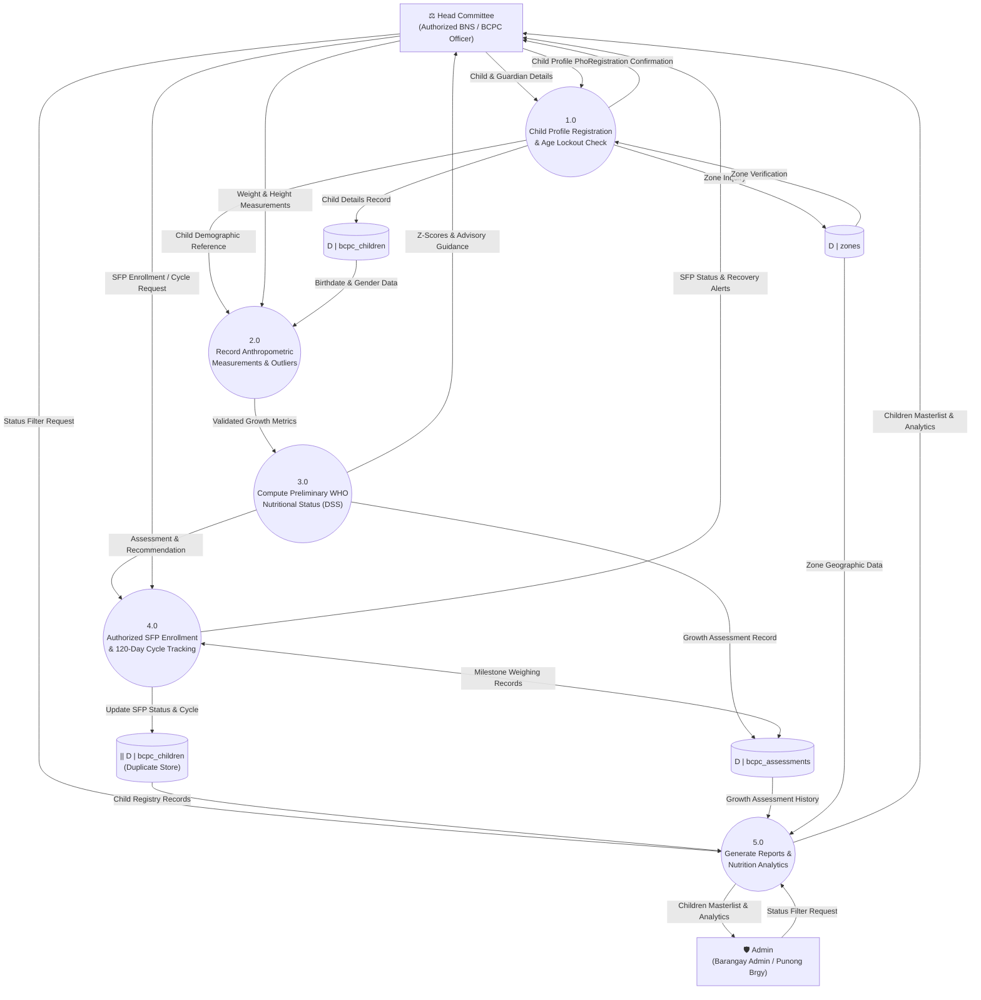
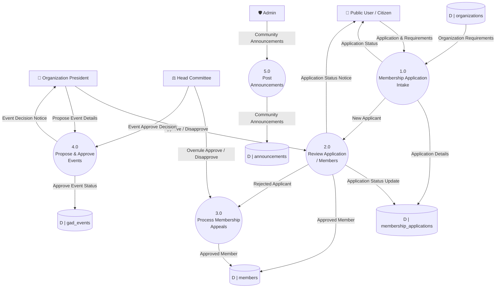

# Women and Family Protection System (WFPS)
## Data Flow Diagrams (DFD) Specification — Level 0 & Level 1

---

### 1. Overview & Image Transcription Confirmation

We have thoroughly inspected and decoded your previous reference images:
- **`DFDLVL0.png`** (Context Diagram):
  - **External Entities**: `Public User/Citizen`, `Admin`, `Org President/Head`
  - **Processes**: Single bubble `Women and Family Protection System`
  - **Incoming Flows to System**:
    - From Public User: *Organization Membership Application*
    - From Admin: *Case*, *Announcement*
    - From Org President: *Membership Application Data*
  - **Outgoing Flows from System**:
    - To Public User: *Organization Events*, *Organization Guidelines*, *Organization Announcements*, *Organization Membership Form*
    - To Admin: *Organization Membership Applications*, *Organization/Case Analytics*
    - To Org President: *Organization Membership Application*, *Organization Analytics*

- **`DFDLVL1.png`** (Level 1 Decomposition):
  - **External Entities**: `Public User`, `Admin`, `Org President`
  - **Data Stores**: `membership_applications`, `officials.table`, `Announcements`, `gad_events`, `organizations`, `agencies`, `case_reports`
  - **Processes**:
    - `1.0 Apply Organizational Membership`
    - `2.0 Content Viewing`
    - `3.0 Post/Update/Delete Announcement`
    - `4.0 Manage Organization`
    - `5.0 Case Manual Encoding`
    - `6.0 Generate Cases Analytics/ Membership Analytics`
    - `8.0 Review All Organization Applications`
    - `9.0 Update All Organization Applications`
    - `10.0 Archive /Delete Membership Application`
    - `11.0 Update/Delete Brgy Officials Lists`
    - `12.0 Review Own Organization Membership Application`
    - `13.0 Update/Delete GAD Events`

---

### 2. Comprehensive DFD Level 0 (Context Diagram)

The upgraded, actual system incorporates **four distinct external entities**:
1. **Public User / Citizen (Resident)**
2. **Organization President / Sector Head**
3. **Committee Head / Desk Officer (VAWC & BCPC Specialists)**
4. **Super Administrator (Barangay Executive Admin)**

Figure: Data Flow Diagram Level 0 (Context Diagram)

The Context Diagram (DFD Level 0) illustrates the overall flow of information between the Women and Family Protection System (WFPS) and its four primary users: the Public User / Citizen, Organization President, Committee Head, and System Administrator.

- **Public User / Citizen**: Citizens submit their membership applications to organizations, file appeals if an application is rejected, and send questions to the chatbot. In return, the system provides announcements, event updates, application status, printable forms, barangay officials directory, and automated chatbot answers.
- **Organization President**: The Organization President submits event proposals, reviews membership applications for their organization, and updates their organization profile. The system provides them with applicant records, event status notices, and organization reports.
- **Committee Head**: The Committee Head inputs confidential VAWC case details, protection order (BPO) information, and child nutrition monitoring records (BCPC), and reviews proposed events. The system provides past case history, alerts for malnourished children, and summary reports.
- **System Administrator**: The Administrator possesses exclusive authority over system-level governance. The Admin manages user accounts (inviting staff, assigning roles, and unlocking accounts), configures system settings (maintaining barangay officials and organizational charts, zones, abuse categories, and feature toggles), and executes database backup and restore commands. In return, the system provides the administrator with master audit logs, database backup files, and comprehensive system analytics across all modules.

```mermaid
flowchart TD
    %% Entities
    Citizen["👤 Public User / Citizen"]
    President["👔 Organization President"]
    Head["⚖️ Committee Head (VAWC / BCPC)"]
    Admin["🛡️ System Administrator"]

    %% Central Process
    System(("0.0<br/><b>Women and Family<br/>Protection System</b>"))

    %% Public User Flows
    Citizen -->|"Membership Application"| System
    Citizen -->|"Application Appeal"| System
    Citizen -->|"Questions / Inquiries"| System
    System -->|"Announcements & Events"| Citizen
    System -->|"Application Status & Form"| Citizen
    System -->|"Officials Directory & Laws"| Citizen
    System -->|"Chatbot Answers"| Citizen

    %% Org President Flows
    President -->|"Application Decision"| System
    President -->|"Event Proposals"| System
    President -->|"Organization Updates"| System
    System -->|"Membership Applications"| President
    System -->|"Organization Reports"| President
    System -->|"Event Status Notice"| President

    %% Committee Head Flows
    Head -->|"VAWC Case Data"| System
    Head -->|"Protection Order (BPO) Data"| System
    Head -->|"Child Nutrition Records"| System
    Head -->|"Event Approvals"| System
    System -->|"VAWC Records & Alerts"| Head
    System -->|"Child Nutrition Status"| Head
    System -->|"VAWC & BCPC Reports"| Head

    %% System Administrator Flows (Exclusive Administrative Powers)
    Admin -->|"User Accounts & Roles"| System
    Admin -->|"System Settings & Officials"| System
    Admin -->|"Backup & Restore Commands"| System
    System -->|"System Analytics & Reports"| Admin
    System -->|"Master Audit Logs"| Admin
    System -->|"Database Backup Files"| Admin
```



---

### 3. Comprehensive DFD Level 1 (Subsystem Decomposition)

In the live system, the functionality is divided into **10 core processes** interacting with **11 structured data stores**.

```mermaid
flowchart TB
    %% External Entities
    subgraph Entities [External Entities]
        E1["👤 Public User / Citizen"]
        E2["👔 Organization President"]
        E3["⚖️ Committee Head"]
        E4["🛡️ System Administrator"]
    end

    %% Processes
    subgraph Processes [Level 1 Core Processes]
        P1(("1.0<br/>Public Portal &<br/>Chatbot Assistance"))
        P2(("2.0<br/>Membership Intake &<br/>Appeals Processing"))
        P3(("3.0<br/>Organization &<br/>Sector Management"))
        P4(("4.0<br/>Member Roster &<br/>Beneficiary Dispatch"))
        P5(("5.0<br/>GAD & Community<br/>Events Management"))
        P6(("6.0<br/>Announcements &<br/>Broadcast Hub"))
        P7(("7.0<br/>VAWC Digital Case &<br/>BPO Lifecycle"))
        P8(("8.0<br/>BCPC Nutrition &<br/>Growth Monitoring"))
        P9(("9.0<br/>System Users, Security &<br/>Disaster Recovery"))
        P10(("10.0<br/>Executive Analytics &<br/>Audit Logging"))
    end

    %% Data Stores
    subgraph Stores [Data Stores]
        D1[("D1: users & email_otps")]
        D2[("D2: organizations")]
        D3[("D3: organizational_members")]
        D4[("D4: membership_applications")]
        D5[("D5: members")]
        D6[("D6: beneficiary_dispatches")]
        D7[("D7: announcements")]
        D8[("D8: gad_events")]
        D9[("D9: vawc_dossiers & cases")]
        D10[("D10: bcpc_children & assessments")]
        D11[("D11: audit_logs & backups")]
    end

    %% Flows: Process 1.0 Public Portal
    E1 <-->|"Browse Info / Chatbot"| P1
    P1 <-->|"Fetch News & Officials"| D7
    P1 <-->|"Fetch Officials"| D3

    %% Flows: Process 2.0 Membership Intake & Appeals
    E1 -->|"Submit Application / Appeal"| P2
    P2 -->|"Store Application / Appeal"| D4
    E2 <-->|"Review Sector Applications"| P2
    E4 <-->|"Approve / Reject / Overrule Appeals"| P2
    P2 -->|"Promote Approved Applicant"| D5

    %% Flows: Process 3.0 Org Management
    E4 <-->|"Create / Toggle Active / Import CSV"| P3
    E2 <-->|"Update Mission, Vision, Profile"| P3
    P3 <-->|"Read/Write Org Data"| D2

    %% Flows: Process 4.0 Members & Beneficiary
    E4 <-->|"Manage Members / Bulk Email"| P4
    E4 -->|"Tag Beneficiary / Release Claim"| P4
    P4 <-->|"Read/Write Members"| D5
    P4 <-->|"Log Dispatches"| D6

    %% Flows: Process 5.0 GAD Events
    E2 -->|"Propose Org Event"| P5
    E3 & E4 <-->|"Manage / Approve GAD Events"| P5
    P5 <-->|"Read/Write Events"| D8

    %% Flows: Process 6.0 Announcements
    E4 & E3 -->|"Create / Publish Announcements"| P6
    P6 <-->|"Store Announcements"| D7

### 3. DFD Level 1 – VAWC Digital Case Management Subsystem (RA 9262)

This diagram represents the finalized Level 1 data flows within the VAWC module, strictly verified against the system's database schema and controller workflows.

```mermaid
flowchart TD
    %% External Entities
    Admin["🛡️ Admin"]
    Head["⚖️ Head Committee"]

    %% Core Subsystem Processes (1.0 to 7.0)
    P1(("1.0<br/>Search / Verify<br/>Dossier Case"))
    P2(("2.0<br/>Intake Case /<br/>Involved Parties"))
    P3(("3.0<br/>Victim Risk<br/>Assessment"))
    P4(("4.0<br/>Issue & Serve<br/>Barangay Protection Order"))
    P5(("5.0<br/>Monitor BPO<br/>Compliance & Violations"))
    P6(("6.0<br/>Referrals & Legal<br/>Escalations"))
    P7(("7.0<br/>Generate Reports<br/>& Analytics"))

    %% Data Stores (STRICTLY 1 TABLE = 1 STORE)
    D1[("D | vawc_dossiers")]
    D2[("D | vawc_cases")]
    D3[("D | vawc_involved_parties")]
    D4[("D | vawc_assessments")]
    D5[("D | vawc_protection_orders")]
    D6[("D | vawc_bpo_service_records")]
    D7[("D | vawc_compliance_logs")]
    D8[("D | vawc_agency_transmittals")]
    D9[("D | vawc_legal_escalations")]

    %% Process 1.0: Dossier Search & Verification
    Head -->|"Search complainant / respondent"| P1
    D1 -->|"Dossier History & Case Information"| P1
    P1 -->|"Search Details"| D1
    P1 -->|"Dossier History / Alerts"| Head
    P1 -->|"Active Case Reference"| P2

    %% Process 2.0: Case Intake & Parties Recording
    Head -->|"Incident & Party Details"| P2
    P2 -->|"Case Incident Details"| D2
    P2 -->|"Involved Parties Details"| D3
    P2 -->|"Case Confirmation & Case No."| Head
    P2 -->|"Active Case Reference"| P3

    %% Process 3.0: Victim Risk Assessment (VRA)
    Head -->|"Risk Assessment Information"| P3
    P3 -->|"Risk Assessment Results"| D4
    P3 -->|"Risk Assessment Rating Results"| Head
    P3 -->|"Active Case Reference"| P4

    %% Process 4.0: BPO Issuance & Service
    Head -->|"BPO Provisions & Reliefs"| P4
    Head -->|"Proof of Delivery Details"| P4
    P4 -->|"Protection Order Details"| D5
    P4 -->|"Proof of Service Record"| D6

    %% Process 5.0: Compliance Monitoring
    D5 -->|"Active BPO Conditions"| P5
    Head -->|"Compliance & Violation Report"| P5
    P5 -->|"Compliance Summary Status"| Head
    P5 -->|"Compliance Log Entry"| D7

    %% Process 6.0: Referrals & Legal Escalation
    Head -->|"Transmittal & Referral Details"| P6
    Head -->|"Court Docket & Legal Counsel"| P6
    D2 -->|"Incident Summary Data"| P6
    P6 -->|"Transmittal Records"| D8
    P6 -->|"Escalation Records"| D9
    P6 -->|"Transmittal & Endorsement Slip"| Head

    %% Process 7.0: Generate Reports & Analytics
    Admin -->|"Date Filter"| P7
    P7 -->|"Filtered Case Reports"| Admin
    Head -->|"Date Filter"| P7
    P7 -->|"Filtered Case Reports"| Head
    D2 -->|"Case Incident Records"| P7
```

---

### 4. Data Flow Matrix (VAWC Module Level 1)

| Process # | Process Name | Source / Trigger | Input Data Flow | Primary Data Store | Output Data Flow | Destination |
| :--- | :--- | :--- | :--- | :--- | :--- | :--- |
| **1.0** | Search / Verify Dossier Case | Head Committee<br>`vawc_dossiers` | `Search complainant / respondent`<br>`Dossier History & Case Information` | `vawc_dossiers` (`D1`) | `Search Details`<br>`Dossier History / Alerts`<br>`Active Case Reference` | `vawc_dossiers`<br>Head Committee<br>Process 2.0 |
| **2.0** | Intake Case / Involved Parties | Head Committee<br>Process 1.0 | `Incident & Party Details`<br>`Active Case Reference` | `vawc_cases` (`D2`)<br>`vawc_involved_parties` (`D3`) | `Case Incident Details`<br>`Involved Parties Details`<br>`Case Confirmation & Case No.`<br>`Active Case Reference` | `vawc_cases`<br>`vawc_involved_parties`<br>Head Committee<br>Process 3.0 |
| **3.0** | Victim Risk Assessment | Head Committee<br>Process 2.0 | `Risk Assessment Information`<br>`Active Case Reference` | `vawc_assessments` (`D4`) | `Risk Assessment Results`<br>`Risk Assessment Rating Results`<br>`Active Case Reference` | `vawc_assessments`<br>Head Committee<br>Process 4.0 |
| **4.0** | Issue & Serve Barangay Protection Order | Head Committee<br>Process 3.0 | `BPO Provisions & Reliefs`<br>`Proof of Delivery Details`<br>`Active Case Reference` | `vawc_protection_orders` (`D5`)<br>`vawc_bpo_service_records` (`D6`) | `Protection Order Details`<br>`Proof of Service Record` | `vawc_protection_orders`<br>`vawc_bpo_service_records` |
| **5.0** | Monitor BPO Compliance & Violations | Head Committee<br>`vawc_protection_orders` | `Compliance & Violation Report`<br>`Active BPO Conditions` | `vawc_compliance_logs` (`D7`) | `Compliance Log Entry`<br>`Compliance Summary Status` | `vawc_compliance_logs`<br>Head Committee |
| **6.0** | Referrals & Legal Escalations | Head Committee<br>`vawc_cases` | `Transmittal & Referral Details`<br>`Court Docket & Legal Counsel`<br>`Incident Summary Data` | `vawc_agency_transmittals` (`D8`)<br>`vawc_legal_escalations` (`D9`) | `Transmittal Records`<br>`Escalation Records`<br>`Transmittal & Endorsement Slip` | `vawc_agency_transmittals`<br>`vawc_legal_escalations`<br>Head Committee |
| **7.0** | Generate Reports & Analytics | Admin<br>Head Committee<br>`vawc_cases` | `Date Filter`<br>`Date Filter`<br>`Case Incident Records` | `vawc_cases` (`D2`) | `Filtered Case Reports`<br>`Filtered Case Reports` | Admin<br>Head Committee |

---

### 5. DFD Level 1 – BCPC Child Nutrition & Decision Support Subsystem (RA 11037)

This diagram represents the finalized Level 1 data flows within the BCPC module, strictly verified against the system's database schema (`bcpc_children`, `bcpc_assessments`, `zones`), `BcpcMonitoringController`, and the WHO / DOH-NNC Operation Timbang Plus (e-OPT Plus) clinical decision support guidelines.

> [!NOTE]
> **Zero Line-Collision Layout Architecture:**
> 1. **Sequential Top-to-Bottom Flow**: Processes flow strictly downwards from `1.0` to `5.0`.
> 2. **Process 5.0 Placed at Bottom**: Placing `5.0 Generate Reports & Analytics` at the bottom allows short, direct connections from `bcpc_assessments` and `bcpc_children` without climbing across the canvas.
> 3. **Admin Positioned at Bottom-Left**: Directly opposite Process 5.0, removing all long looping alert arrows.
> 4. **Duplicate Data Store Convention (`bcpc_children`)**: Standard Gane & Sarson DFD convention permits repeating a master data store (`[ || D | bcpc_children ]`) at the bottom so Process 4.0 and 5.0 connect horizontally without crossing Process 3.0 or `bcpc_assessments`.
> 5. **Bidirectional Milestone Flow**: The read/write between Process 4.0 and `bcpc_assessments` is consolidated into a single two-way arrow (`Milestone Weighing Records`), halving line density.



---

### 6. Data Flow Matrix (BCPC Module Level 1)

| Process # | Process Name | Source / Trigger | Input Data Flow | Primary Data Store | Output Data Flow | Destination |
| :--- | :--- | :--- | :--- | :--- | :--- | :--- |
| **1.0** | Child Profile Registration & Age Lockout Check | Head Committee (BNS)<br>`zones` | `Child & Guardian Details`<br>`Child Profile Photo`<br>`Zone Verification` | `bcpc_children` (`D1`)<br>`zones` (`D3`) | `Zone Inquiry`<br>`Child Details Record`<br>`Registration Confirmation`<br>`Child Demographic Reference` | `zones`<br>`bcpc_children`<br>Head Committee<br>Process 2.0 |
| **2.0** | Record Anthropometric Measurements & Outliers | Head Committee (BNS)<br>Process 1.0<br>`bcpc_children` | `Weight & Height Measurements`<br>`Child Demographic Reference`<br>`Birthdate & Gender Data` | `bcpc_children` (`D1`) | `Validated Growth Metrics` | Process 3.0 |
| **3.0** | Compute Preliminary WHO Nutritional Status (DSS) | Process 2.0 | `Validated Growth Metrics` | `bcpc_assessments` (`D2`) | `Growth Assessment Record`<br>`Z-Scores & Advisory Guidance`<br>`Assessment & Recommendation` | `bcpc_assessments`<br>Head Committee<br>Process 4.0 |
| **4.0** | Authorized SFP Enrollment & 120-Day Cycle Tracking | Head Committee (BNS)<br>Process 3.0<br>`bcpc_assessments` | `SFP Enrollment / Cycle Request`<br>`Assessment & Recommendation`<br>`Milestone Weighing Records` | `bcpc_assessments` (`D2`)<br>`bcpc_children` (`D1`) | `Milestone Weighing Records`<br>`Update SFP Status & Cycle`<br>`SFP Status & Recovery Alerts` | `bcpc_assessments`<br>`bcpc_children`<br>Head Committee |
| **5.0** | Generate Reports & Nutrition Analytics | Head Committee<br>Admin<br>`bcpc_children`<br>`bcpc_assessments`<br>`zones` | `Status Filter Request`<br>`Status Filter Request`<br>`Child Registry Records`<br>`Growth Assessment History`<br>`Zone Geographic Data` | `bcpc_children` (`D1`)<br>`bcpc_assessments` (`D2`)<br>`zones` (`D3`) | `Children Masterlist & Analytics`<br>`Children Masterlist & Analytics` | Head Committee<br>Admin |

---

### 7. DFD Level 1 – Organization & GAD Community Subsystem

This diagram represents the finalized Level 1 data flows within the combined Organization and Gender and Development (GAD) module, strictly verified against `MembershipController`, `MembershipApplicationController`, `OrganizationEventController`, `GadEventController`, `AnnouncementController`, and the associated database schema (`organizations`, `membership_applications`, `members`, `gad_events`, `announcements`).



---

### 8. Data Flow Matrix (Organization & GAD Subsystem Level 1)

| Process # | Process Name | Source / Trigger | Input Data Flow | Primary Data Store | Output Data Flow | Destination |
| :--- | :--- | :--- | :--- | :--- | :--- | :--- |
| **1.0** | Membership Application Intake | Public User / Citizen<br>`organizations` | `Application & Requirements`<br>`Organization Requirements` | `organizations` (`D1`)<br>`membership_applications` (`D2`) | `Application Status`<br>`Application Details`<br>`New Applicant` | Public User / Citizen<br>`membership_applications`<br>Process 2.0 |
| **2.0** | Review Application / Members | Organization President<br>Process 1.0 | `Approve / Disapprove`<br>`New Applicant` | `membership_applications` (`D2`)<br>`members` (`D3`) | `Application Status Notice`<br>`Application Status Update`<br>`Approved Member`<br>`Rejected Applicant` | Public User / Citizen<br>`membership_applications`<br>`members`<br>Process 3.0 |
| **3.0** | Process Membership Appeals | Head Committee<br>Process 2.0 | `Overrule Approve / Disapprove`<br>`Rejected Applicant` | `members` (`D3`) | `Approved Member` | `members` |
| **4.0** | Propose & Approve Events | Organization President<br>Head Committee | `Propose Event Details`<br>`Event Approve Decision` | `gad_events` (`D4`) | `Event Decision Notice`<br>`Approve Event Status` | Organization President<br>`gad_events` |
| **5.0** | Post Announcements | Admin | `Community Announcements` | `announcements` (`D5`) | `Community Announcements` | `announcements` |


