# Women and Family Protection System (WFPS)
## Data Flow Diagrams (DFD) Specification — Level 0 & Level 1

---

### 1. Overview & Image Transcription Confirmation

We have thoroughly inspected and decoded your previous reference images:
- **`DFDLVL0.png`** (Context Diagram):
  - **External Entities**: `Public User/Citizen`, `Admin`, `Org President/Head`
  - **Processes**: Single bubble `Women and Family Protection System`
  - **Incoming Flows to System**:
    - From Public User: *Organization Membership Application*
    - From Admin: *Case*, *Announcement*
    - From Org President: *Membership Application Data*
  - **Outgoing Flows from System**:
    - To Public User: *Organization Events*, *Organization Guidelines*, *Organization Announcements*, *Organization Membership Form*
    - To Admin: *Organization Membership Applications*, *Organization/Case Analytics*
    - To Org President: *Organization Membership Application*, *Organization Analytics*

- **`DFDLVL1.png`** (Level 1 Decomposition):
  - **External Entities**: `Public User`, `Admin`, `Org President`
  - **Data Stores**: `membership_applications`, `officials.table`, `Announcements`, `gad_events`, `organizations`, `agencies`, `case_reports`
  - **Processes**:
    - `1.0 Apply Organizational Membership`
    - `2.0 Content Viewing`
    - `3.0 Post/Update/Delete Announcement`
    - `4.0 Manage Organization`
    - `5.0 Case Manual Encoding`
    - `6.0 Generate Cases Analytics/ Membership Analytics`
    - `8.0 Review All Organization Applications`
    - `9.0 Update All Organization Applications`
    - `10.0 Archive /Delete Membership Application`
    - `11.0 Update/Delete Brgy Officials Lists`
    - `12.0 Review Own Organization Membership Application`
    - `13.0 Update/Delete GAD Events`

---

### 2. Comprehensive DFD Level 0 (Context Diagram)

The upgraded, actual system incorporates **four distinct external entities**:
1. **Public User / Citizen (Resident)**
2. **Organization President / Sector Head**
3. **Committee Head / Desk Officer (VAWC & BCPC Specialists)**
4. **Super Administrator (Barangay Executive Admin)**

Figure: Data Flow Diagram Level 0 (Context Diagram)

The Context Diagram (DFD Level 0) illustrates the overall flow of information between the Women and Family Protection System (WFPS) and its four primary users: the Public User / Citizen, Organization President, Committee Head, and System Administrator.

- **Public User / Citizen**: Citizens submit their membership applications to organizations, file appeals if an application is rejected, and send questions to the chatbot. In return, the system provides announcements, event updates, application status, printable forms, barangay officials directory, and automated chatbot answers.
- **Organization President**: The Organization President submits event proposals, reviews membership applications for their organization, and updates their organization profile. The system provides them with applicant records, event status notices, and organization reports.
- **Committee Head**: The Committee Head inputs confidential VAWC case details, protection order (BPO) information, and child nutrition monitoring records (BCPC), and reviews proposed events. The system provides past case history, alerts for malnourished children, and summary reports.
- **System Administrator**: The Administrator possesses exclusive authority over system-level governance. The Admin manages user accounts (inviting staff, assigning roles, and unlocking accounts), configures system settings (maintaining barangay officials and organizational charts, zones, abuse categories, and feature toggles), and executes database backup and restore commands. In return, the system provides the administrator with master audit logs, database backup files, and comprehensive system analytics across all modules.

```mermaid
flowchart TD
    %% Entities
    Citizen["👤 Public User / Citizen"]
    President["👔 Organization President"]
    Head["⚖️ Committee Head (VAWC / BCPC)"]
    Admin["🛡️ System Administrator"]

    %% Central Process
    System(("0.0<br/><b>Women and Family<br/>Protection System</b>"))

    %% Public User Flows
    Citizen -->|"Membership Application"| System
    Citizen -->|"Application Appeal"| System
    Citizen -->|"Questions / Inquiries"| System
    System -->|"Announcements & Events"| Citizen
    System -->|"Application Status & Form"| Citizen
    System -->|"Officials Directory & Laws"| Citizen
    System -->|"Chatbot Answers"| Citizen

    %% Org President Flows
    President -->|"Application Decision"| System
    President -->|"Event Proposals"| System
    President -->|"Organization Updates"| System
    System -->|"Membership Applications"| President
    System -->|"Organization Reports"| President
    System -->|"Event Status Notice"| President

    %% Committee Head Flows
    Head -->|"VAWC Case Data"| System
    Head -->|"Protection Order (BPO) Data"| System
    Head -->|"Child Nutrition Records"| System
    Head -->|"Event Approvals"| System
    System -->|"VAWC Records & Alerts"| Head
    System -->|"Child Nutrition Status"| Head
    System -->|"VAWC & BCPC Reports"| Head

    %% System Administrator Flows (Exclusive Administrative Powers)
    Admin -->|"User Accounts & Roles"| System
    Admin -->|"System Settings & Officials"| System
    Admin -->|"Backup & Restore Commands"| System
    System -->|"System Analytics & Reports"| Admin
    System -->|"Master Audit Logs"| Admin
    System -->|"Database Backup Files"| Admin
```

---

### 3. Comprehensive DFD Level 1 (Subsystem Decomposition)

In the live system, the functionality is divided into **10 core processes** interacting with **11 structured data stores**.

```mermaid
flowchart TB
    %% External Entities
    subgraph Entities [External Entities]
        E1["👤 Public User / Citizen"]
        E2["👔 Organization President"]
        E3["⚖️ Committee Head"]
        E4["🛡️ System Administrator"]
    end

    %% Processes
    subgraph Processes [Level 1 Core Processes]
        P1(("1.0<br/>Public Portal &<br/>Chatbot Assistance"))
        P2(("2.0<br/>Membership Intake &<br/>Appeals Processing"))
        P3(("3.0<br/>Organization &<br/>Sector Management"))
        P4(("4.0<br/>Member Roster &<br/>Beneficiary Dispatch"))
        P5(("5.0<br/>GAD & Community<br/>Events Management"))
        P6(("6.0<br/>Announcements &<br/>Broadcast Hub"))
        P7(("7.0<br/>VAWC Digital Case &<br/>BPO Lifecycle"))
        P8(("8.0<br/>BCPC Nutrition &<br/>Growth Monitoring"))
        P9(("9.0<br/>System Users, Security &<br/>Disaster Recovery"))
        P10(("10.0<br/>Executive Analytics &<br/>Audit Logging"))
    end

    %% Data Stores
    subgraph Stores [Data Stores]
        D1[("D1: users & email_otps")]
        D2[("D2: organizations")]
        D3[("D3: organizational_members")]
        D4[("D4: membership_applications")]
        D5[("D5: members")]
        D6[("D6: beneficiary_dispatches")]
        D7[("D7: announcements")]
        D8[("D8: gad_events")]
        D9[("D9: vawc_dossiers & cases")]
        D10[("D10: bcpc_children & assessments")]
        D11[("D11: audit_logs & backups")]
    end

    %% Flows: Process 1.0 Public Portal
    E1 <-->|"Browse Info / Chatbot"| P1
    P1 <-->|"Fetch News & Officials"| D7
    P1 <-->|"Fetch Officials"| D3

    %% Flows: Process 2.0 Membership Intake & Appeals
    E1 -->|"Submit Application / Appeal"| P2
    P2 -->|"Store Application / Appeal"| D4
    E2 <-->|"Review Sector Applications"| P2
    E4 <-->|"Approve / Reject / Overrule Appeals"| P2
    P2 -->|"Promote Approved Applicant"| D5

    %% Flows: Process 3.0 Org Management
    E4 <-->|"Create / Toggle Active / Import CSV"| P3
    E2 <-->|"Update Mission, Vision, Profile"| P3
    P3 <-->|"Read/Write Org Data"| D2

    %% Flows: Process 4.0 Members & Beneficiary
    E4 <-->|"Manage Members / Bulk Email"| P4
    E4 -->|"Tag Beneficiary / Release Claim"| P4
    P4 <-->|"Read/Write Members"| D5
    P4 <-->|"Log Dispatches"| D6

    %% Flows: Process 5.0 GAD Events
    E2 -->|"Propose Org Event"| P5
    E3 & E4 <-->|"Manage / Approve GAD Events"| P5
    P5 <-->|"Read/Write Events"| D8

    %% Flows: Process 6.0 Announcements
    E4 & E3 -->|"Create / Publish Announcements"| P6
    P6 <-->|"Store Announcements"| D7

    %% Flows: Process 7.0 VAWC Case Management
    E3 & E4 <-->|"Dossier Search, Intake, Risk Assessment"| P7
    E3 & E4 -->|"Issue BPO, Record Service, Transmittal"| P7
    P7 <-->|"Read/Write VAWC Records"| D9

    %% Flows: Process 8.0 BCPC Nutrition
    E3 & E4 <-->|"Register Child & e-OPT Plus Assessment"| P8
    P8 <-->|"Read/Write Child Data"| D10

    %% Flows: Process 9.0 System Admin
    E4 <-->|"User Roles, Passwords, Zones, Backups"| P9
    P9 <-->|"Read/Write User Accounts"| D1
    P9 <-->|"Manage Backups"| D11

    %% Flows: Process 10.0 Analytics & Audit
    P1 & P2 & P3 & P4 & P5 & P6 & P7 & P8 & P9 -.->|"Emit Audit Action"| P10
    P10 -->|"Write Master Ledger"| D11
    D9 & D10 & D4 & D5 & D8 -->|"Aggregated Metrics"| P10
    P10 -->|"Display Dashboards & Reports"| E4
    P10 -->|"Sector Reports"| E2
    P10 -->|"VAWC / BCPC Summaries"| E3
```

---

### 4. Data Flow Matrix

| Process # | Process Name | Trigger / Input | Primary Data Store | Output / Destination |
| :--- | :--- | :--- | :--- | :--- |
| **1.0** | Public Portal & Inquiries | Citizen navigates site, asks chatbot | `announcements`, `organizational_members` | Public announcements, official directory, bot responses |
| **2.0** | Membership Applications & Appeals | Citizen applies online or desk officer encodes | `membership_applications`, `members` | Tracking number, applicant verification, approval/rejection notices, appeal results |
| **3.0** | Organization Management | Admin or Org President updates sector data | `organizations` | Updated charter, requirements, CSV member roster import |
| **4.0** | Member Registry & Beneficiaries | Admin tags assistance batches or broadcasts emails | `members`, `beneficiary_dispatches`, `member_communications` | Dispatch claim slips, bulk/individual email delivery |
| **5.0** | GAD & Community Programs | Org President proposes; Admin/Head approves | `gad_events` | Community calendar, participant invitations, approval records |
| **6.0** | Announcements & Bulletins | Admin / Head posts urgent advisory | `announcements` | Public bulletin board, target-audience filtering |
| **7.0** | VAWC Confidential Case Tracking | VAWC Desk Officer handles intake (RA 9262) | `vawc_dossiers`, `vawc_cases`, `vawc_protection_orders` | Case dossiers, risk rating, BPO issuance, PNP transmittal, compliance log |
| **8.0** | BCPC Child Nutrition Monitoring | Barangay Nutrition Scholar measures weight/height | `bcpc_children`, `bcpc_assessments` | Z-score status (WFA/HFA/WFLH), SFP feeding cycle re-enrollment, e-OPT Plus report |
| **9.0** | System Administration & Security | Admin configures users, zones, abuse types, backups | `users`, `email_otps`, `audit_logs` | Account invitations, OTP tokens, SQL backup archive files |
| **10.0** | Executive Analytics & Audit Trail | User acts or views dashboard | `audit_logs`, all operational tables | Real-time charts, printable PDF/Excel summaries, forensic log export |
