# Admin Procedural Workflow
## Barangay Women and Family Protection System (WFPS)

This document specifies the exact procedural workflow of the **System Administrator (Admin)** in the Barangay Women and Family Protection System. It reflects both the foundational flowchart structure of the Head Committee / Org President references and the complete operational capabilities implemented in the live system.

---

### 1. Procedural Workflow Diagram (Mermaid Flowchart)

```mermaid
flowchart TD
    Start([Start]) --> Login[/Admin Login/]
    Login --> Auth[Authenticate Admin Credentials & Role]
    Auth --> IsAuth{Authorized?}
    
    IsAuth -- No --> Err[Display Login Error / Log Audit Trail]
    Err --> Login
    
    IsAuth -- Yes --> Dash[Display Admin Unified Executive Dashboard]
    Dash --> SelMod{Select System Module}

    %% ---------------------------------------------------------
    %% 1. VAWC MANAGEMENT
    %% ---------------------------------------------------------
    SelMod --> ModVAWC{1. VAWC Digital Case Management}
    ModVAWC --> VSearch[Search Dossier / Person De-duplication]
    VSearch --> VIntake[/Encode Case Intake & Incident Details/]
    VIntake --> VAssess[Conduct Risk Assessment & Triage Table]
    VAssess --> VBPO{Apply Barangay Protection Order?}
    VBPO -- Yes --> VIssue[Issue BPO & Record Reliefs]
    VIssue --> VServe[Record BPO Service & Proof of Delivery]
    VServe --> VComp[Log BPO Compliance / Violations]
    VComp --> VEscalate[Escalate to Court / Transmit to PNP/DSWD]
    VBPO -- No --> VClose[Record Case Resolution / Formal Closure]
    VEscalate --> VPrint[Print Complaint & BPO Documentation]
    VClose --> VPrint

    %% ---------------------------------------------------------
    %% 2. BCPC MONITORING
    %% ---------------------------------------------------------
    SelMod --> ModBCPC{2. BCPC Child Nutrition & Welfare}
    ModBCPC --> BReg[/Register Child Profile & Upload Photo/]
    BReg --> BAssess[/Record Anthropometric e-OPT+ Assessment/]
    BAssess --> BStatus[Compute Nutritional Status: WFA / HFA / WFLH]
    BStatus --> BSFP{Malnourished / Needs SFP?}
    BSFP -- Yes --> BEnroll[Enroll in Supplementary Feeding Program Cycle]
    BSFP -- No --> BLog[Log Healthy Growth Record]
    BEnroll --> BReport[Generate & Print e-OPT Plus Nutrition Reports]
    BLog --> BReport

    %% ---------------------------------------------------------
    %% 3. GAD & COMMUNITY PROGRAMS
    %% ---------------------------------------------------------
    SelMod --> ModGAD{3. GAD & Community Events}
    ModGAD --> GView[/View GAD Events & Org Proposals/]
    GView --> GAction{Action Type}
    GAction -- Create GAD Event --> GCreate[/Input Event Details & Schedule/]
    GCreate --> GSave[(Save to GAD Database)]
    GAction -- Review Org Proposal --> GApprove{Approve Event?}
    GApprove -- Yes --> GPublish[Approve & Publish to Public Calendar]
    GApprove -- No --> GReject[Return Proposal with Feedback / Reschedule]

    %% ---------------------------------------------------------
    %% 4. MEMBERSHIP APPLICATIONS & APPEALS
    %% ---------------------------------------------------------
    SelMod --> ModApp{4. Membership Applications & Appeals}
    ModApp --> AView[/View Pending Applications / Manual Intake/]
    AView --> AReview[Review Requirements & Applicant Info]
    AReview --> ADecide{Application Approved?}
    ADecide -- Yes --> AApprove[Approve Application & Generate Member Code]
    AApprove --> ANotify[Send Email Notification to Resident]
    ANotify --> AMemSave[(Save to Member Database)]
    ADecide -- No --> AReject[Reject Application with Justification]
    AReject --> ARejMail[Send Rejection Notification]
    ARejMail --> AAppeal[/Resident Submits Appeal/]
    AAppeal --> AAppReview[Review Appeal Statement & Documents]
    AAppReview --> AOverrule{Executive Appeal Decision}
    AOverrule -- Overrule Rejection --> AApprove
    AOverrule -- Sustain Rejection --> ASustain[Confirm Final Rejection]

    %% ---------------------------------------------------------
    %% 5. MEMBERS & BENEFICIARY DISPATCH
    %% ---------------------------------------------------------
    SelMod --> ModMem{5. Members & Beneficiary Dispatch}
    ModMem --> MList[/View Master Member Roster/]
    MList --> MAction{Select Action}
    MAction -- Communication --> MEmail[/Send Individual or Bulk Queue Email/]
    MAction -- Beneficiary Tagging --> MTag[Tag Member for Relief / Ayuda Batch]
    MTag --> MClaim{Beneficiary Claims Relief?}
    MClaim -- Yes --> MRelease[Record Claim Timestamp & Proof]
    MClaim -- No --> MForfeit[Mark Forfeited / Pending]

    %% ---------------------------------------------------------
    %% 6. ORGANIZATIONS MANAGEMENT
    %% ---------------------------------------------------------
    SelMod --> ModOrg{6. Organization & Sector Management}
    ModOrg --> OList[/View Registered Organizations/]
    OList --> OAct{Action}
    OAct -- Edit Charter --> OEdit[/Update Mission, Vision & Requirements/]
    OAct -- Toggle Active --> OToggle[Activate / Deactivate Sector Org]
    OAct -- Bulk Import --> OCSV[/Upload Member CSV & Download Template/]

    %% ---------------------------------------------------------
    %% 7. ANNOUNCEMENTS HUB
    %% ---------------------------------------------------------
    SelMod --> ModAnn{7. Announcements & Bulletins}
    ModAnn --> AnnView[/Manage Announcements/]
    AnnView --> AnnEdit[/Create / Update Bulletin with Image/]
    AnnEdit --> AnnPub[Publish to Target Audience: All, VAWC, GAD, Org]

    %% ---------------------------------------------------------
    %% 8. SYSTEM USERS & ACCESS CONTROL
    %% ---------------------------------------------------------
    SelMod --> ModUser{8. System Users Administration}
    ModUser --> UView[/View User Directory & Role Filters/]
    UView --> UAct{User Action}
    UAct -- Invite New User --> UInvite[/Send Invitation with Role & Org Assignment/]
    UInvite --> UOTP[Generate Activation OTP]
    UAct -- Account Security --> ULock[Unlock Locked Account / Resend Credentials]
    UAct -- Decommission --> UArchive[Soft-delete / Restore User Account]

    %% ---------------------------------------------------------
    %% 9. BARANGAY SETTINGS & TAXONOMY
    %% ---------------------------------------------------------
    SelMod --> ModSet{9. Barangay Settings & Taxonomy}
    ModSet --> SConfig{Configuration Type}
    SConfig -- Feature Toggles --> STog[Enable / Disable Public Features & Chatbot]
    SConfig -- Abuse Types --> SAbuse[Manage RA 9262 Abuse Categories]
    SConfig -- Barangay Zones --> SZone[Manage Purok / Zone Classifications]
    SConfig -- Officials Directory --> SOfficials[Manage Brgy Officials, Positions & Level Hierarchy]

    %% ---------------------------------------------------------
    %% 10. AUDIT TRAIL & EXECUTIVE LOGS
    %% ---------------------------------------------------------
    SelMod --> ModAudit{10. Master Audit Trail}
    ModAudit --> AudView[/Review Immutable User Actions & IP Addresses/]
    AudView --> AudExport[/Export Audit Logs as CSV / Forensic Report/]

    %% ---------------------------------------------------------
    %% 11. DATABASE BACKUP & DISASTER RECOVERY
    %% ---------------------------------------------------------
    SelMod --> ModBack{11. Database Backup & Disaster Recovery}
    ModBack --> BList[/View Database Snapshots/]
    BList --> BAct{Backup Operation}
    BAct -- Create Backup --> BCreate[Generate Full SQL Dump Archive]
    BAct -- Download --> BDown[/Download Snapshot for Off-Site Storage/]
    BAct -- Upload Backup --> BUp[/Upload Existing SQL Snapshot/]
    BAct -- Restore Database --> BRest[Execute Database Restoration Safeguard]
    BAct -- Delete Old --> BDel[Prune Deprecated Backup Files]

    %% ---------------------------------------------------------
    %% 12. EXECUTIVE ANALYTICS
    %% ---------------------------------------------------------
    SelMod --> ModAnal{12. Executive Analytics & Reporting}
    ModAnal --> DispAnal[Display Cross-Module Demographic & Incident Trends]
    DispAnal --> PrintAnal[/Generate & Print Formal Executive Reports/]

    %% ---------------------------------------------------------
    %% TERMINATION
    %% ---------------------------------------------------------
    VPrint --> End([End])
    BReport --> End
    GSave --> End
    GPublish --> End
    GReject --> End
    AMemSave --> End
    ASustain --> End
    MRelease --> End
    MForfeit --> End
    MEmail --> End
    OEdit --> End
    OToggle --> End
    OCSV --> End
    AnnPub --> End
    UOTP --> End
    ULock --> End
    UArchive --> End
    STog --> End
    SAbuse --> End
    SZone --> End
    SOfficials --> End
    AudExport --> End
    BCreate --> End
    BDown --> End
    BRest --> End
    BDel --> End
    PrintAnal --> End
```

---

### 2. Procedural Breakdown by Subsystem

#### Subsystem 1: Administrative Authentication & Session Management
1. **Login**: Admin inputs email and password at `/login`.
2. **Authentication**: System verifies credentials, checks `role == 'admin'`, and checks account status.
3. **Session Routing**: On successful authorization, the admin is directed to `/dashboard` (Executive Overview).

#### Subsystem 2: VAWC Confidential Case Management (RA 9262)
1. **Search & Deduplication**: Search existing `vawc_dossiers` to prevent duplicate case histories.
2. **Case Intake**: Record incident narrative, incident date, zone/purok, abuse types (physical, psychological, sexual, economic), survivor and respondent profiles.
3. **Risk Assessment**: Score immediate safety threat using the Victim Risk Assessment (VRA) triage matrix (Low, Medium, High, Critical).
4. **BPO Issuance & Service**: Issue Barangay Protection Order, record formal relief provisions, document service on respondent, log compliance, and escalate to PNP/Court if violated.
5. **Documentation**: Generate official PNP Transmittal Form and BPO certificate.

#### Subsystem 3: BCPC Child Nutrition & Welfare (e-OPT Plus)
1. **Registration**: Record child profile (name, birth date, mother/father/guardian, purok, photo).
2. **Growth Assessment**: Input anthropometric measurements (Weight in kg, Height in cm).
3. **Automatic Status Computation**: System calculates nutritional classifications (Weight-for-Age, Height-for-Age, Weight-for-Length/Height).
4. **Intervention**: Flag wasted/stunted children, assign to Supplementary Feeding Program (SFP) cycles, and track quarterly recovery.

#### Subsystem 4: GAD & Organization Programs
1. **Event Management**: Create and schedule barangay-level GAD seminars, skills training, and health missions.
2. **Proposal Review**: Evaluate program/seminar proposals submitted by Organization Presidents.
3. **Approval Decision**: Approve and publish to public calendar, or reject with revision instructions.

#### Subsystem 5: Membership Applications & Appeals Engine
1. **Application Intake**: Review self-service applications submitted by residents or manually encode walk-in applications.
2. **Documentary Verification**: Inspect uploaded documentary requirements (valid IDs, residency certificates).
3. **Approval / Rejection**:
   - If approved: System creates a verified record in the `members` table, assigns a unique `member_code`, and dispatches an approval email.
   - If rejected: System records the rejection reason and notifies the applicant.
4. **Appeals Engine**: Admin reviews public appeals from residents or appeals from presidents, with executive authority to **overrule** (reverse rejection) or **sustain** (affirm rejection).

#### Subsystem 6: Master Member Registry & Beneficiary Dispatch
1. **Roster Maintenance**: View, filter, and track member status (active, inactive, deceased, transferred).
2. **Communication Broadcast**: Dispatch individual emails or bulk notifications with automatic execution-time handling.
3. **Beneficiary Tagging**: Assign members to aid distribution batches (e.g., Solo Parent Ayuda, Senior Nutrition Subsidy) and record claim status.

#### Subsystem 7: Organization & Sector Management
1. **Sector Governance**: Create and maintain community organizations (KALAPI, Solo Parents, Senior Citizens, Kababaihan, etc.).
2. **Requirements Definition**: Define mandatory criteria and upload requirements per sector.
3. **Bulk Ingestion**: Download standardized CSV templates and import pre-existing member rosters in bulk.

#### Subsystem 8: System Users & Security Administration
1. **Account Provisioning**: Send invitation links to new staff, committee heads, and organization presidents.
2. **Lifecycle Controls**: Unlock accounts locked due to excessive failed attempts, resend OTP activation codes, and update credentials.
3. **Archival & Recovery**: Soft-delete decommissioned users while preserving case audit integrity, with one-click restoration.

#### Subsystem 9: Barangay Taxonomy & System Settings
1. **Barangay Zones**: Configure official purok and zone lists used for spatial reporting.
2. **Abuse Types**: Maintain legal taxonomy of abuse classifications under Republic Act 9262.
3. **Barangay Officials Directory**: Manage active officials, positions, committee assignments, and hierarchical ranking levels.
4. **Feature Toggles**: Dynamically toggle public registration forms, AI chatbot assistance, and community portal feeds.

#### Subsystem 10: Master Audit Trail & Forensics
1. **Immutable Logging**: System automatically records user ID, IP address, user agent, target model, action type, and field-level delta changes.
2. **Search & Compliance**: Filter logs by actor, module, date range, or action.
3. **Forensic Export**: Export complete ledger as CSV for administrative reporting.

#### Subsystem 11: Database Backup & Disaster Recovery
1. **Snapshot Creation**: Trigger automated, compressed SQL dumps of the relational database.
2. **Offsite Management**: Download snapshots for secure offsite archival, or upload external backups.
3. **Disaster Restoration**: Execute safeguarded database restores with administrative confirmation.
