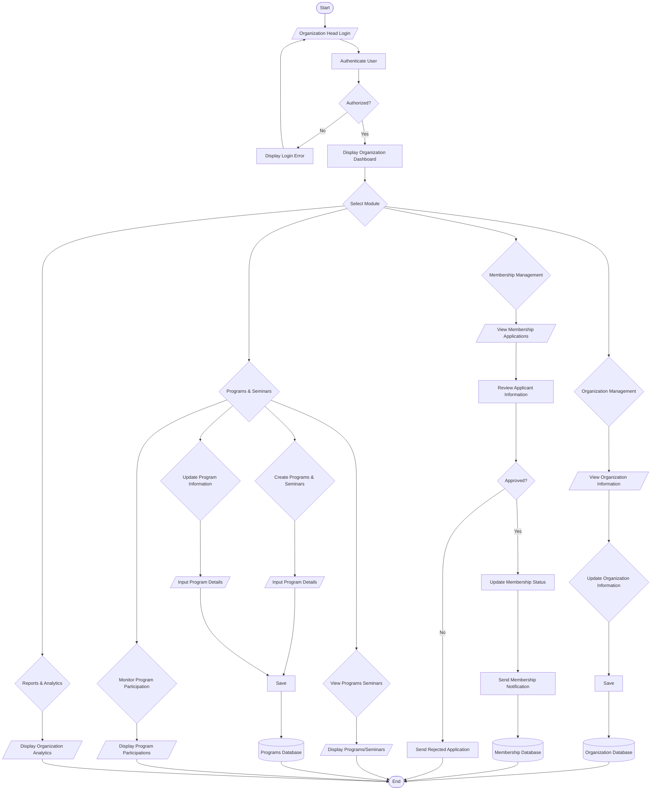

# Organization President Procedural Workflow
## Barangay Women and Family Protection System (WFPS)

This document formalizes the exact procedural workflow of the **Organization Head / President (Org President)** as illustrated in `ProceduralWorkflowOrgPresident.png`.

---

### 1. Procedural Workflow Diagram (Mermaid Flowchart)

---

### 2. Procedural Steps Summary

1. **Authentication**: Organization Head logs in -> System authenticates -> Displays Organization Dashboard.
2. **Organization Management**: View organization profile -> Edit charter, mission, vision, and requirements -> Save updates to Organization Database.
3. **Membership Management**: View applicant list -> Review submitted information -> Decision:
   - Approved: Update status to active -> Dispatch membership notification -> Save to Membership Database.
   - Rejected: Dispatch rejection notice with remarks.
4. **Programs & Seminars**:
   - View / Display existing programs and seminars.
   - Create new program/seminar proposals -> Input details -> Save to Programs Database.
   - Update existing program information -> Save to Programs Database.
   - Monitor participant attendance and engagement records.
5. **Reports & Analytics**:
   - View sector-specific analytics (demographics, membership growth, participation rates).