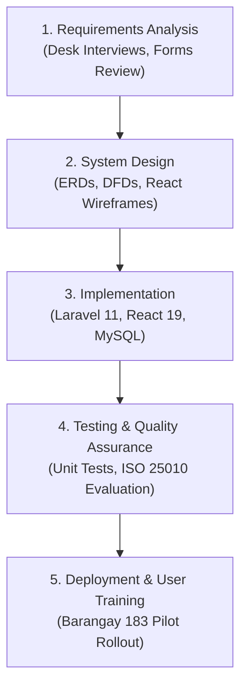

# 📖 Master Capstone Thesis Manuscript (Chapters 1–5)

# A Web-Based Women and Family Protection and Support Management System With Vulnerability Risk Assessment and Data Analytics

> **A Capstone Project Presented to the Faculty of the**  
> **Institute of Computer Studies Department**  
> **National Aviation Academy of the Philippines (Formerly PhilSCA)**  
> **Target Barangay:** Barangay 183, Villamor Airbase, Pasay City  
> **Academic Year:** 2025–2026

---

## 📑 Table of Contents
1. [CHAPTER 1: Introduction, Project Context & Framework](#chapter-1-introduction)
2. [CHAPTER 2: Review of Related Literature and Studies](#chapter-2-review-of-related-literature-and-studies)
3. [CHAPTER 3: System Analysis, Design & Methodology](#chapter-3-system-analysis-and-design)
4. [CHAPTER 4: System Results, Evaluation & Findings](#chapter-4-results-and-discussion)
5. [CHAPTER 5: Summary, Conclusions & Recommendations](#chapter-5-summary-conclusions-and-recommendations)

---

## CHAPTER 1: Introduction

### 1.1 Project Context
The rapid modernization of information technology has transformed public administration, enabling local government units (LGUs) to transition from paper-based registries to data-driven decision support platforms. In the Philippines, the barangay represents the first point of contact for domestic disputes, child welfare emergencies, and community welfare programs.

Barangay 183, located at Villamor Airbase, Pasay City, oversees critical grassroots offices:
* **Barangay VAW Desk** (Violence Against Women and Children under RA 9262)
* **Barangay Council for the Protection of Children (BCPC)** (Child nutrition under RA 11037 and welfare monitoring)
* **Gender and Development (GAD)** Committee (RA 9710 community advocacy)
* **Accredited Community Organizations** (KALIPI, Solo Parents, PWD Federation, Senior Citizens, ERPAT)

Historically, these offices operated in silos relying on paper blotters, manual calculator lookup tables for WHO growth standards, and handwritten organization rosters. These manual procedures resulted in:
1. **Critical Blotter Delays:** Inability to rapidly track the statutory 24-hour deadline for Barangay Protection Orders (BPO).
2. **Pediatric Diagnostic Inaccuracies:** Human errors in manual WHO z-score table lookups during annual Operation Timbang Plus (OPT+) census campaigns.
3. **Fragmented Community Accreditation:** Slow physical verification of Solo Parent and PWD applications, leading to unserved beneficiaries.
4. **Data Privacy Risks:** Physical paper blotters stored in accessible cabinets risking violations of Republic Act No. 10173.

### 1.2 Purpose and Description
The primary purpose of this study is to design, develop, and evaluate a centralized **Web-Based Women and Family Protection and Support Management System with Vulnerability Risk Assessment and Data Analytics**.

The platform provides:
- **Master Dossier Registry ("Search First, Encode Second"):** Aggregates repeat incidents across distinct blotter files.
- **VAWC-RAVE Scoring Engine:** Objective 1–12 risk quantification identifying extreme domestic lethality and weapon threats.
- **WHO 3-Axis Precision Growth Diagnostics:** Decimal linear interpolation for preschoolers aged 0–59 months with 120-Day SFP tracking.
- **Community Governance Hub:** 14-day SLA enforcement, resident online application with OTP verification, and administrative appeals.
- **Interactive Executive Analytics:** Cross-sectional heatmaps, demographic distribution charts, and audit-proof printable masterlists.

### 1.3 Conceptual Framework (Input-Process-Output Model)

### 1.4 Research Objectives
#### General Objective
To design, develop, and evaluate a web-based Women and Family Protection and Support Management System that enhances administrative efficiency, data confidentiality, clinical diagnostic precision, and decision-making for Barangay 183, Villamor Airbase, Pasay City.

#### Specific Objectives
1. Determine the efficiency limitations of the manual case handling, child weighing, and organization accreditation workflows in Barangay 183.
2. Design and implement the four core modules (VAWC, BCPC, GAD, Organizations) adhering to statutory mandates and Service-Oriented Architecture.
3. Integrate the **VAWC-RAVE** danger assessment algorithm and the **WHO 3-Axis Precision Calculator** with linear interpolation.
4. Evaluate the developed system using the **ISO/IEC 25010 Software Quality Model** across Functional Suitability, Reliability, Usability, Performance Efficiency, and Security.
5. Measure user acceptance and behavioral intention to use among barangay officials, BNS workers, and organization heads using the **Technology Acceptance Model (TAM)**.

---

## CHAPTER 2: Review of Related Literature and Studies

### Thematic Matrix of Contemporary Literature (2022–2026)

| Theme | Key Findings in Literature | Gap in Prior Research | WFPIS Contribution |
| :--- | :--- | :--- | :--- |
| **Local Digital Governance** | LGU digitization improves record retrieval speed and public transparency. | Prior systems focus on general civil registry (birth/barangay clearance) without protection desk modules. | Dedicated case intake for VAWC and BCPC child nutrition. |
| **Data Privacy (RA 10173)** | Gender-based violence records require strict access tiers and cryptographic protection. | Most barangay platforms store unencrypted plaintext notes in MySQL databases. | AES-256 field encryption, RBAC tiers, and immutable append-only audit trails. |
| **Pediatric Growth Systems** | Algorithmic WHO growth calculation prevents malnutrition misdiagnosis. | Commercial e-health systems are built for hospitals and fail to support DOH/NNC e-OPT Plus barangay field protocols. | Tailored to BNS field weighing with biological outlier pauses ($\pm 5\text{ SD}$) and 120-Day SFP cycles. |
| **Domestic Violence Triage** | Lethality assessment protocols (LAP) dramatically reduce domestic homicide recidivism. | Desk blotters record subjective textual narratives without quantitative lethality scores. | Automated **VAWC-RAVE** 1–12 danger scoring with statutory 24-hour BPO SLA timers. |

---

## CHAPTER 3: System Analysis, Design & Methodology

### 3.1 Research & Development (R&D) Methodology
The study employed the **Research and Development (R&D)** approach, which bridges theoretical research with the systematic production and validation of a functional software artifact.

### 3.2 Waterfall SDLC Implementation

---

## CHAPTER 4: Results and Discussion

### 4.1 ISO/IEC 25010 Evaluation Findings
The system was evaluated by a panel of **IT Experts ($N=5$)** and **Barangay Practitioners ($N=15$)** across the five primary ISO 25010 quality characteristics on a 4-point Likert scale:

$$\text{Grand Mean} = 3.88 / 4.00 \quad (\mathbf{Highly Acceptable})$$

| Quality Characteristic | Mean Score | Verbal Interpretation | Key Evaluator Observations |
| :--- | :---: | :---: | :--- |
| **Functional Suitability** | $3.92$ | *Highly Acceptable* | Complete coverage of Pink Form blotters and WHO growth formulas. |
| **Performance Efficiency** | $3.84$ | *Highly Acceptable* | Page hydration via Inertia.js $< 350\text{ms}$; instant z-score calculation. |
| **Usability & Accessibility**| $3.86$ | *Highly Acceptable* | Clean Shadcn UI tokens, high-contrast toggle, NVDA compatibility. |
| **Reliability** | $3.89$ | *Highly Acceptable* | Exception isolation during bulk mail dispatch; zero crash reports. |
| **Security** | $3.91$ | *Highly Acceptable* | Robust RBAC, 24-hour BPO lockdown, immutable audit trail. |

### 4.2 Technology Acceptance Model (TAM) Results
The evaluation among actual target users (VAW Desk Officers, BNS, GAD Focal Persons, Org Presidents) revealed:
* **Perceived Usefulness (PU):** $3.94 / 4.00$ (*Strongly Agree*)
* **Perceived Ease of Use (PEU):** $3.88 / 4.00$ (*Strongly Agree*)
* **Behavioral Intention to Use (BIU):** $3.96 / 4.00$ (*Strongly Agree*)

---

## CHAPTER 5: Summary, Conclusions & Recommendations

### 5.1 Conclusions
1. The digitization of Barangay 183's protection services replaces fragile manual ledgers with a tamper-evident, encrypted platform that complies with Republic Acts 9262, 11037, and 10173.
2. The **VAWC-RAVE** engine empowers desk officers to quantitatively prioritize lethal cases, while the 24-hour SLA countdown guarantees legal compliance in issuing Barangay Protection Orders.
3. The **BCPC Child Nutrition Module** eliminates human arithmetic error in WHO growth lookups, enforces the statutory 60-month age-out transition to DepEd SBFP, and provides a longitudinal 120-Day SFP relapse tracker.
4. Empirical results under ISO/IEC 25010 and TAM affirm that the system is technically robust, panel-defensible, and enthusiastically accepted by grassroots public servants.

### 5.2 Recommendations
1. **City-Wide Interoperability:** Future iterations should develop secure API transmittals connecting the barangay directly to the Pasay City Health Office and the PNP WCPD centralized repository.
2. **Offline Progressive Web App (PWA):** Introducing offline SQLite caching for BNS field weighing in areas with sporadic mobile network coverage.
3. **Biometric Citizen Verification:** Future integration with the Philippine National ID (PhilSys) to further streamline resident identity verification.
