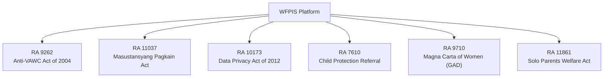

# ⚖️ Statutory Legal Compendium & Jurisprudence

> **Municipal & Barangay Women and Family Protection Information System (WFPIS)**  
> **Barangay 183, Villamor Airbase, Pasay City**

---

## 📜 1. Philippine Statutory Matrix

The WFPIS platform is not merely a database management system; it is an algorithmic implementation of Philippine statutory law and jurisprudence.

---

## 🏛️ 2. Detailed Statutory Analysis & Code Enforcement

### 2.1 Republic Act No. 9262 (Anti-VAWC Act of 2004)
* **Section 14 — Issuance of Barangay Protection Orders (BPO):**
  - *Statutory Rule:* The Punong Barangay or officiating Kagawad must issue or deny an ex-parte BPO application within twenty-four (24) hours of receipt.
  - *System Enforcement:* Real-time countdown timer tracking $\Delta t = T_{\text{applied}} + 24\text{ hours} - T_{\text{now}}$. UI flags `Critical (Under 6h)` and `Expired SLA`.
* **Section 15 — BPO Validity:**
  - *Statutory Rule:* A BPO remains legally binding for **fifteen (15) calendar days** starting from personal service to the respondent.
  - *System Enforcement:* Automated expiration date computed as $T_{\text{served}} + 15\text{ days}$, triggering pre-expiration court referral reminders at Day 12.
* **Section 33 — Absolute Prohibition of Conciliation:**
  - *Statutory Rule:* Under no circumstances may a VAWC case be submitted to *Katarungang Pambarangay* conciliation, mediation, or amicable settlement.
  - *System Enforcement:* The system provides **zero** mediation or amicable closure pathways. Attempting to record amicable settlement throws a hard programmatic exception.
* **Section 44 — Confidential Informant Shield:**
  - *Statutory Rule:* Whistleblowers and neighbors reporting abuse are granted immunity and identity protection.
  - *System Enforcement:* Toggleable `is_confidential` flag redacting informant details on public and standard staff viewports.

---

### 2.2 Republic Act No. 11037 (Masustansyang Pagkain para sa Batang Pilipino Act)
* **Target Beneficiaries (0–59 Months):**
  - *Statutory Boundary:* LGU supplemental feeding applies strictly to preschoolers aged 0 to 59 months.
  - *System Enforcement:* At 60 months (5 years), the system locks new assessment entries and issues an automated notice redirecting the child to DepEd's School-Based Feeding Program (SBFP).
* **120-Day Feeding Cycle:**
  - *Statutory Rule:* Mandates 120 consecutive feeding days for undernourished preschoolers.
  - *System Enforcement:* Tracks 5 mandatory clinical milestones (Day 1 Baseline, Day 30, Day 60, Day 90, Day 120 Final Graduation) with weight velocity tracking ($\text{g/day}$).

---

### 2.3 Republic Act No. 7610 (Special Protection of Children Against Abuse)
* **Jurisdictional Boundary:**
  - *Statutory Rule:* Cases involving physical or sexual abuse of minors committed by individuals outside intimate or parental relationships are non-mediable public crimes outside barangay conciliation jurisdiction.
  - *System Enforcement:* The system excludes an internal RA 7610 blotter and instead provides an emergency referral routing console directing cases immediately to the PNP WCPD and DSWD.

---

### 2.4 Republic Act No. 10173 (Data Privacy Act of 2012)
* **Processing of Sensitive Personal Information:**
  - *Statutory Rule:* Processing domestic violence disclosures and minor medical metrics requires strict technical safeguards.
  - *System Enforcement:* AES-256 field encryption for contact numbers and victim addresses, role-based access control (RBAC), and append-only audit trails (`audit_logs`) capturing old and new values.
