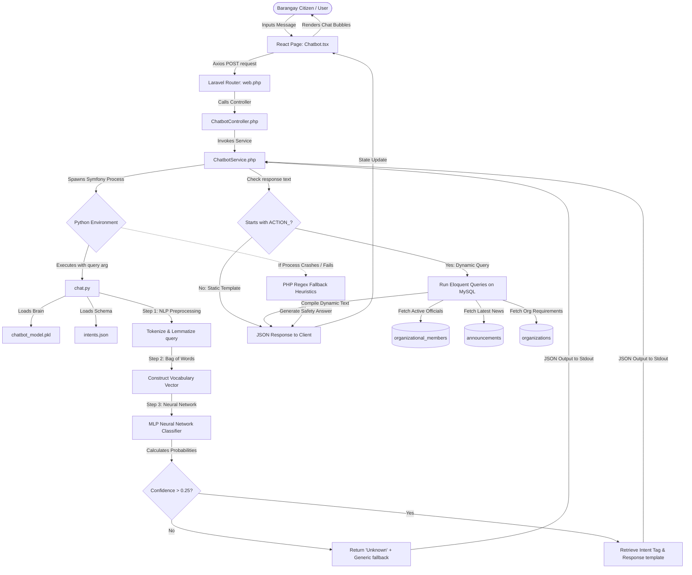

# 📊 WFP System AI Chatbot (The Sentinel) Flowchart & Code Explanation

This document provides a comprehensive flowchart and a detailed, line-by-line explanation of the Python machine learning scripts (`train.py` and `chat.py`) and their integration with the Laravel backend. Use this guide to easily defend the system to the technical panel!

---

## 🔄 1. System Integration Flowchart



---

## 🐍 2. Python Code Explanation (For PHP Developers)

Since your primary background is in PHP, here is how the Python machine learning code works in simple terms.

### A. The Brain Compiler: `train.py`
This script is run once during deployment to train the neural network model. It acts like a "seed" file that creates the compiled brain file `chatbot_model.pkl`.

1. **Imports (Lines 8-14):**
   * `nltk`: The **Natural Language Toolkit** library used for word parsing.
   * `WordNetLemmatizer` from NLTK: The tool that simplifies words to their base roots.
   * `MLPClassifier` from `scikit-learn`: The Multi-Layer Perceptron neural network model.
2. **NLTK Downloads (Lines 19-22):**
   * Downloads the grammar tokenizers and dictionary files required to analyze words.
3. **Data Parsing (Lines 37-57):**
   * It loops through the `intents.json` file.
   * For every pattern (sample user question), it runs `nltk.word_tokenize(pattern)` to break the sentence into words.
   * It runs `lemmatizer.lemmatize(word.lower())` to change words like "reporting" or "reports" into their base word "report".
   * It builds a sorted vocabulary list (`words`) of all unique keywords.
4. **Vectorization / Bag of Words (Lines 62-80):**
   * Neural networks cannot read letters; they only understand numbers.
   * For each sample question, the script creates an array of `1`s and `0`s. If a word in our global vocabulary is present in the question, it puts a `1`, otherwise a `0`.
   * *Example:* If vocabulary is `["abuse", "child", "file", "hello", "vawc"]`. The question *"file vawc"* becomes `[0, 0, 1, 0, 1]`.
5. **Neural Network Training (Lines 90-96):**
   * It initializes an `MLPClassifier` with two hidden layers of `128` and `64` neurons.
   * It runs `model.fit(train_x, train_y)` which uses backpropagation to adjust mathematical weights, training the model to associate specific number vectors with specific intent tags.
6. **Model Serialization (Lines 98-107):**
   * It saves the trained `model` structure, the sorted `words` list, and the list of intent `classes` into a binary file called `chatbot_model.pkl` using Python's `pickle` utility.

---

### B. The Live Classifier: `chat.py`
This script is executed by Laravel in real-time when a user sends a message.

1. **Model Loading (Lines 16-33):**
   * Reads `chatbot_model.pkl` and parses the compiled neural network model, vocabulary list (`words`), and intent classes.
2. **Preprocessing the User's Query (Lines 35-49):**
   * When a user inputs a message (e.g. *"Paano mag report?"*), `clean_up_sentence()` tokenizes and lemmatizes it.
   * `bow()` transforms the cleaned user query into a binary vector (Bag of Words) matching the global vocabulary index.
3. **Inference / Prediction (Lines 51-72):**
   * `model.predict_proba([p])` feeds the Bag of Words vector into the neural network.
   * The network outputs probability scores for all classes.
   * The scores are filtered using `ERROR_THRESHOLD = 0.25` (25%). Any intent below 25% confidence is discarded to prevent the bot from returning confident incorrect answers.
   * The results are sorted with the highest probability first.
4. **Response Formulation (Lines 74-86):**
   * The tag with the highest probability is selected.
   * If it matches a static template in `intents.json`, it returns one of the random text templates.
   * If it maps to a dynamic intent, it returns the **Action Tag** (e.g., `ACTION_FETCH_OFFICIALS`).
5. **Laravel stdout Communication (Lines 89-103):**
   * The script prints the result as a JSON string using `print(json.dumps(...))`. 
   * Laravel's Symfony Process reads this output stream and decodes the JSON array.

---

## 🛠️ 3. PHP calling Python (Process Bridge) Explanation

Laravel calls the Python script dynamically inside [ChatbotService.php](file:///c:/Users/djemp/Herd/wfp-system_captsone/app/Services/ChatbotService.php):

```php
// app/Services/ChatbotService.php
$scriptPath = resource_path('python/chat.py');

// Spawns a background process: python resources/python/chat.py "user query here"
$process = new Process(['python', $scriptPath, $query]);
$process->run();

// Fallback to python3 if python failed (common on Linux production servers)
if (!$process->isSuccessful()) {
    $process = new Process(['python3', $scriptPath, $query]);
    $process->run();
}
```

* **Why this approach?**
  Instead of hosting a separate, expensive Python microservice (like Flask or FastAPI) which consumes continuous RAM and requires open ports, we use a **sub-process architecture**. Python is called on-demand to process the query, output its classification, and immediately exit, freeing up RAM.
* **Why the fallback?**
  On local Windows computers, the command is usually `python`. On Linux production servers (like AWS, Heroku, or DigitalOcean), it is registered as `python3`. This fallback check guarantees a **plug-and-play** deployment on both systems without changing code config.
