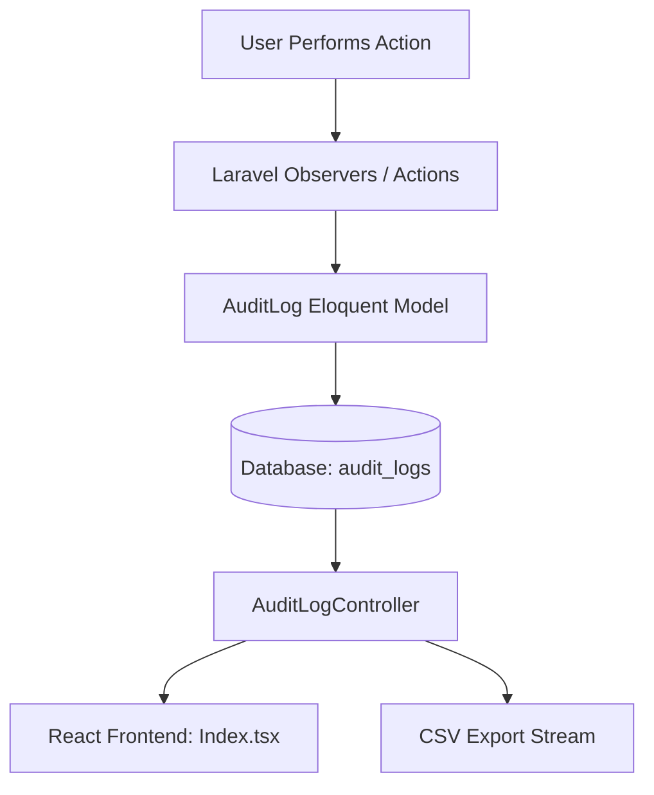

# Capstone Defense Guide: Audit Trails & Activity Logging System

This documentation provides an in-depth breakdown of the **Audit Trails and Activity Logging System**, detailing its architecture, code structure, compliance with **SOLID** principles, and technical strategies to defend the implementation during a capstone or panelist review.

---

## 1. System Overview & Architecture

The Audit Trails system is designed to provide **traceability, transparency, and accountability (non-repudiation)** for all critical actions taken within the system. It tracks changes to models (creation, modification, deletion) and captures security-oriented metadata.

### Architectural Diagram


---

## 2. Core Features

### A. Dynamic Record Identification
Instead of showing generic and unhelpful identifiers (e.g., `App\Models\VawcCase (ID: 1)`), the frontend translates type contexts into human-readable labels like `Case #2026-0001` or the child's name `Juan Dela Cruz`. If the record is deleted, it gracefully salvages the identity from the snapshot values.

### B. Visual Changes Diffing Engine
Instead of dumping raw JSON strings (which panelists often criticize as "unfriendly for non-technical users"), the system processes the `old_values` and `new_values` objects:
* **Additions:** Highlighted in **green**.
* **Deletions:** Highlighted in **red**.
* **Modifications:** Displayed side-by-side (`Previous -> New`) with colored visual cues.
* **Collapsible Raw Payload:** Administrators can toggle a details tab to inspect the raw JSON output for legal/technical audits.

### C. Security Metadata Capture
Every logged action records:
* **IP Address:** Useful to verify the geographical source of the request.
* **User Agent:** Tracks the browser, device, and operating system used, helping to identify unauthorized session hijacking or bot activity.

### D. Export & Isolation Filters
* **Date Range Pickers:** Enables administrators to target specific timeframes for incident investigation.
* **CSV Export Stream:** A memory-efficient mechanism to export filtered datasets for third-party audits or archiving.

---

## 3. Codebase Structure & Logic

### A. Database Schema (`audit_logs` table)
The database structure relies on Laravel's polymorphic relations (`auditable_type`, `auditable_id`) to track edits to any database table:

| Column Name | Type | Description |
| :--- | :--- | :--- |
| `id` | BigInt (PK) | Unique auto-increment log ID |
| `user_id` | Foreign Key | The user who executed the action (NULL for automated system tasks) |
| `action` | String | Description of the action (`created`, `updated`, `deleted`, etc.) |
| `auditable_type` | String | Model namespace (polymorphic relationship, e.g., `App\Models\BcpcChild`) |
| `auditable_id` | BigInt | The ID of the target model record |
| `old_values` | JSON | Snapshot of the model's fields *before* the modification |
| `new_values` | JSON | Snapshot of the model's fields *after* the modification |
| `ip_address` | String | IP address of the request client |
| `user_agent` | Text | User agent string of the request client |
| `created_at` | Timestamp | Log generation timestamp |

### B. Controller Logic ([AuditLogController.php](file:///c:/Users/djemp/Herd/wfp-system_captsone/app/Http/Controllers/Admin/AuditLogController.php))
The controller handles two duties: rendering the list (with RBAC constraints) and exporting CSV files:

```php
// Date-based queries and search filtering
if ($request->filled('date_start')) {
    $query->whereDate('created_at', '>=', $request->date_start);
}
if ($request->filled('date_end')) {
    $query->whereDate('created_at', '<=', $request->date_end);
}
```

**Export Streaming Mechanism:**
To support exporting thousands of records without memory crashes (`Allowed memory size exhausted`), we stream the database cursor using a PHP output stream:
```php
return response()->stream(function() use($logs) {
    $file = fopen('php://output', 'w');
    fputcsv($file, $columns);
    foreach ($logs as $log) {
        fputcsv($file, [...]);
    }
    fclose($file);
}, 200, $headers);
```

### C. Frontend Interface ([Index.tsx](file:///c:/Users/djemp/Herd/wfp-system_captsone/resources/js/Pages/Admin/AuditLogs/Index.tsx))
Uses a debounced search listener to update the Inertia dataset without triggering fully static page reloads.

**Visual Diffing Logic:**
```typescript
const renderVisualDiff = (oldVals: any, newVals: any) => {
    // 1. Get all unique keys between old and new snapshots (excluding technical columns)
    // 2. Loop through keys and categorize:
    //    - isAdded (!key in oldData)
    //    - isDeleted (!key in newData)
    //    - isModified (oldVal !== newVal)
    // 3. Render color-coded <tr> cells based on classification
};
```

---

## 4. Compliance with SOLID Principles

To impress your panelists, you can demonstrate how this feature follows strict object-oriented design standards:

### 1. **S**ingle Responsibility Principle (SRP)
Each component has one reason to change:
* **`AuditLog` Model:** Only represents the schema structure and Eloquent relationships.
* **`AuditLogController`:** Responsibilities are strictly bounded to processing incoming requests, scoping models based on User roles (RBAC), and sending formatting templates (CSV/Inertia views).
* **`Index.tsx` View:** Handles presentation layer logic, user events, and formatting operations (converting JSON diff arrays into visual HTML grids).

### 2. **O**pen/Closed Principle (OCP)
The logging system is **open to extension, but closed to modification**. 
* Because it uses **polymorphic relations** (`auditable_type`/`auditable_id`), if you add a new model to the application (e.g., `PnpIncidentReport`), the audit log table structure, observers, and controllers **do not need to change**. The logging mechanism will immediately support it.

### 3. **L**iskov Substitution Principle (LSP)
* The polymorphic `auditable` relationship depends on the base Laravel Eloquent `Model` class. Any database record subclassing Eloquent can be dynamically resolved by `AuditLog::auditable` without breaking application logic.

### 4. **I**nterface Segregation Principle (ISP)
* The controller exposes specialized endpoints. For example, search parameters and export parameters are decoupled from core settings and system endpoints, keeping routers thin and interfaces narrow.

### 5. **D**ependency Inversion Principle (DIP)
* The controllers and UI components do not interact with raw SQL database drivers. They depend on database abstractions (Laravel's Eloquent ORM interface and database query builders). This makes the database driver interchangeable (SQLite, PostgreSQL, MySQL) without modifying a single line of business logic.

---

## 5. Defense Q&A: Tamper-Resistance & Security

Panelists often look for security holes in logs. Be prepared with these answers:

#### **Q1: How do you prevent users or administrators from tampering with (deleting/modifying) these logs?**
* **Defense:** 
  1. **No routes/methods exist** in the system to edit or delete `AuditLog` rows. There are no controllers or endpoints matching `destroy` or `update` for logs.
  2. The `AuditLog` Eloquent model has `$fillable` fields only for creation. It has no update logic.
  3. *(For production)* Database users mapped to typical application operations can be restricted using SQL permissions (e.g., granting only `SELECT` and `INSERT` privileges on the `audit_logs` table, blocking `UPDATE` and `DELETE`).

#### **Q2: What happens if a record is permanently deleted from the database? Doesn't the log's relationship break?**
* **Defense:** We anticipated this! In database design, this is the "orphan record" problem. The application solves this by using a **snapshot fallback pattern**. When a record is deleted, its primary properties are captured inside the `old_values` field. The React frontend check falls back to extract names/titles from `old_values` if the direct relationship (`log.auditable`) returns null, keeping logs complete and readable.

#### **Q3: What precautions are taken for Data Privacy (e.g., logging passwords or sensitive user credentials)?**
* **Defense:** Observers are configured to ignore security-sensitive fields (such as `password`, `remember_token`, and two-factor secrets) when writing to `old_values` and `new_values`. Additionally, the frontend diff viewer explicitly filters out system properties like passwords or token fields from visual display.

#### **Q4: How does the system handle log export scalability if the table grows to millions of rows?**
* **Defense:** We avoided buffering. Standard Excel packages parse rows into memory before downloading, causing crashes on large tables. Our export endpoint uses **PHP stream output** (`php://output`). Rows are fetched incrementally via database cursors and flushed straight to the HTTP response stream, keeping server memory usage low and constant regardless of the export size.
