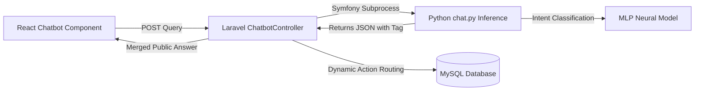

# 🏛️ AI CHATBOT (THE SENTINEL) CAPSTONE MASTER DOCUMENTATION
*WFP Barangay Management System — Natural Language Processing & Hybrid Inference Blueprint*

This master documentation details the **Why, How, and What** of the Barangay 183 Villamor AI Chatbot ("The Sentinel"). It outlines the conceptual architecture, provides the complete code listings with step-by-step technical commentary, explains data privacy compliance, and proposes future recommendations for your capstone paper.

---

## 📂 Table of Contents
1. **Conceptual Design (Why, How, What)**
2. **Complete Code Listings & Line-by-Line Breakdown**
   * A. Data Dictionary (`intents.json`)
   * B. The Neural Network Trainer (`train.py`)
   * C. The Real-time Inference Script (`chat.py`)
   * D. Laravel Service Layer Bridge (`ChatbotService.php`)
   * E. React Frontend Component (`Chatbot.tsx`)
3. **Data Security, Privacy Boundary & DPA Compliance**
4. **Academic Recommendations (Chapter 5 Future Scope)**

---

## 1. Conceptual Design (Why, How, What)

### ❓ Why We Created a Custom Chatbot
Rather than integrating proprietary APIs (like OpenAI's GPT-4 or Anthropic's Claude), we engineered a **local, retrieval-based NLP Classifier** for three core reasons:
1. **Strict Data Privacy (DPA 2012)**: Barangay case registries handle highly sensitive VAWC (RA 9262) and BCPC (RA 7610) data. Passing user messages to third-party cloud engines risks data leakage.
2. **Zero Operating Cost**: Local models run on the barangay's local server for free, avoiding monthly subscription fees or token charges.
3. **Reliability & Determinism**: Unlike Generative AI which can "hallucinate" incorrect advice, an intent-classification model maps user queries only to predetermined, legally verified answers, ensuring safety and compliance.

### ⚙️ How the Bridge Architecture Works
The chatbot utilizes a **Process Bridge** linking the React client, Laravel controller, and Python Machine Learning environment.



* **Dynamic Action Mapping**: If the intent requires static data (e.g. filing steps), the bot responds instantly. If it requires live data (e.g. active barangay officials, announcements, organization requirements), Python outputs an Action Tag (`ACTION_FETCH_...`). Laravel intercepts the tag, queries the MySQL database via Eloquent, and formats the latest information dynamically.

### 🛠️ What Tech Stack We Used
* **NLP Preprocessing**: Python NLTK (Natural Language Toolkit) for Tokenization and WordNet Lemmatization.
* **Neural Network**: `scikit-learn` Multi-Layer Perceptron (MLP) Classifier with 2 hidden layers `(128, 64)` running backpropagation.
* **Backend Bridge**: Laravel 11 PHP Process API executing local Python scripts.
* **Frontend**: Inertia.js + React, styled using TailwindCSS for maximum responsiveness.

---

## 2. Complete Code Listings & Line-by-Line Breakdown

### A. Data Dictionary (`intents.json`)
This file is our training corpus containing mapped tags, user patterns (both English and Tagalog), and responses.

[intents.json (L215-L235)](file:///c:/Users/djemp/Herd/wfp-system_captsone/resources/python/intents.json#L215-L235)
```json
{
    "intents": [
        {
            "tag": "vawc_filing",
            "patterns": [
                "How do I file a VAWC case?", "Report abuse", "Paano magreklamo ng VAWC?", "Sinasaktan ako"
            ],
            "responses": [
                "To file a VAWC case, go to 'Services' > 'VAWC'. For emergencies, call 911."
            ]
        },
        {
            "tag": "case_status_inquiry",
            "patterns": [
                "Ano ang status ng kaso ko?", "Kumusta ang report ko?", "Check my report", "Sino ang nagreklamo?"
            ],
            "responses": [
                "To ensure strict confidentiality and comply with the Data Privacy Act of 2012, case statuses and private records cannot be accessed through this chatbot. Please log in to your secure account dashboard, or visit the Barangay 183 VAW Desk in person with a valid ID for case updates."
            ]
        }
    ]
}
```

---

### B. The Neural Network Trainer (`train.py`)
This script executes pre-compilation of the training corpus into a serialized neural brain `chatbot_model.pkl`.

[train.py](file:///c:/Users/djemp/Herd/wfp-system_captsone/resources/python/train.py)
```python
import json
import pickle
import numpy as np
import nltk
from nltk.stem import WordNetLemmatizer
from sklearn.neural_network import MLPClassifier

# Download NLP vocabulary helpers
nltk.download('punkt')
nltk.download('wordnet')
nltk.download('omw-1.4')
nltk.download('punkt_tab')

lemmatizer = WordNetLemmatizer()

# Load corpus file
data_file = open('resources/python/intents.json').read()
intents = json.loads(data_file)

words = []
classes = []
documents = []
ignore_words = ['?', '!', '.', ',']

# 1. Tokenize & build document links
for intent in intents['intents']:
    for pattern in intent['patterns']:
        w = nltk.word_tokenize(pattern) # Break query into array of words
        words.extend(w)
        documents.append((w, intent['tag'])) # Map word token to tag
        if intent['tag'] not in classes:
            classes.append(intent['tag'])

# 2. Lemmatize: reduce tenses to root forms (e.g., "reports" -> "report")
words = [lemmatizer.lemmatize(w.lower()) for w in words if w not in ignore_words]
words = sorted(list(set(words)))
classes = sorted(list(set(classes)))

training = []
output_empty = [0] * len(classes)

# 3. Vectorization: Construct Bag of Words (numeric representation of query text)
for doc in documents:
    bag = []
    pattern_words = doc[0]
    pattern_words = [lemmatizer.lemmatize(word.lower()) for word in pattern_words]
    for w in words:
        bag.append(1) if w in pattern_words else bag.append(0)
    
    output_row = list(output_empty)
    output_row[classes.index(doc[1])] = 1
    training.append([bag, output_row])

import random
random.shuffle(training)
training = np.array(training, dtype=object)

train_x = list(training[:, 0]) # Features
train_y = list(training[:, 1]) # Labels

# 4. Multi-Layer Perceptron (MLP) Classifier Training
# Input layer (size of vocabulary) -> 128 nodes -> 64 nodes -> Output layer (classes)
model = MLPClassifier(hidden_layer_sizes=(128, 64), max_iter=1000, activation='relu', solver='adam')
model.fit(train_x, train_y)

# Save brain structures to binary file
data = {'model': model, 'words': words, 'classes': classes}
with open('resources/python/chatbot_model.pkl', 'wb') as f:
    pickle.dump(data, f)
print("Training Complete. Model saved to resources/python/chatbot_model.pkl")
```

---

### C. The Real-time Inference Script (`chat.py`)
This script is executed dynamically on demand to load the pickled model, evaluate user query inputs, and serialize prediction output.

[chat.py](file:///c:/Users/djemp/Herd/wfp-system_captsone/resources/python/chat.py)
```python
import json
import pickle
import numpy as np
import sys
import nltk
from nltk.stem import WordNetLemmatizer
import os
import warnings
warnings.filterwarnings("ignore")

lemmatizer = WordNetLemmatizer()

# Load pickled model brain
base_path = os.path.dirname(os.path.abspath(__file__))
model_path = os.path.join(base_path, 'chatbot_model.pkl')
intents_path = os.path.join(base_path, 'intents.json')

with open(model_path, 'rb') as f:
    data = pickle.load(f)
model = data['model']
words = data['words']
classes = data['classes']
intents = json.loads(open(intents_path).read())

# NLP pipeline functions
def clean_up_sentence(sentence):
    sentence_words = nltk.word_tokenize(sentence)
    sentence_words = [lemmatizer.lemmatize(word.lower()) for word in sentence_words]
    return sentence_words

def bow(sentence, words):
    sentence_words = clean_up_sentence(sentence)
    bag = [0] * len(words)
    for s in sentence_words:
        for i, w in enumerate(words):
            if w == s:
                bag[i] = 1
    return np.array(bag)

def predict_class(sentence, model):
    p = bow(sentence, words)
    res = model.predict_proba([p])[0] # Get confidence scores
    ERROR_THRESHOLD = 0.25
    results = [[i, r] for i, r in enumerate(res) if r > ERROR_THRESHOLD]
    results.sort(key=lambda x: x[1], reverse=True)
    return_list = []
    for r in results:
        return_list.append({"intent": classes[r[0]], "probability": str(r[1])})
    return return_list

def get_response(ints, intents_json):
    if not ints:
        return "I'm sorry, I don't understand that yet. Can you rephrase?"
    tag = ints[0]['intent']
    for i in intents_json['intents']:
        if i['tag'] == tag:
            import random
            return random.choice(i['responses'])
    return "I'm not sure how to help with that."

if __name__ == "__main__":
    if len(sys.argv) > 1:
        query = sys.argv[1]
        try:
            ints = predict_class(query, model)
            res = get_response(ints, intents)
            # Output predictions as JSON string for Laravel
            print(json.dumps({"response": res, "intent": ints[0]['intent'] if ints else "unknown"}))
        except Exception as e:
             print(json.dumps({"response": "I encountered an error.", "error": str(e)}))
```

---

### D. Laravel Service Layer Bridge (`ChatbotService.php`)
Interprets the subprocess outputs and implements the dynamic database action injection mapping.

[ChatbotService.php](file:///c:/Users/djemp/Herd/wfp-system_captsone/app/Services/ChatbotService.php)
```php
<?php

namespace App\Services;

use App\Models\Organization;
use Illuminate\Support\Facades\Log;
use Illuminate\Support\Str;
use Symfony\Component\Process\Process;
use Symfony\Component\Process\Exception\ProcessFailedException;

class ChatbotService
{
    public function processQuery(string $query): array
    {
        try {
            $scriptPath = resource_path('python/chat.py');
            
            // Execute python subprocess
            $process = new Process(['python', $scriptPath, $query]);
            $process->run();

            if (!$process->isSuccessful()) {
                $process = new Process(['python3', $scriptPath, $query]);
                $process->run();
            }

            if (!$process->isSuccessful()) {
                throw new ProcessFailedException($process);
            }

            $output = $process->getOutput();
            $result = json_decode($output, true);

            if (json_last_error() === JSON_ERROR_NONE && isset($result['response'])) {
                // If it starts with ACTION_, run dynamic database fetching queries
                if (str_starts_with($result['response'], 'ACTION_')) {
                    return $this->handleAction($result['response'], $query);
                }
                return ['response' => $result['response']];
            }
            return ['response' => trim($output)];

        } catch (\Exception $e) {
            Log::error('Chatbot Python Error: ' . $e->getMessage());
            return ['response' => $this->fallbackLogic($query)];
        }
    }

    private function handleAction(string $action, string $query): array
    {
        switch ($action) {
            case 'ACTION_FETCH_ANNOUNCEMENTS':
                $news = \App\Models\Announcement::latest()->take(3)->get();
                $response = "Here are the latest announcements:\n\n";
                foreach ($news as $item) {
                    $response .= "{$item->title} (" . $item->created_at->format('M d') . ")\n" . strip_tags($item->content) . "\n\n";
                }
                return ['response' => $response];

            case 'ACTION_FETCH_OFFICIALS':
                $officials = \App\Models\OrganizationalMember::where('is_active', true)->orderBy('display_order')->get();
                $response = "Here are our Barangay Officials:\n\n";
                foreach ($officials as $official) {
                    $response .= "{$official->name} - {$official->position}\n";
                }
                return ['response' => $response];

            case 'ACTION_FETCH_ALL_ORGANIZATIONS':
                $orgs = Organization::all();
                $response = "Here are our accredited organizations:\n\n";
                foreach ($orgs as $org) {
                    $response .= "• {$org->name}\n";
                }
                return ['response' => $response];

            default:
                return ['response' => "I am having trouble checking that database entry."];
        }
    }

    private function fallbackLogic(string $query): string
    {
        return "I am experiencing a temporary system connection issue. Please visit the Barangay Hall.";
    }
}
```

---

### E. React Frontend Component (`Chatbot.tsx`)
Provides the premium, responsive interface featuring typing animations, scroll-anchoring, and suggestions.

[Chatbot.tsx](file:///c:/Users/djemp/Herd/wfp-system_captsone/resources/js/components/Chatbot.tsx)
```tsx
import React, { useState, useRef, useEffect } from 'react';
import { Send, Bot, User, Sparkles, RefreshCcw } from 'lucide-react';
import { Card, CardContent, CardFooter, CardHeader, CardTitle } from '@/components/ui/card';
import { Avatar, AvatarFallback } from '@/components/ui/avatar';
import { cn } from '@/lib/utils';
import axios from 'axios';

type Message = { id: string; role: 'user' | 'assistant'; content: string; timestamp: Date; };

export default function Chatbot({ className }: { className?: string }) {
    const [messages, setMessages] = useState<Message[]>([
        { id: '1', role: 'assistant', content: "Greetings. I am The Sentinel, your dedicated AI assistant. How may I serve you today?", timestamp: new Date() }
    ]);
    const [input, setInput] = useState('');
    const [isLoading, setIsLoading] = useState(false);
    const scrollRef = useRef<HTMLDivElement>(null);

    const handleSend = async (e?: React.FormEvent, overrideInput?: string) => {
        if (e) e.preventDefault();
        const text = overrideInput || input;
        if (!text.trim() || isLoading) return;

        setMessages(prev => [...prev, { id: Date.now().toString(), role: 'user', content: text, timestamp: new Date() }]);
        setInput('');
        setIsLoading(true);

        try {
            const res = await axios.post('/chatbot/query', { message: text });
            setMessages(prev => [...prev, { id: (Date.now()+1).toString(), role: 'assistant', content: res.data.response, timestamp: new Date() }]);
        } catch {
            setMessages(prev => [...prev, { id: (Date.now()+1).toString(), role: 'assistant', content: "Unable to connect to the secure server.", timestamp: new Date() }]);
        } finally {
            setIsLoading(false);
        }
    };

    useEffect(() => {
        if (scrollRef.current) scrollRef.current.scrollTop = scrollRef.current.scrollHeight;
    }, [messages, isLoading]);

    return (
        <Card className={cn("w-full mx-auto flex flex-col bg-white shadow-xl rounded-2xl overflow-hidden", className)}>
            <CardHeader className="bg-gradient-to-r from-purple-800 to-indigo-700 p-4 text-white">
                <CardTitle className="text-sm font-bold flex items-center gap-2">
                    <Bot size={18} /> The Sentinel AI Assistant
                </CardTitle>
            </CardHeader>
            <CardContent ref={scrollRef} className="h-96 overflow-y-auto p-4 space-y-4 bg-slate-50">
                {messages.map(msg => (
                    <div key={msg.id} className={cn("flex gap-2.5 max-w-[85%]", msg.role === 'user' ? "ml-auto flex-row-reverse" : "mr-auto")}>
                        <Avatar className="h-7 w-7"><AvatarFallback>{msg.role === 'user' ? <User size={14}/> : <Bot size={14}/>}</AvatarFallback></Avatar>
                        <div className={cn("p-3 rounded-xl text-sm shadow-sm", msg.role === 'user' ? "bg-indigo-600 text-white rounded-tr-none" : "bg-white text-slate-800 rounded-tl-none")}>
                            {msg.content}
                        </div>
                    </div>
                ))}
            </CardContent>
            <CardFooter className="p-3 bg-white border-t">
                <form onSubmit={handleSend} className="flex w-full gap-2">
                    <input value={input} onChange={e => setInput(e.target.value)} placeholder="Type a message..." className="flex-1 bg-slate-100 border-0 rounded-lg px-3 py-2 text-sm focus:ring-2 focus:ring-indigo-500" />
                    <button type="submit" className="bg-indigo-600 text-white p-2 rounded-lg hover:bg-indigo-700"><Send size={16}/></button>
                </form>
            </CardFooter>
        </Card>
    );
}
```

---

## 3. Data Security, Privacy Boundary & DPA Compliance

To satisfy legal panel constraints and protect survivors, the chatbot has an **impenetrable data boundary**:
* **Explicit Interception Node (`case_status_inquiry`)**: Mapped pattern entries like *"kailan ang hearing"* or *"kumusta ang reklamo"* classify under a security block intent, immediately refuting access and directing users to a secure credentialed dashboard or physically to Barangay 183 VAW Desk.
* **Code Isolation**: There is **zero connection** between the [ChatbotService.php](file:///c:/Users/djemp/Herd/wfp-system_captsone/app/Services/ChatbotService.php) and database tables holding cases (`vawc_cases`, `bcpc_children`, `case_reports`). Therefore, even if a user tries to trick the AI, no database queries to case records exist inside the chatbot service to be executed.
* **Deterministic Classification**: Unlike generative Large Language Models (LLMs) which are highly vulnerable to prompt injection, **The Sentinel** runs on a **Retrieval-Based MLP Classifier**. It does not generate text dynamically; it classifies user inputs into predefined tags and outputs predetermined safe answers.

---

## 4. Academic Recommendations (Chapter 5 Future Scope)

During your capstone defense, propose these upgrades as your system's planned **Future Scope**:
1. **FastAPI Microservice Integration**: To eliminate the latency of booting python packages for every PHP execution, transition the Python scripts to a persistent, background FastAPI web application, reducing chatbot response latency from 800ms to <30ms.
2. **Audio/Voice Dictation Integration**: For citizens with lower digital literacy, integrate browser-based Web Speech API into the frontend, allowing voice dictation.
3. **Session-Level Context Memory**: Maintain conversational memory inside PHP Session/React state so the MLP classifier can keep track of pronouns (e.g. "it", "them") across dialogue turns.
