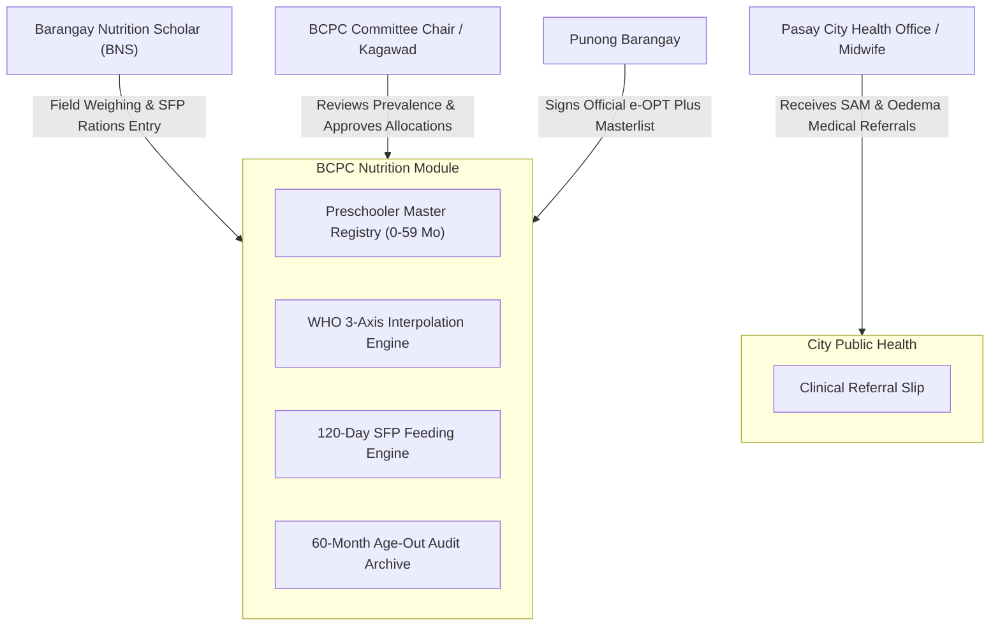

# 👶 Barangay Council for the Protection of Children (BCPC) Module

> **Municipal & Barangay Women and Family Protection Information System (WFPIS)**  
> **Barangay 183, Villamor Airbase, Pasay City**  
> **Module Identifier:** `bcpc`  
> **Primary Statutory Mandates:** Republic Act No. 11037 (*Masustansyang Pagkain para sa Batang Pilipino Act*), Presidential Decree No. 1567 (*Barangay Nutrition Scholar Program Decree*), Republic Act No. 8980 (*Early Childhood Care and Development Act*), DOH AO No. 2015-0055 (*Severe Acute Malnutrition Management Guidelines*), National Nutrition Council (NNC) Operation Timbang Plus (e-OPT+) Standards.

---

## 📌 1. Module Overview & Purpose

The **BCPC Child Nutrition & Health Module** is an enterprise-grade, medically validated public health tracking system engineered for Barangay 183, Pasay City. It automates the annual **Operation Timbang Plus (OPT+)** preschooler census, enforces real-time WHO growth diagnostics across 3 axes, manages the statutory **120-Day Supplemental Feeding Program (SFP)**, prevents clerical error via biological range guardrails, and maintains permanent longitudinal records for government audits (COA, DOH, NNC).

### 🎯 Key System Highlights
1. **0–59 Months Statutory Scope**: Dedicated to infant and preschool nutrition from birth up to 4 years, 11 months, and 29 days. Automated lockout and non-destructive archival trigger on the child's 5th birthday (60 months), transferring jurisdiction to DepEd School-Based Feeding.
2. **WHO 3-Axis Precision Calculator**: Performs continuous linear interpolation against official 2006 WHO Child Growth Standard tables for **Weight-for-Age (WFA)**, **Height-for-Age (HFA)**, and **Weight-for-Length/Height (WFL/H)**.
3. **Biological Range Sanity Checks ($\pm 5\text{ SD}$)**: An automated pause-prompt intercepts extreme biological outliers to stop typographical errors before database write.
4. **120-Day SFP Relapse Engine**: Longitudinal tracking across 5 mandatory clinical milestones (Day 1 Baseline, Day 30, Day 60, Day 90, Day 120 Graduation) with automatic Cycle 2 reactivation if a child relapses.
5. **DOH/NNC Official Print Engine**: Generates official formatted OPT+ masterlists with tripartite certification signature blocks (BNS, BCPC Chair, Punong Barangay).

---

## 🏛️ 2. Statutory Legal Framework & Jurisdictional Boundaries

| Legal / Policy Basis | Statutory Mandate | System Implementation |
| :--- | :--- | :--- |
| **Republic Act No. 11037** | Mandates 120-day supplemental feeding for undernourished children aged 0–59 months in LGUs. | SFP Engine creates 120-day milestone schedule and monitors net weight gain velocity ($\Delta \text{kg}$). |
| **Presidential Decree No. 1567** | Institutionalizes Barangay Nutrition Scholars (BNS) as primary grassroots health workers. | Dedicated BNS role-based access for field weighing data entry and clinic logs. |
| **DOH AO No. 2015-0055** | National guidelines for Severe Acute Malnutrition (SAM) identification and immediate clinical triage. | WFL/H z-score $<-3\text{ SD}$ or Bilateral Pitting Oedema triggers urgent Pasay Health Office referral alert. |
| **Statutory Exclusion: RA 7610** | External child abuse/exploitation cases are non-mediable public crimes under court jurisdiction. | BCPC module **excludes** a child abuse blotter; provides emergency hotlines to PNP WCPD and DSWD. |
| **Data Privacy Act (RA 10173)** | Protection of sensitive minor health and nutritional telemetry. | Strict RBAC limiting child records to BNS and health committee officials; COA audit retention compliant. |

---

## 👥 3. Actors & Stakeholders

---

## 📚 4. Module Documentation Index

1. [**Features Specification (`features.md`)**](./features.md) — Preschool census, biological outlier checks, SFP tracking, and growth charts.
2. [**System Architecture (`architecture.md`)**](./architecture.md) — Architectural layers, calculation pipelines, and database relations.
3. [**Structured Files & Folders (`structured_files_folders.md`)**](./structured_files_folders.md) — Codebase breakdown in Laravel and React.
4. [**Logics & Mathematical Algorithms (`logics_and_algorithms.md`)**](./logics_and_algorithms.md) — WHO z-score formulas, linear interpolation math, and SFP velocity calculation.
5. [**Process & Operational Workflows (`process_and_workflows.md`)**](./process_and_workflows.md) — BNS annual census workflow, weighing protocol, and SFP graduation.
6. [**Data Flow Diagrams (DFD) (`dfd.md`)**](./dfd.md) — Context Diagram, Level 0, Level 1, and Level 2 process data flows.
7. [**Fullstack Developer Guide (`fullstack_developer_guide.md`)**](./fullstack_developer_guide.md) — Endpoints, service APIs, form validation, and test suites.
