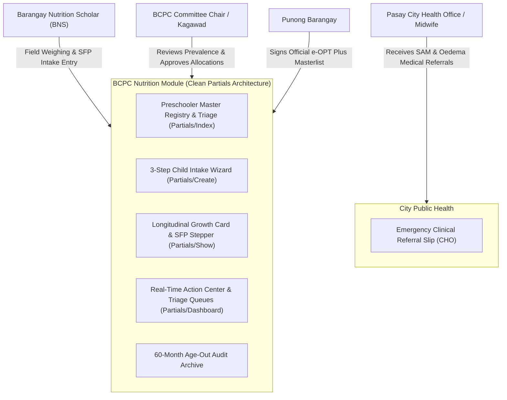

# 👶 Barangay Council for the Protection of Children (BCPC) Module

> **Municipal & Barangay Women and Family Protection Information System (WFPIS)**  
> **Barangay 183, Villamor Airbase, Pasay City**  
> **Module Identifier:** `bcpc`  
> **Primary Statutory Mandates:** Republic Act No. 11037 (*Masustansyang Pagkain para sa Batang Pilipino Act*), Presidential Decree No. 1567 (*Barangay Nutrition Scholar Program Decree*), Republic Act No. 8980 (*Early Childhood Care and Development Act*), DOH AO No. 2015-0055 (*Severe Acute Malnutrition Management Guidelines*), National Nutrition Council (NNC) Operation Timbang Plus (e-OPT+) Standards.

---

## 📌 1. Module Overview & Decision Support System (DSS) Framework

The **BCPC Child Nutrition Module** operates strictly as a **Clinical & Administrative Decision Support System (DSS)** engineered for Barangay 183, Pasay City. It assists human health workers (Barangay Nutrition Scholars, Barangay Health Workers, and Committee Officials) during the annual **Operation Timbang Plus (OPT+)** preschooler census, provides preliminary WHO growth screening across 3 axes, assists with the administrative monitoring of the statutory **120-Day Supplemental Feeding Program (SFP)**, prevents clerical error via biological range sanity checks, and prepares formatted documents for executive sign-off (COA, DOH, NNC).

> [!IMPORTANT]
> **Core Decision Support System (DSS) Mandate:**  
> 1. **No Autonomous Diagnoses:** Software calculations serve as decision-support telemetry to guide authorized personnel; they do **not** replace professional clinical judgment.
> 2. **No Automatic SFP Enrollment:** Supplemental Feeding Program (SFP) enrollment is strictly an authorized clinical decision requiring guardian consent and human activation by the BNS.
> 3. **No Unilateral Referrals or Certifications:** The system generates draft documents (CHO Referral Slips and e-OPT Plus Masterlists) which require physical review and handwritten/tripartite certification by the BNS, Kagawad on Health, and Punong Barangay.

### 🎯 Key System Highlights
1. **0–59 Months Statutory Scope**: Dedicated to infant and preschool nutrition from birth up to 4 years, 11 months, and 29 days. Automated lockout and non-destructive archival trigger on the child's 5th birthday (60 months), transferring jurisdiction to DepEd School-Based Feeding.
2. **Modular Clean-Partials Architecture**: Re-architected following the system's VAWC paradigm into clean page orchestrators supported by isolated, single-responsibility components in `Partials/` subdirectories (`Partials/Index`, `Partials/Create`, `Partials/Show`, `Partials/Dashboard`).
3. **WHO 3-Axis Precision Calculator**: Computes preliminary classifications for **Weight-for-Age (WFA)**, **Height-for-Age (HFA)**, and **Weight-for-Length/Height (WFL/H)** using continuous linear interpolation against official 2006 WHO reference standards.
4. **Biological Range Sanity Checks ($\pm 5\text{ SD}$)**: Interactive confirmation dialog intercepts extreme biological outliers (weight outside 1.5–35 kg, height outside 40–125 cm) before saving to prevent field typing mistakes.
5. **120-Day SFP Lifecycle & Velocity Tracking**: Voluntary, guardian-consented intake monitoring across 5 statutory milestones (Day 1 Baseline, Day 30, Day 60, Day 90, Day 120 Graduation) with longitudinal relapse handling.
6. **Real-Time Nutrition Action Center**: High-velocity dashboard with 10s auto-polling, interactive clinical action triage queues (SAM, MAM, Double Burden, Stunting, Overdue), active SFP roster, and Zone 1–10 malnutrition density heatmaps.
7. **DOH/NNC Official Print Engine**: Generates official formatted OPT+ masterlists with tripartite certification signature blocks (BNS, BCPC Chair, Punong Barangay).

---

## 🏛️ 2. Statutory Legal Framework & Jurisdictional Boundaries

| Legal / Policy Basis | Statutory Mandate | System Implementation |
| :--- | :--- | :--- |
| **Republic Act No. 11037** | Mandates 120-day supplemental feeding for undernourished children aged 0–59 months in LGUs. | SFP Engine creates 120-day milestone schedule and monitors net weight gain velocity ($\Delta \text{kg}$, $\text{g/day}$) with guardian consent. |
| **Presidential Decree No. 1567** | Institutionalizes Barangay Nutrition Scholars (BNS) as primary grassroots health workers. | Dedicated BNS role-based access for field weighing data entry and clinic logs. |
| **DOH AO No. 2015-0055** | National guidelines for Severe Acute Malnutrition (SAM) identification and immediate clinical triage. | WFL/H z-score $<-3\text{ SD}$ or Bilateral Pitting Oedema triggers urgent Pasay Health Office referral slip generator. |
| **Statutory Exclusion: RA 7610** | External child abuse/exploitation cases are non-mediable public crimes under court jurisdiction. | BCPC module **excludes** a child abuse blotter; provides emergency hotlines to PNP WCPD and DSWD. |
| **Data Privacy Act (RA 10173)** | Protection of sensitive minor health and nutritional telemetry. | Strict RBAC limiting child records to BNS and health committee officials; COA audit retention compliant. |

---

## 👥 3. Actors & Stakeholders

```mermaid
graph TD
    BNS["Barangay Nutrition Scholar (BNS)"] -->|Field Weighing & SFP Intake Entry| BCPC_Core
    BCPC_Chair["BCPC Committee Chair / Kagawad"] -->|Reviews Prevalence & Approves Allocations| BCPC_Core
    PB["Punong Barangay"] -->|Signs Official e-OPT Plus Masterlist| BCPC_Core
    CHO["Pasay City Health Office / Midwife"] -->|Receives SAM & Oedema Medical Referrals| External_Health

    subgraph BCPC_Core ["BCPC Nutrition Module (Clean Partials Architecture)"]
        Registry["Preschooler Master Registry & Triage (Partials/Index)"]
        Intake["3-Step Child Intake Wizard (Partials/Create)"]
        Profile["Longitudinal Growth Card & SFP Stepper (Partials/Show)"]
        Dashboard["Real-Time Action Center & Triage Queues (Partials/Dashboard)"]
        Archive["60-Month Age-Out Audit Archive"]
    end

    subgraph External_Health ["City Public Health"]
        Referral["Emergency Clinical Referral Slip (CHO)"]
    end
```

---

## 📚 4. Module Documentation Index

1. [**Features Specification (`features.md`)**](./features.md) — Preschool census, biological outlier checks, SFP tracking, and clinical triage queues.
2. [**System Architecture (`architecture.md`)**](./architecture.md) — Multi-tier architecture, clean-partials design, and database relationships.
3. [**Structured Files & Folders (`structured_files_folders.md`)**](./structured_files_folders.md) — Comprehensive directory tree across backend and frontend partials.
4. [**Logics & Mathematical Algorithms (`logics_and_algorithms.md`)**](./logics_and_algorithms.md) — WHO z-score formulas, linear interpolation math, velocity equations, and advisory disclaimers.
5. [**Process & Operational Workflows (`process_and_workflows.md`)**](./process_and_workflows.md) — BNS annual census workflow, weighing protocol, and non-automatic SFP enrollment.
6. [**Data Flow Diagrams (DFD) (`dfd.md`)**](./dfd.md) — Context Diagram, Level 0, Level 1, and Level 2 process data flows.
7. [**Fullstack Developer Guide (`fullstack_developer_guide.md`)**](./fullstack_developer_guide.md) — Endpoints, service APIs, form validation, and test suites.
