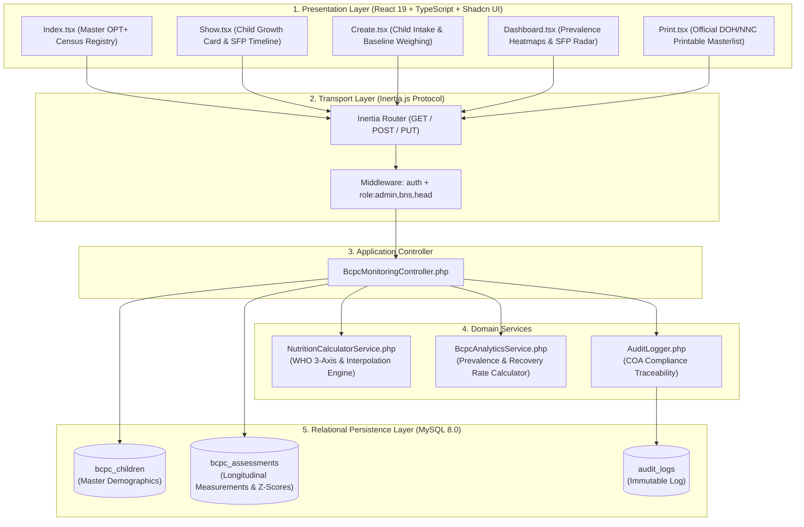
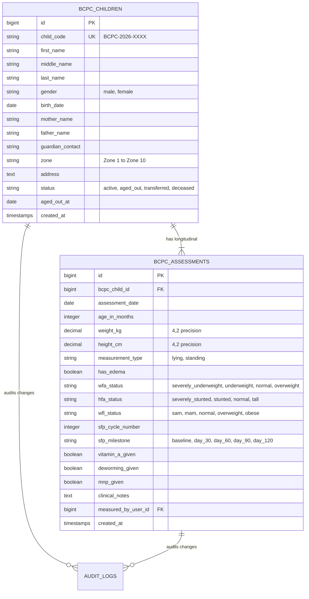

# 🏗️ BCPC Module: System Architecture

> **Municipal & Barangay Women and Family Protection Information System (WFPIS)**  
> **Module:** Barangay Council for the Protection of Children (BCPC) Child Nutrition Module

---

## 🏛️ 1. Multi-Tier Layered Architecture

The BCPC module isolates mathematical calculations from HTTP handling, delegating WHO z-score lookups to an encapsulated calculation service.

---

## 💾 2. Entity-Relationship Data Model

The schema separates stable demographic entities from time-series clinical weighing evaluations:

---

## ⚙️ 3. Service Layer Architecture

### `NutritionCalculatorService.php`
- **WHO Array Tables:** Stores static reference lookup vectors for boys and girls from month 0 to 60 (Median, $-1\text{ SD}$, $-2\text{ SD}$, $-3\text{ SD}$, $+1\text{ SD}$, $+2\text{ SD}$, $+3\text{ SD}$).
- **Continuous Interpolation:** Computes exact decimal age and performs linear interpolation between bounding monthly milestones.
- **Extreme Sanity Checking:** Implements `isBiologicalOutlier($weight, $height, $ageMonths)` returning boolean warning flags.
- **Clinical Triage Evaluator:** Assigns categorical status based on WHO standard cut-offs.

### `BcpcAnalyticsService.php`
- Computes aggregate zone prevalence:
  $$\text{Prevalence Rate} = \left( \frac{N_{\text{malnourished children in zone}}}{N_{\text{total children weighed in zone}}} \right) \times 100\%$$
- Computes SFP recovery velocity:
  $$\text{Velocity} = \frac{\text{Weight}_{\text{final}} - \text{Weight}_{\text{baseline}}}{\Delta t_{\text{days}}} \quad (\text{g/day})$$
