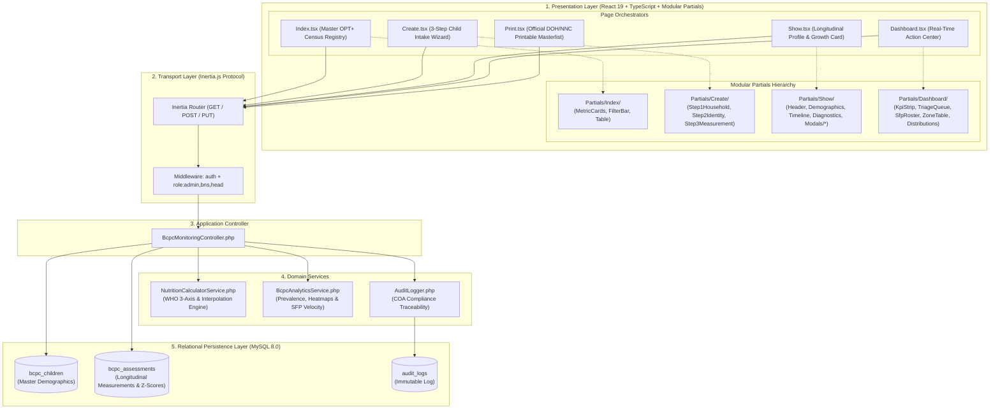
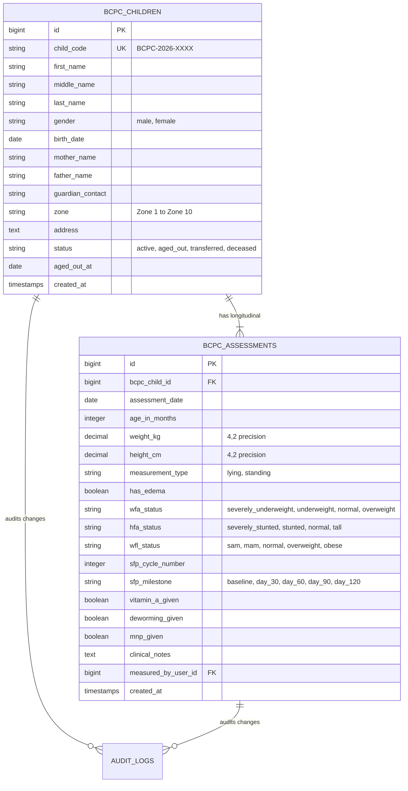

# 🏗️ BCPC Module: System Architecture

> **Municipal & Barangay Women and Family Protection Information System (WFPIS)**  
> **Module:** Barangay Council for the Protection of Children (BCPC) Child Nutrition Module  
> **Architecture Pattern:** Multi-Tier Architecture with Modular Clean-Partials Presentation Layer

---

## 🏛️ 1. Multi-Tier Layered Architecture

The BCPC module is organized into five decoupled architectural layers, isolating presentation logic, transport routing, domain business services, and database persistence.

---

## 💾 2. Entity-Relationship Data Model

The schema cleanly isolates immutable/longitudinal demographic records from time-series clinical weighing evaluations:

---

## ⚙️ 3. Service Layer Architecture

### `NutritionCalculatorService.php`
- **WHO Growth Reference Standards:** Encapsulates official WHO reference tables for boys and girls from birth to 60 months.
- **Continuous Interpolation:** Computes exact decimal age and performs linear interpolation between adjacent monthly nodes for decimal-accurate z-score approximation.
- **Extreme Biological Sanity Guardrail:** Implements `isBiologicalOutlier($weight, $height, $ageMonths)` enforcing $[1.5\text{ kg}, 35\text{ kg}]$ and $[40\text{ cm}, 125\text{ cm}]$ limits to trap typographical errors.
- **Preliminary Decision-Support Triage:** Assigns preliminary nutritional status across WFA, HFA, and WFL/H for human health worker verification.

### `BcpcAnalyticsService.php`
- **Zone Heatmap Aggregations:** Computes malnutrition density and prevalence rates across all 10 Zones of Barangay 183.
- **Clinical Action Queues:** Dynamically segments children requiring intervention (SAM, MAM, Double Burden, Stunting, Overdue Weighings).
- **SFP Velocity Engine:** Evaluates therapeutic weight velocity ($g/\text{day}$) to track rehabilitation progress.
