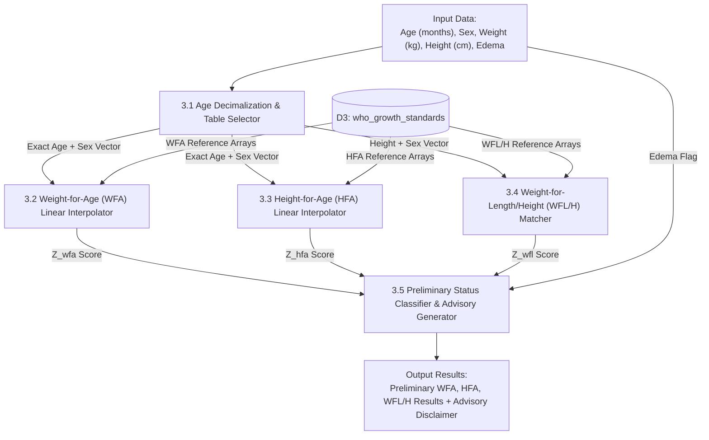

# 📊 BCPC Module: Data Flow Diagrams (DFD)

> **Municipal & Barangay Women and Family Protection Information System (WFPIS)**  
> **Module:** Barangay Council for the Protection of Children (BCPC) Child Nutrition Module  
> **Standards:** Clean Partials Architecture, NNC e-OPT Plus Standards, RA 11037

---

## 1. Context Diagram (Level 0 DFD)

The Context Diagram outlines external entities interacting with the BCPC Child Nutrition Subsystem.

```mermaid
flowchart TD
    Parent["Parent / Guardian"]
    BNS["Barangay Nutrition Scholar (BNS)"]
    BCPC_Chair["BCPC Committee Chair"]
    PB["Punong Barangay"]
    CHO["Pasay City Health Office"]
    
    BCPC_System(("(0.0)<br/>BCPC Child Nutrition &<br/>e-OPT Plus Subsystem"))

    %% Flows
    Parent -->|1. Child Demographics & Consent for SFP| BCPC_System
    BCPC_System -->|2. Growth Card & SFP Feeding Timeline| Parent

    BNS -->|3. Field Weight, Height & Clinical Oedema Telemetry| BCPC_System
    BNS -->|4. Verified SFP Milestone Weighings & Rations Logs| BCPC_System
    BCPC_System -->|5. Preliminary WHO Results, Advisory Disclaimer & Outlier Warnings| BNS

    BCPC_System -->|6. Zone Prevalence Reports & Action Center Triage Queues| BCPC_Chair
    BCPC_Chair -->|7. Program Oversight & Nutrition Resource Allocations| BCPC_System

    BCPC_System -->|8. Formatted DOH/NNC Printable e-OPT Plus Masterlist| PB
    PB -->|9. Executive Tripartite Certification & Electronic Sign-off| BCPC_System

    BCPC_System -->|10. Clinical Referral Slips (SAM & Severe Oedema)| CHO
    CHO -->|11. Inpatient Medical Discharge Assessment| BCPC_System
```

---

## 2. Level 1 Data Flow Diagram (Subsystem Decomposition)

Level 1 breaks down the subsystem into functional processes and relational data stores, highlighting the preliminary nature of nutritional calculations and human-in-the-loop SFP enrollment:

```mermaid
flowchart TD
    %% External Entities
    BNS["Barangay Nutrition Scholar"]
    Parent["Parent / Guardian"]
    BCPC_Chair["BCPC Chair"]
    PB["Punong Barangay"]
    CHO["Pasay City Health Office"]

    %% Data Stores
    D1[("D1: bcpc_children<br/>(Master Demographics)")]
    D2[("D2: bcpc_assessments<br/>(Longitudinal Measurements)")]
    D3[("D3: who_growth_standards<br/>(Static Reference Vectors)")]
    D_Audit[("D_AUDIT: audit_logs")]

    %% Processes
    P1["1.0 Child Registration & Age Lockout Check"]
    P2["2.0 Biological Range Sanity Verification"]
    P3["3.0 Preliminary WHO 3-Axis Interpolator"]
    P4["4.0 Verified 120-Day SFP Lifecycle Engine"]
    P5["5.0 Official Masterlist Reporting & Archival"]

    %% Flows
    BNS -->|Birth Date & Demographic Profile| P1
    P1 -->|Age < 60 Mo: Persist Child Profile| D1
    P1 -->|Log Registration Audit| D_Audit

    BNS -->|Weight, Height, Measurement Type| P2
    P2 -->|Check Plausibility Range (±5 SD)| P2
    P2 -->|Validated Clinical Metrics| P3

    P3 <-->|Read Lookup Standard Deviations| D3
    P3 -->|Interpolate Decimal Z-Scores| P3
    P3 -->|Store Longitudinal Weighing & Preliminary Diagnosis| D2
    P3 -->|Advisory Notice & Diagnostic Telemetry| BNS

    Parent -->|Guardian SFP Consent| P4
    BNS -->|Verified Enrollment Trigger| P4
    D2 -->|Clinical Screening Data| P4
    P4 -->|Track Daily Recovery Velocity| P4
    P4 -->|SAM / Oedema Referral Slip| CHO
    P4 -->|Update Milestone State & Rations| D2

    D1 & D2 -->|Aggregate Census & Status Data| P5
    P5 -->|Zone Malnutrition Heatmaps| BCPC_Chair
    P5 -->|Formatted DOH/NNC Report| PB
```

---

## 3. Level 2 Data Flow Diagram (Preliminary WHO 3-Axis Interpolation Engine)

Level 2 examines **Process 3.0 (Preliminary WHO 3-Axis Interpolator)**:


