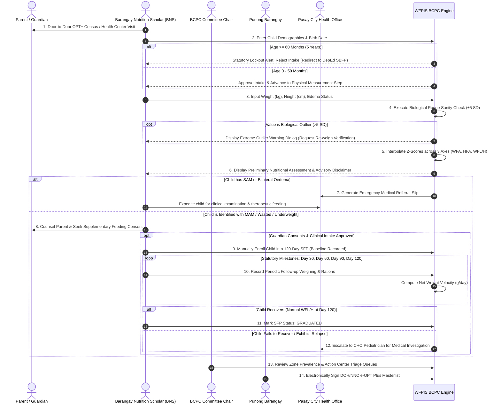

# 🔄 BCPC Module: Operational Process & Workflows

> **Municipal & Barangay Women and Family Protection Information System (WFPIS)**  
> **Module:** Barangay Council for the Protection of Children (BCPC) Child Nutrition Module  
> **Protocols:** NNC Operation Timbang Plus & DOH Guidelines (Compliant with Republic Act No. 11037)

---

## ⚠️ Statutory Clinical Disclaimer

> [!IMPORTANT]
> **Advisory Disclaimer (Adviser & NNC Compliance):**  
> *"The system generates a preliminary nutritional-status result for verification by authorized nutrition or health personnel. It does not provide a medical diagnosis or automatically enroll a child in a feeding program."*  
> Software calculations serve as decision-support telemetry. Formal clinical diagnoses and Supplementary Feeding Program (SFP) enrollments require human-in-the-loop validation by a certified Barangay Nutrition Scholar (BNS), Barangay Health Worker (BHW), or City Health Office (CHO) medical officer with parent/guardian consent.

---

## 🚦 End-to-End Operational Lifecycle

---

## 📋 Step-by-Step Field Manual for BNS & Encoders

### Step 1: Pre-Weighing Demographics & Household Verification
- Confirm child resides within one of the 10 Zones of Barangay 183 (Villamor Airbase).
- Verify child date of birth via Philippine Statistics Authority (PSA) Birth Certificate or Barangay Immunization Card (*Bakuna Card*).
- Check chronological age: Child must be strictly between 0 and 59 months. Children $\ge 60$ months are automatically locked out per RA 11037 and transitioned to the Department of Education's School-Based Feeding Program (DepEd SBFP).
- Gather guardian details, relationship, contact numbers, and address in Step 1 of the registration wizard.

### Step 2: Physical Measurement Protocol
- **Weight Measurement:**
  - Children $< 24\text{ months}$: Use an infant beam balance or hanging Salter scale with clean weighing trousers.
  - Children $\ge 24\text{ months}$: Use a calibrated digital or mechanical floor scale. Ensure light clothing and no footwear.
- **Length / Height Measurement:**
  - Children $< 24\text{ months}$: Measure recumbent length using a wooden infantometer board with sliding headboard and footpiece.
  - Children $\ge 24\text{ months}$: Measure standing height using a vertical stadiometer.
- **Bilateral Pitting Oedema Check:**
  - Press thumbs gently on the tops of both feet for 3 seconds.
  - If visible indentations remain on both feet upon release, mark `has_edema = true`.

### Step 3: Encoding & Preliminary Assessment Verification
- Open `/admin/bcpc/cases/create` (3-Step Intake Wizard):
  - **Step 1:** Guardian & household details.
  - **Step 2:** Child identity and date of birth (system calculates exact decimal age in months).
  - **Step 3:** Baseline measurements (Weight in kg to 2 decimals, Height in cm to 1 decimal).
- Review the preliminary assessment result:
  - **Weight-for-Age (WFA):** Severely Underweight, Underweight, Normal, Overweight
  - **Height-for-Age (HFA):** Severely Stunted, Stunted, Normal, Tall
  - **Weight-for-Length/Height (WFL/H):** Severely Wasted / SAM, Moderately Wasted / MAM, Normal, Overweight, Obese
- Review the prominent **Advisory Disclaimer**: Confirm that this result represents preliminary decision-support data for health worker verification.

### Step 4: Supplemental Feeding Program (SFP) Voluntary Intake
- If the child is identified as malnourished (SAM, MAM, Underweight, or Stunted):
  - SFP is **not automatically enforced** by code. Instead, the BNS engages the guardian, explains the program, and checks the voluntary enrollment toggle (`Enroll in 120-Day SFP`).
  - Active feeding entails daily fortified hot meals and micronutrient distribution over a 120-day cycle.
  - The BNS logs scheduled follow-up evaluations on Day 30, Day 60, Day 90, and Day 120 via the child's longitudinal profile (`/admin/bcpc/cases/{id}`).

### Step 5: Clinical Escalation & City Health Office (CHO) Referral
- When a child presents with **Severe Acute Malnutrition (SAM)** or **Bilateral Pitting Oedema**:
  - The system highlights the red-flag clinical badge.
  - The BNS clicks **"Generate CHO Referral Slip"** from the profile header.
  - The child is immediately expedited to the Pasay City Health Office or nearest health center for medical evaluation and therapeutic feeding (RUTF).

### Step 6: Annual Masterlist Generation & Executive Certification
- At the conclusion of the annual OPT+ census campaign:
  - Access the printable masterlist at `/admin/bcpc/print`.
  - Filter by Zone (1–10) or view the consolidated Barangay 183 registry.
  - Print the standardized NNC e-OPT Plus format featuring official certification and signature blocks for:
    1. **Barangay Nutrition Scholar (BNS)** (Preparer)
    2. **BCPC Committee Chairperson** (Reviewer)
    3. **Punong Barangay** (Approving Official)
