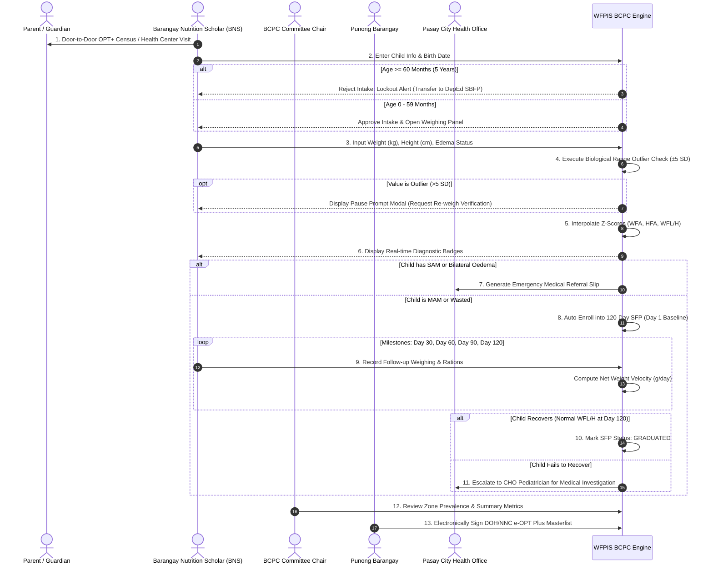

# 🔄 BCPC Module: Operational Process & Workflows

> **Municipal & Barangay Women and Family Protection Information System (WFPIS)**  
> **Module:** Barangay Council for the Protection of Children (BCPC) Child Nutrition Module  
> **Protocols:** NNC Operation Timbang Plus & DOH Guidelines

---

## 🚦 End-to-End Operational Lifecycle

---

## 📋 2. Step-by-Step Field Manual for BNS

### Step 1: Pre-Weighing Screening
- Confirm child resides within one of the 10 Zones of Barangay 183.
- Verify child date of birth via PSA Birth Certificate or Barangay Immunization Card (*Bakuna Card*).
- Check age: Must be between 0 and 59 months.

### Step 2: Physical Measurement Protocol
- **Weight Measurement:**
  - Children $< 24\text{ months}$: Use infant beam balance or hanging Salter scale with clean weighing trousers.
  - Children $\ge 24\text{ months}$: Use calibrated digital/mechanical bathroom floor scale. Ensure light clothing, no shoes.
- **Length / Height Measurement:**
  - Children $< 24\text{ months}$: Measure recumbent length using wooden infantometer board.
  - Children $\ge 24\text{ months}$: Measure standing height using vertical stadiometer.
- **Bilateral Pitting Oedema Check:**
  - Press thumbs gently on the tops of both feet for 3 seconds.
  - If indentation remains on both feet, mark `has_edema = true`.

### Step 3: Encoding & System Validation
- Open `/admin/bcpc` -> Click `New Child Intake`.
- Fill required demographic fields.
- Enter weight to 2 decimal places (e.g. `9.45`) and height to 1 decimal place (e.g. `76.2`).
- Click `Calculate Status`:
  - System highlights three badges:
    - **Weight-for-Age:** *Normal*
    - **Height-for-Age:** *Stunted*
    - **Weight-for-Height:** *Normal*

### Step 4: SFP Feeding Management
- If child is enrolled in SFP:
  - Coordinate with barangay nutrition feeding center for daily fortified hot meal distribution.
  - Record periodic check-ins in the child's `Show.tsx` profile on Day 30, Day 60, Day 90, and Day 120.
  - If child reaches Day 120 with normal growth metrics, system issues a graduation certificate.

### Step 5: Official Masterlist Printing & Sign-Off
- At the end of the OPT+ census campaign (March 31):
  - Go to `/admin/bcpc/print`.
  - Filter by Zone or generate consolidated Barangay 183 masterlist.
  - Export printable document containing official NNC layout and signature lines for BNS, BCPC Committee Chair, and Punong Barangay.
