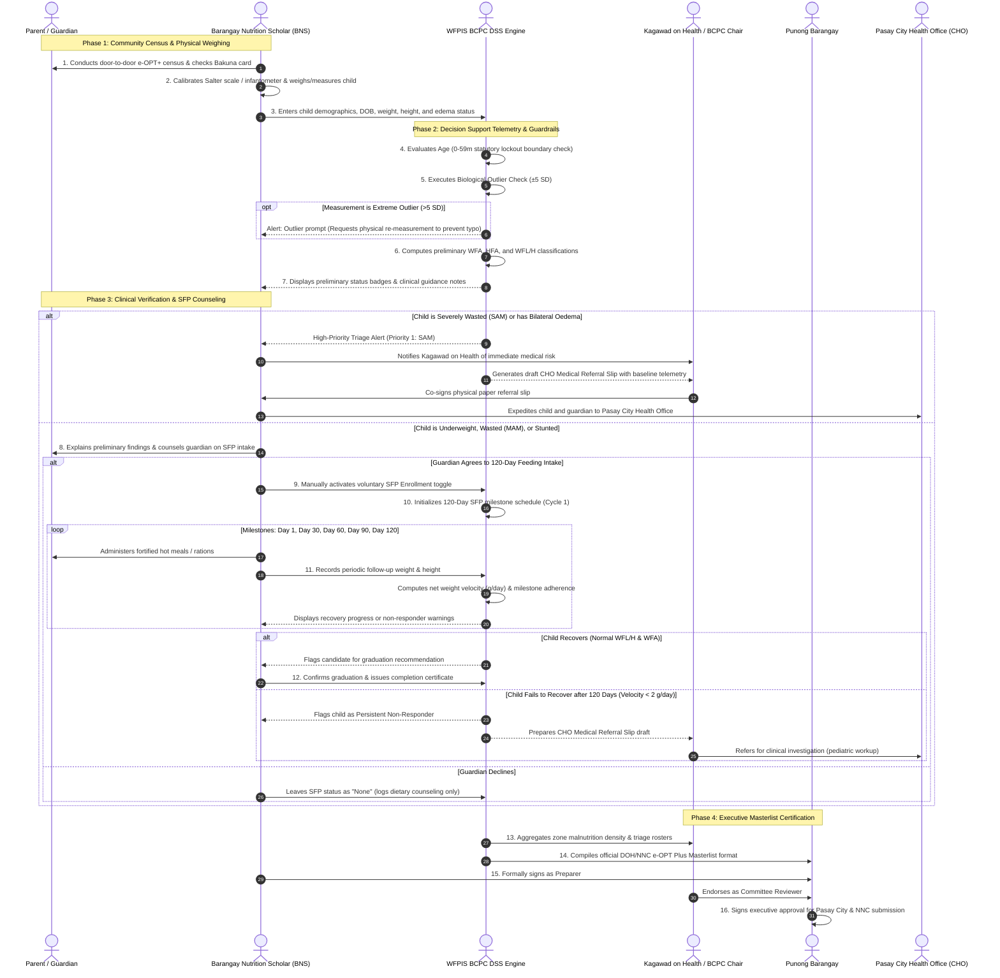

# 🔄 BCPC Module: Operational Process & Decision Support Workflows

> **Municipal & Barangay Women and Family Protection Information System (WFPIS)**  
> **Module:** Barangay Council for the Protection of Children (BCPC) Child Nutrition Module  
> **Framework:** Clinical & Administrative Decision Support System (DSS)  
> **Statutory Basis:** Republic Act No. 11037 (*Masustansyang Pagkain para sa Batang Pilipino Act*), Presidential Decree No. 1567 (*BNS Program Decree*)  
> **Authorized Personnel:** Barangay Nutrition Scholar (BNS), Kagawad on Health & Sanitation (BCPC Committee Head), Punong Barangay

---

## ⚠️ Core Decision Support System (DSS) Governance

> [!IMPORTANT]
> **Decision Support Mandate (Human-in-the-Loop Authority):**  
> 1. **No Autonomous Clinical Diagnoses:** The system calculates preliminary Z-score thresholds and flags nutritional anomalies to assist authorized human health workers. It does **not** provide definitive medical diagnoses.
> 2. **No Automatic SFP Enrollment:** Supplementary Feeding Program (SFP) enrollment is strictly an authorized clinical and administrative decision requiring parental/guardian consent and manual activation by the BNS/health committee. The system only provides recommendation guidance based on WHO triage cutoffs.
> 3. **No Unilateral Medical Referrals:** The system drafts official referral slips with telemetry data, but formal transmission to the Pasay City Health Office (CHO) requires review and physical signature by the BNS and the Kagawad on Health & Sanitation.
> 4. **No Automated Legal/Census Certification:** The e-OPT Plus Masterlist requires manual review and tripartite physical certification by the BNS, BCPC Committee Chair, and Punong Barangay.

---

## 🚦 End-to-End Decision Support Lifecycle

```mermaid
sequenceDiagram
    autonumber
    actor Parent as Parent / Guardian
    actor BNS as Barangay Nutrition Scholar (BNS)
    actor DSS as WFPIS BCPC DSS Engine
    actor Kagawad as Kagawad on Health / BCPC Chair
    actor PB as Punong Barangay
    actor CHO as Pasay City Health Office (CHO)

    Note over Parent,BNS: Phase 1: Community Census & Physical Weighing
    BNS->>Parent: 1. Conducts door-to-door e-OPT+ census & checks Bakuna card
    BNS->>BNS: 2. Calibrates Salter scale / infantometer & weighs/measures child
    BNS->>DSS: 3. Enters child demographics, DOB, weight, height, and edema status

    Note over DSS: Phase 2: Decision Support Telemetry & Guardrails
    DSS->>DSS: 4. Evaluates Age (0-59m statutory lockout boundary check)
    DSS->>DSS: 5. Executes Biological Outlier Check (±5 SD)
    opt Measurement is Extreme Outlier (>5 SD)
        DSS-->>BNS: Alert: Outlier prompt (Requests physical re-measurement to prevent typo)
    end
    DSS->>DSS: 6. Computes preliminary WFA, HFA, and WFL/H classifications
    DSS-->>BNS: 7. Displays preliminary status badges & clinical guidance notes

    Note over BNS,Parent: Phase 3: Clinical Verification & SFP Counseling
    alt Child is Severely Wasted (SAM) or has Bilateral Oedema
        DSS-->>BNS: High-Priority Triage Alert (Priority 1: SAM)
        BNS->>Kagawad: Notifies Kagawad on Health of immediate medical risk
        DSS-->>Kagawad: Generates draft CHO Medical Referral Slip with baseline telemetry
        Kagawad->>BNS: Co-signs physical paper referral slip
        BNS->>CHO: Expedites child and guardian to Pasay City Health Office
    else Child is Underweight, Wasted (MAM), or Stunted
        BNS->>Parent: 8. Explains preliminary findings & counsels guardian on SFP intake
        alt Guardian Agrees to 120-Day Feeding Intake
            BNS->>DSS: 9. Manually activates voluntary SFP Enrollment toggle
            DSS->>DSS: 10. Initializes 120-Day SFP milestone schedule (Cycle 1)
            
            loop Milestones: Day 1, Day 30, Day 60, Day 90, Day 120
                BNS->>Parent: Administers fortified hot meals / rations
                BNS->>DSS: 11. Records periodic follow-up weight & height
                DSS->>DSS: Computes net weight velocity (g/day) & milestone adherence
                DSS-->>BNS: Displays recovery progress or non-responder warnings
            end

            alt Child Recovers (Normal WFL/H & WFA)
                DSS-->>BNS: Flags candidate for graduation recommendation
                BNS->>DSS: 12. Confirms graduation & issues completion certificate
            else Child Fails to Recover after 120 Days (Velocity < 2 g/day)
                DSS-->>BNS: Flags child as Persistent Non-Responder
                DSS-->>Kagawad: Prepares CHO Medical Referral Slip draft
                Kagawad->>CHO: Refers for clinical investigation (pediatric workup)
            end
        else Guardian Declines
            BNS->>DSS: Leaves SFP status as "None" (logs dietary counseling only)
        end
    end

    Note over Kagawad,PB: Phase 4: Executive Masterlist Certification
    DSS->>Kagawad: 13. Aggregates zone malnutrition density & triage rosters
    DSS->>PB: 14. Compiles official DOH/NNC e-OPT Plus Masterlist format
    BNS->>PB: 15. Formally signs as Preparer
    Kagawad->>PB: Endorses as Committee Reviewer
    PB->>PB: 16. Signs executive approval for Pasay City & NNC submission
```

---

## 📋 Step-by-Step Field Operating Manual for Authorized Personnel

### Step 1: Physical Examination Protocol (BNS Field Mandate)
- **Age Verification:** Inspect child PSA Birth Certificate or Barangay Immunization Card (*Bakuna Card*). Calculate age: Child must be strictly between 0 and 59 months.
  - Children $\ge 60$ months (5 years) are statutory responsibility of the Department of Education (DepEd SBFP) under RA 11037.
- **Physical Weight Protocol:**
  - Children $< 24\text{ months}$: Use hanging Salter scale or infant beam balance with calibrated weighing pants.
  - Children $\ge 24\text{ months}$: Use calibrated digital/beam floor scale in light clothing without footwear.
- **Length / Height Protocol:**
  - Children $< 24\text{ months}$: Measure recumbent length using a wooden infantometer board.
  - Children $\ge 24\text{ months}$: Measure standing height using a vertical stadiometer.
- **Bilateral Pitting Oedema Inspection:**
  - Press thumbs gently on the tops of both feet for 3 seconds. Check for indentation to detect fluid retention.

### Step 2: DSS Data Encoding & Preliminary Screening
- An authorized staff member (Admin or Committee Head) opens `/admin/bcpc/cases/create` (3-Step Wizard):
  - **Step 1:** Guardian contact, household address, and Barangay Zone (Zones 1–10).
  - **Step 2:** Child identity, sex, and date of birth.
  - **Step 3:** Date of weighing, weight (kg), height (cm), and oedema checkbox.
- The DSS immediately processes the inputs and displays:
  - Preliminary WFA, HFA, and WFL/H diagnostic classifications.
  - Outlier verification prompts if values deviate $> 5\text{ SD}$ from biological norms.
  - **Mandatory Advisory Notice:** Confirming this is preliminary screening telemetry for BNS validation.

### Step 3: SFP Intake Authorization (Human Decision)
- If the child exhibits wasting, stunting, or underweight status:
  - The system **recommends** intervention but **does not force enrollment**.
  - The BNS explains the program requirements to the guardian (daily feeding for 120 days).
  - If the guardian gives consent, the encoder marks the voluntary toggle `Enroll in 120-Day SFP`.
  - **Contraindication Rule:** If preliminary screening indicates Overweight or Obese status, the system prevents caloric SFP enrollment to prevent overnutrition complications.

### Step 4: Follow-up Weighings & Velocity Monitoring
- BNS schedules weighings aligned with the 5 statutory milestones: Day 1 (Baseline), Day 30, Day 60 (Mid-term), Day 90, and Day 120 (Graduation evaluation).
- At each visit, BNS records new weight and height via the child's profile (`/admin/bcpc/cases/{id}`).
- The DSS calculates:
  $$\text{Net Weight Velocity } (V) = \left( \frac{W_{\text{latest}} - W_{\text{baseline}}}{\Delta t_{\text{days}}} \right) \times 1000 \quad [\text{g/day}]$$
- If velocity is positive ($\ge 5\text{ g/day}$), recovery is progressing well.
- If velocity falters ($< 2\text{ g/day}$ at or after Day 60), the DSS alerts the BNS of potential non-response.

### Step 5: Clinical Escalation & Paper Referral Slips
- For severe cases (SAM, Bilateral Oedema, or Day 120 Non-Responders):
  - The DSS provides an official **City Health Office (CHO) Medical Referral Slip** generator.
  - The encoder prints the paper slip containing baseline weight, latest weight, net velocity, and preliminary diagnostic classifications.
  - The **BNS (Assessor)** and **Kagawad on Health & Sanitation (Committee Head)** physically sign the referral slip.
  - The guardian takes the signed paper slip to the Pasay City Health Office for pediatrician workup.

### Step 6: Annual e-OPT Plus Census Sign-Off
- At the end of the annual Operation Timbang Plus campaign:
  - Authorized staff navigates to `/admin/bcpc/print`.
  - The DSS formats the registry into the standardized National Nutrition Council (NNC) tabular layout.
  - The document is printed on legal paper and signed by:
    1. **Barangay Nutrition Scholar (BNS)** — Preparer
    2. **Kagawad on Health & Sanitation / BCPC Chair** — Reviewer
    3. **Punong Barangay (Barangay Captain)** — Executive Approval
  - The certified document is submitted to the Pasay City Nutrition Committee and the DOH.
