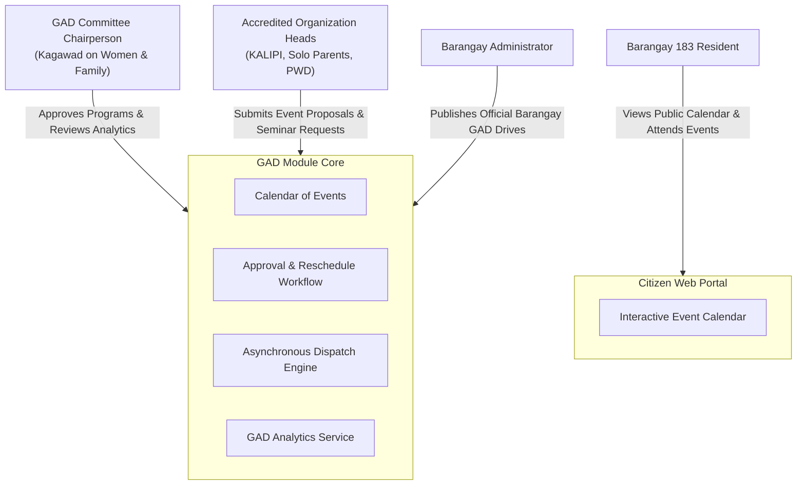

# 🌸 Gender and Development (GAD) Module

> **Municipal & Barangay Women and Family Protection Information System (WFPIS)**  
> **Barangay 183, Villamor Airbase, Pasay City**  
> **Module Identifier:** `gad`  
> **Primary Statutory Mandates:** Republic Act No. 9710 (*Magna Carta of Women*), PCW-DILG-DBM-NEDA Joint Memorandum Circular No. 2013-01 (*Barangay GAD Focal Point System Guidelines*), Republic Act No. 11313 (*Safe Spaces Act*).

---

## 📌 1. Module Overview & Executive Summary

The **Gender and Development (GAD) Module** enables Barangay 183 to institutionalize gender-responsive governance and public program coordination. Under Philippine law, local government units must allocate at least **5% of their total annual budget** to Gender and Development plans, activities, and capacity-building programs.

The GAD module serves as the central coordination hub for:
1. **Annual GAD Calendar of Activities & Seminars**: Digitally schedules, publishes, and coordinates community livelihood workshops, anti-VAWC awareness seminars, and legal literacy campaigns.
2. **Community Event Proposal & Approval Workflow**: Allows accredited civil society groups and organization presidents to submit program proposals for review, approval, or rescheduling by the GAD Committee Head.
3. **Automated Citizen Notification Engine**: Dispatches background email broadcasts via asynchronous Laravel queues (`SendBulkGadEventEmail`) upon event approval.
4. **Sectoral Outreach & Demographic Tracking**: Integrates with accredited community sectors (KALIPI, Solo Parents, Senior Citizens, PWDs, LGBTQ+ KABAHAGI) to verify that GAD expenditures directly benefit marginalized groups.
5. **DILG/PCW Accomplishment Reporting**: Aggregates event metrics, participation figures, and project statuses for official annual GAD Accomplishment Reports.

---

## 🏛️ 2. Statutory Legal Framework

| Statutory Basis | Legal Requirement | System Implementation |
| :--- | :--- | :--- |
| **Republic Act No. 9710 (Sec. 36)** | Mandatory allocation of $\ge 5\%$ of LGU budget for GAD programs and activities. | Event budgeting tags, accomplishment categorization, and participation metrics tracking. |
| **PCW-DILG-DBM-NEDA JMC 2013-01** | Guidelines on the localization of the Magna Carta of Women at the barangay level. | Institutionalizes GAD Focal Point System (GFPS) review workflows for community initiatives. |
| **Republic Act No. 11313** | Safe Spaces Act awareness and community-based anti-harassment training campaigns. | Event category classification for Bataan/Pasay community educational drives. |
| **DILG Memorandum Circulars** | Submission of annual Barangay GAD Accomplishment Report (GAR). | Automated year-by-year event analytics and sector attendance dashboards. |

---

## 👥 3. Actors & Stakeholders

---

## 📚 4. Module Documentation Index

1. [**Features Specification (`features.md`)**](./features.md) — GAD event calendar, proposal workflows, bulk alerts, and analytics.
2. [**System Architecture (`architecture.md`)**](./architecture.md) — Multi-tier design, asynchronous queue dispatch, and data relations.
3. [**Structured Files & Folders (`structured_files_folders.md`)**](./structured_files_folders.md) — Exact codebase map across controllers, jobs, and React components.
4. [**Logics & Mathematical Algorithms (`logics_and_algorithms.md`)**](./logics_and_algorithms.md) — GAD project approval state machine, attendance metrics, and sector radar formulations.
5. [**Process & Operational Workflows (`process_and_workflows.md`)**](./process_and_workflows.md) — Program proposal lifecycle, review procedures, and annual reporting.
6. [**Data Flow Diagrams (DFD) (`dfd.md`)**](./dfd.md) — Context Diagram, Level 0, Level 1, and Level 2 process data flows.
7. [**Fullstack Developer Guide (`fullstack_developer_guide.md`)**](./fullstack_developer_guide.md) — Route matrix, controller handlers, queue jobs, and test assertions.
