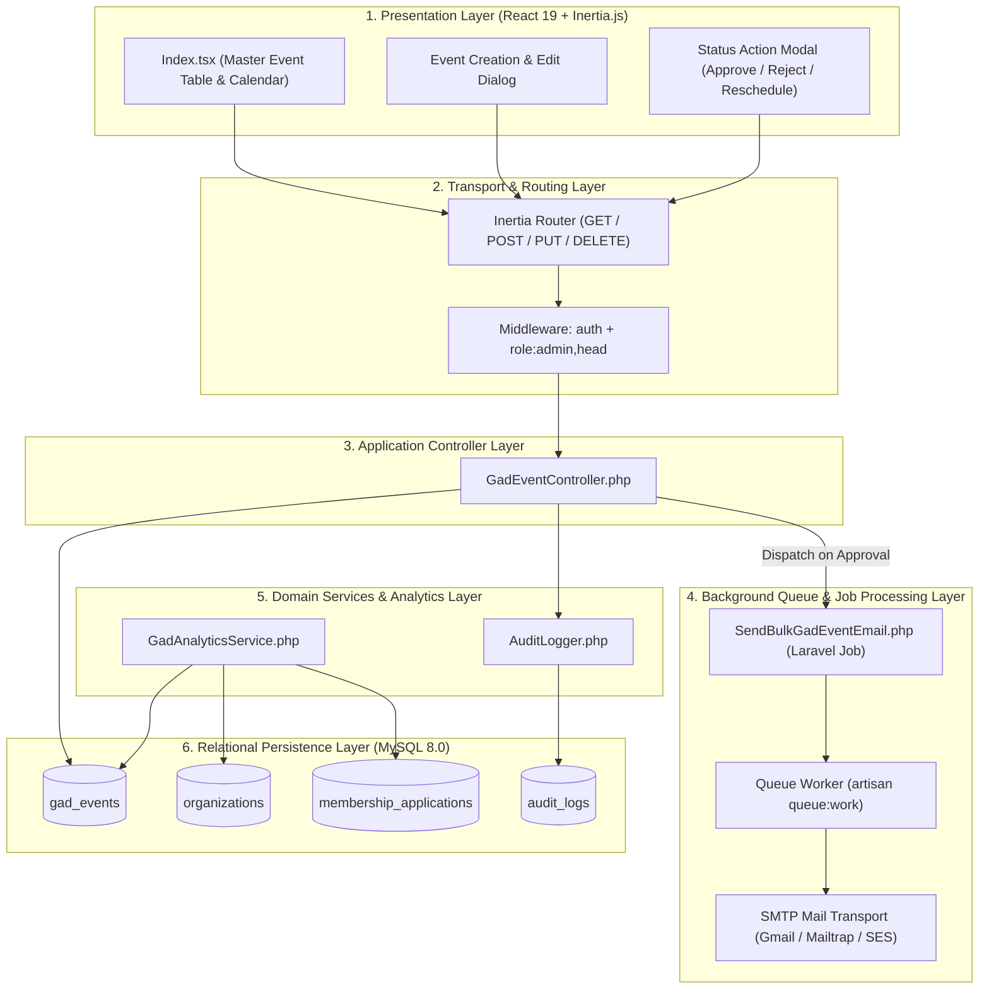
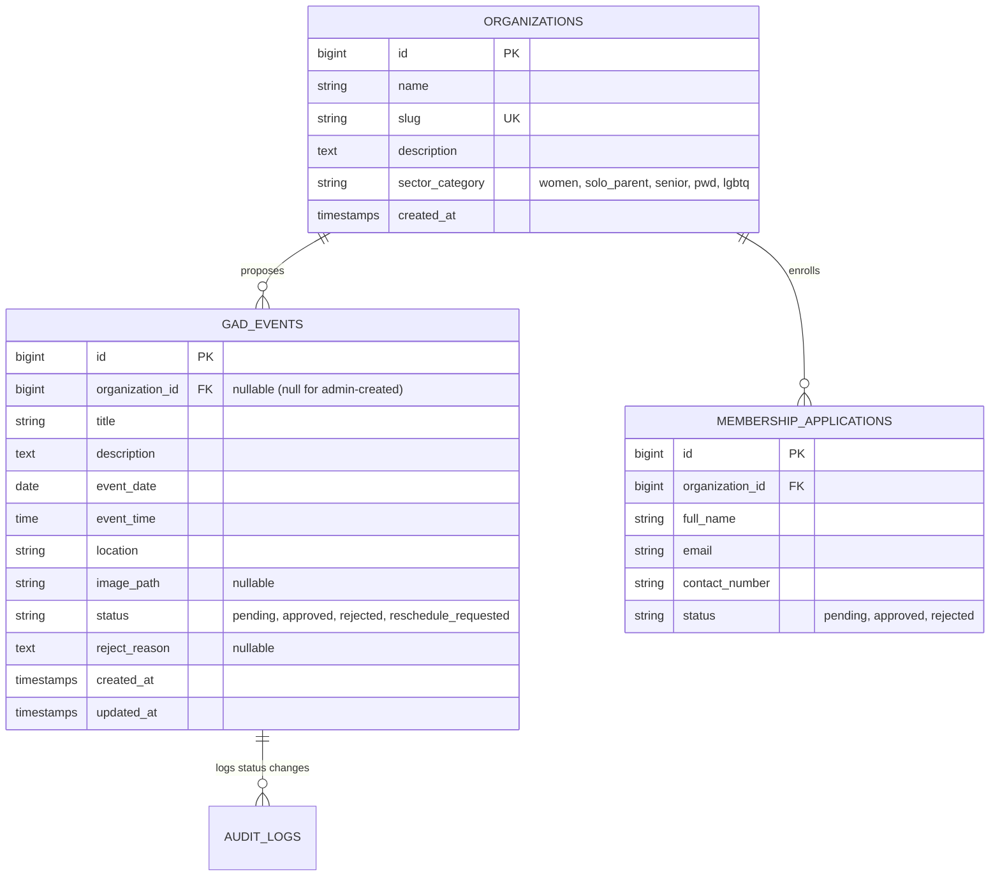

# 🏗️ GAD Module: System Architecture

> **Municipal & Barangay Women and Family Protection Information System (WFPIS)**  
> **Module:** Gender and Development (GAD) Module

---

## 🏛️ 1. Layered Architecture & Asynchronous Event Processing

The GAD module integrates standard request-response operations with background asynchronous queue workers for citizen notifications.



---

## 💾 2. Relational Database Schema



---

## ⚙️ 3. Execution Pipeline & State Transitions

1. **Intake Evaluation:**
   - If user role is `admin` or `head`: `status` defaults to `approved`.
   - If user role is `organization_head`: `status` defaults to `pending`.
2. **Approval Hook:**
   - When transitioning from `pending` -> `approved`:
     ```php
     SendBulkGadEventEmail::dispatch($event);
     ```
   - Dispatches email alerts to all approved members belonging to the sponsoring organization.
3. **Analytics Aggregation:**
   - `GadAnalyticsService` queries `gad_events` by year and aggregates metrics across event statuses, linking them to sectoral membership counts in `membership_applications`.
