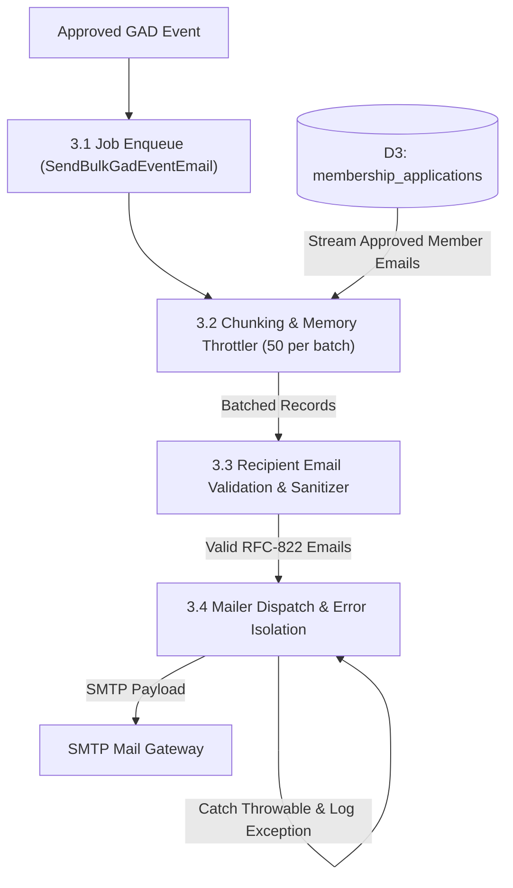

# 📊 GAD Module: Data Flow Diagrams (DFD)

> **Municipal & Barangay Women and Family Protection Information System (WFPIS)**  
> **Module:** Gender and Development (GAD) Module

---

## 1. Context Diagram (Level 0 DFD)

```mermaid
flowchart TD
    Proponent["Organization Proponent"]
    GAD_Head["GAD Committee Head / Admin"]
    Citizen["Barangay Resident / Member"]
    DILG["DILG / PCW Oversight"]
    
    GAD_System(("(0.0)<br/>GAD Activity Coordination &<br/>Event Management Subsystem"))

    Proponent -->|1. Event Proposal & Target Demographic| GAD_System
    GAD_System -->|2. Proposal Status & Reschedule Advisories| Proponent

    GAD_System -->|3. Pending Proposals & Calendar Overview| GAD_Head
    GAD_Head -->|4. Approval / Rejection / Reschedule Orders| GAD_System

    GAD_System -->|5. Public Interactive Event Calendar| Citizen
    GAD_System -->|6. Asynchronous Notification Emails| Citizen

    GAD_System -->|7. Annual GAD Accomplishment Report (GAR)| DILG
```

---

## 2. Level 1 Data Flow Diagram (Subsystem Decomposition)

```mermaid
flowchart TD
    %% Entities
    Proponent["Organization Proponent"]
    GAD_Head["GAD Head / Admin"]
    Citizen["Resident / Member"]
    QueueWorker["Laravel Queue Daemon"]

    %% Data Stores
    D1[("D1: gad_events")]
    D2[("D2: organizations")]
    D3[("D3: membership_applications")]
    D_Audit[("D_AUDIT: audit_logs")]

    %% Processes
    P1["1.0 Event Proposal Intake"]
    P2["2.0 GAD Committee Vetting & State Machine"]
    P3["3.0 Queue Notification Dispatcher"]
    P4["4.0 Public Calendar Display"]
    P5["5.0 GAD Analytics & GAR Aggregator"]

    Proponent -->|Title, Date, Description, Banner| P1
    P1 -->|Create Record (Status: PENDING)| D1
    
    D1 -->|Query Pending Events| P2
    GAD_Head -->|Approve / Reject / Reschedule Action| P2
    P2 -->|Update Event Status & Reject Reason| D1
    P2 -->|Log Review Action| D_Audit

    P2 -->|Trigger Job on Approval| P3
    P3 -->|Read Event Details| D1
    P3 -->|Query Target Member Emails| D3
    P3 -->|Dispatch Chunks| QueueWorker
    QueueWorker -->|Send Emails| Citizen

    D1 -->|Approved Events| P4
    P4 -->|Render Calendar Grid| Citizen

    D1 & D2 & D3 -->|Aggregate Outreach Data| P5
    P5 -->|Annual GAD Metrics| GAD_Head
```

---

## 3. Level 2 Data Flow Diagram (Asynchronous Notification Pipeline)


