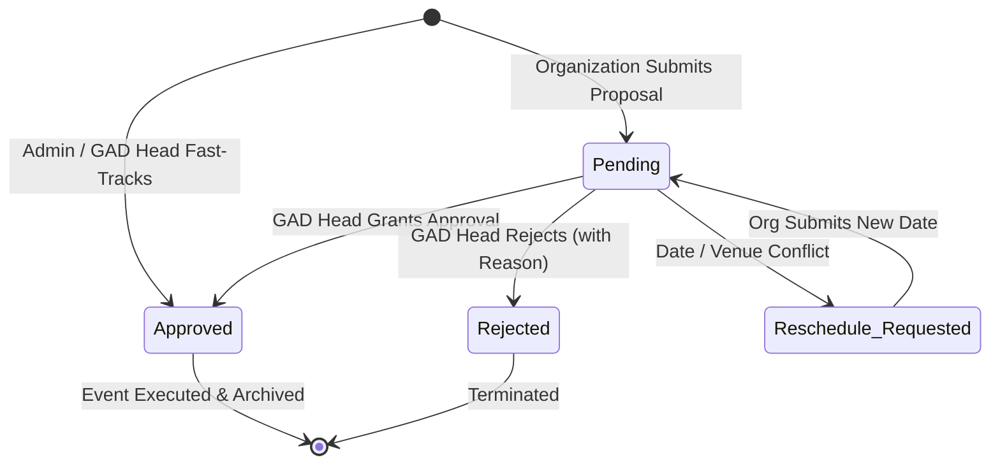

# 🧮 GAD Module: Logics, Rules & Mathematical Algorithms

> **Municipal & Barangay Women and Family Protection Information System (WFPIS)**  
> **Module:** Gender and Development (GAD) Module

---

## 🚦 1. Event Proposal State Machine

The lifecycle of an event submitted by a community organization is governed by a deterministic Finite State Machine (FSM):



### Transition Rule Constraints
1. **Pending $\to$ Approved:** Requires user role `admin` or `head`. Triggers queue event `SendBulkGadEventEmail`.
2. **Pending $\to$ Rejected:** Requires non-empty string `reject_reason` (min 10 characters).
3. **Pending $\to$ Reschedule_Requested:** Marks record for review by proponent; event remains hidden from public calendar.

---

## 🛡️ 2. Bulk Email Dispatch & Timeout Protection Logic

When an event is approved, notification emails must be sent to hundreds of organization members. In environments where background queues are running synchronously (`QUEUE_CONNECTION=sync`), PHP's standard 30-second execution limit can cause fatal crashes.

### The Chunking & Timeout Defense Pattern
```php
// app/Jobs/SendBulkGadEventEmail.php
public function handle(): void
{
    // Prevent PHP timeout on shared hosts or synchronous queue drivers
    if (function_exists('set_time_limit')) {
        @set_time_limit(0);
    }

    $membersQuery = MembershipApplication::where('status', 'approved');
    
    if ($this->event->organization_id) {
        $membersQuery->where('organization_id', $this->event->organization_id);
    }

    // Process in deterministic chunks of 50 to conserve memory
    $membersQuery->chunk(50, function ($members) {
        foreach ($members as $member) {
            if (empty($member->email)) continue;

            try {
                Mail::to($member->email)->send(new GadEventNotificationMail($this->event, $member));
            } catch (\Throwable $e) {
                // Individual delivery failure is logged without terminating the entire queue
                Log::warning("Failed to dispatch GAD notification to {$member->email}: " . $e->getMessage());
            }
        }
    });
}
```

---

## 📊 3. GAD Program Accomplishment & Outreach Formulations

To satisfy DILG and PCW annual auditing requirements, the system computes the following performance metrics:

### 3.1 Proposal Approval Index (PAI)
$$\text{PAI} = \left( \frac{N_{\text{approved}}}{N_{\text{submitted proposals}}} \right) \times 100\%$$

### 3.2 Sectoral Outreach Ratio (SOR)
Measures the proportion of accredited sector members reached by approved GAD activities:

$$\text{SOR}_{\text{sector}} = \left( \frac{\text{Attended / Notified Members in Sector}}{\text{Total Registered Members in Sector}} \right) \times 100\%$$

* **High Engagement:** $\text{SOR} \ge 75\%$
* **Moderate Engagement:** $50\% \le \text{SOR} < 75\%$
* **Underrepresented Sector:** $\text{SOR} < 50\%$ (Triggers automated GAD planning recommendation for subsequent quarter).
