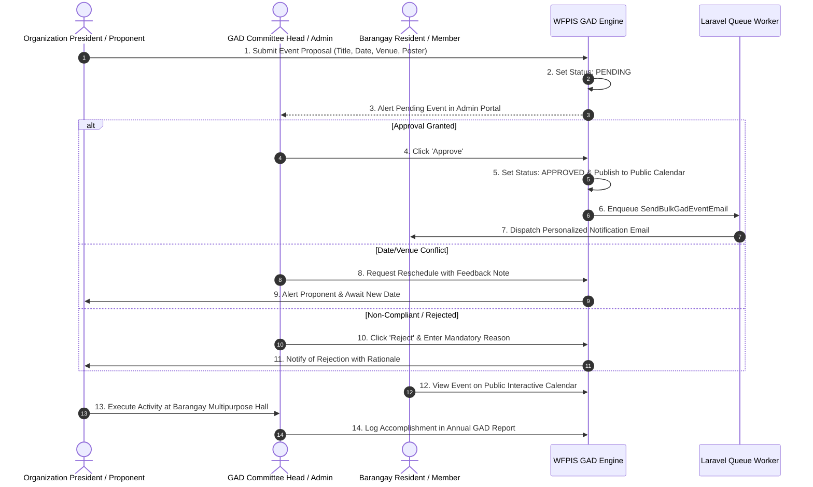

# 🔄 GAD Module: Operational Process & Workflows

> **Municipal & Barangay Women and Family Protection Information System (WFPIS)**  
> **Module:** Gender and Development (GAD) Module

---

## 🚦 End-to-End Operational Lifecycle

---

## 📋 2. Step-by-Step Officer Procedures

### Workflow A: Direct Admin Event Creation (Fast-Track)
1. Navigate to `/admin/gad-events`.
2. Click **Create GAD Event**.
3. Enter title (e.g. *"Barangay 183 Women's Month Livelihood Seminar"*), description, date, start time, and venue.
4. Upload promotional poster banner (`.jpg` or `.png`, max 2MB).
5. Click **Publish Event**.
   - System sets `status = 'approved'` immediately.
   - Event appears in the citizen public calendar.
   - Asynchronous notification job is enqueued.

### Workflow B: Reviewing Community Organization Proposals
1. In `/admin/gad-events`, switch filter tab to **Pending**.
2. Click the action dropdown (`...`) on the pending event row.
3. Choose one of three options:
   - **Approve:** Opens confirmation dialog. Clicking confirm executes state change and starts email notifications.
   - **Request Reschedule:** Enter requested date adjustment notes (e.g., *"Barangay covered court is booked for vaccination drive on this date"*).
   - **Reject:** Enter statutory or policy rejection reason.
4. The system logs the reviewing officer's user ID in the audit trail.
