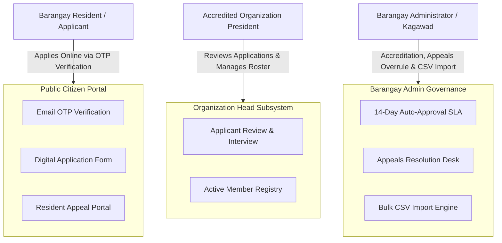

# 👥 Community Organizations & Beneficiary Governance Module

> **Municipal & Barangay Women and Family Protection Information System (WFPIS)**  
> **Barangay 183, Villamor Airbase, Pasay City**  
> **Module Identifier:** `organizations`  
> **Primary Statutory Mandates:** Republic Act No. 8972 as amended by Republic Act No. 11861 (*Expanded Solo Parents Welfare Act*), Republic Act No. 7277 (*Magna Carta for Disabled Persons*), Republic Act No. 9994 (*Expanded Senior Citizens Act*), DILG Barangay CSO Accreditation Guidelines.

---

## 📌 1. Module Overview & Purpose

The **Community Organizations & Beneficiary Governance Module** provides a digital registry, multi-tenant administrative ecosystem, and public membership management platform for accredited civil society organizations in Barangay 183.

The module manages key grassroots organizations including:
* **KALIPI** (*Kababaihang Maralita para sa Kaunlaran*) — Marginalized women's empowerment and livelihood.
* **ERPAT** (*Empowerment and Reaffirmation of Paternal Abilities Training*) — Men/fathers against gender-based violence.
* **Solo Parents Association** — Welfare, educational grants, and statutory discounts under RA 11861.
* **PWD Federation** — Accessibility, emergency evacuation priority, and disability subsidies under RA 7277.
* **Senior Citizens Association** — Healthcare, social pension, and welfare distribution under RA 9994.
* **LGBTQ+ Community (KABAHAGI)** — Anti-discrimination and human rights advocacy.

### 🎯 Key System Highlights
1. **Multi-Tenant Scoping for Organization Heads**: Organization presidents can only view and manage membership rosters, event requests, and applicant data belonging to their specific accredited organization.
2. **Citizen Public Self-Service Portal**: Residents can browse accredited organizations and submit digital membership applications from home with Email OTP identity verification.
3. **14-Day Auto-Approval SLA Daemon**: Mandates prompt administrative review; applications unattended after 14 business days automatically transition or trigger supervisor escalations.
4. **Resident Right of Appeal Workflow**: Applicants rejected by organization heads have a statutory channel to submit an appeal to the Barangay Council for administrative overrule.
5. **CSV Roster Bulk Import & Deduplication**: High-performance streaming parser allowing desk officers to migrate historical paper rosters with automatic phone/email deduplication.

---

## 🏛️ 2. Statutory Legal Framework

| Legal Basis | Core Statutory Requirement | System Implementation in Code |
| :--- | :--- | :--- |
| **Republic Act No. 11861** | Registration and issuance of Solo Parent identification cards and benefits. | Solo parent category validation, dependent child inventory, and automated validity expiration. |
| **Republic Act No. 7277** | Verification and welfare tracking for Persons with Disabilities (PWD). | Disability type classification (visual, orthopedic, psychosocial, etc.) and accessibility tags. |
| **Republic Act No. 9994** | 60+ year citizen census and social pension masterlists. | Date of birth verification ensuring citizen is $\ge 60$ years for senior citizen accreditation. |
| **DILG MC 2019-72** | Accreditation and governance of Barangay Civil Society Organizations (CSOs). | Organization accreditation profile, bylaws repository, and officer directory management. |

---

## 👥 3. Actors & Stakeholders

---

## 📚 4. Module Documentation Index

1. [**Features Specification (`features.md`)**](./features.md) — Organization profiles, public applications, appeals desk, and CSV bulk import.
2. [**System Architecture (`architecture.md`)**](./architecture.md) — Role-scoped multi-tenancy, service classes, and data schema.
3. [**Structured Files & Folders (`structured_files_folders.md`)**](./structured_files_folders.md) — Backend and frontend codebase mapping.
4. [**Logics & Mathematical Algorithms (`logics_and_algorithms.md`)**](./logics_and_algorithms.md) — 14-Day SLA daemon, applicant deduplication, and appeal state machines.
5. [**Process & Operational Workflows (`process_and_workflows.md`)**](./process_and_workflows.md) — Public citizen application, organization review, and appeals hearing.
6. [**Data Flow Diagrams (DFD) (`dfd.md`)**](./dfd.md) — Context Diagram, Level 0, Level 1, and Level 2 process data flows.
7. [**Fullstack Developer Guide (`fullstack_developer_guide.md`)**](./fullstack_developer_guide.md) — Route matrix, controller handlers, validation rules, and testing.
