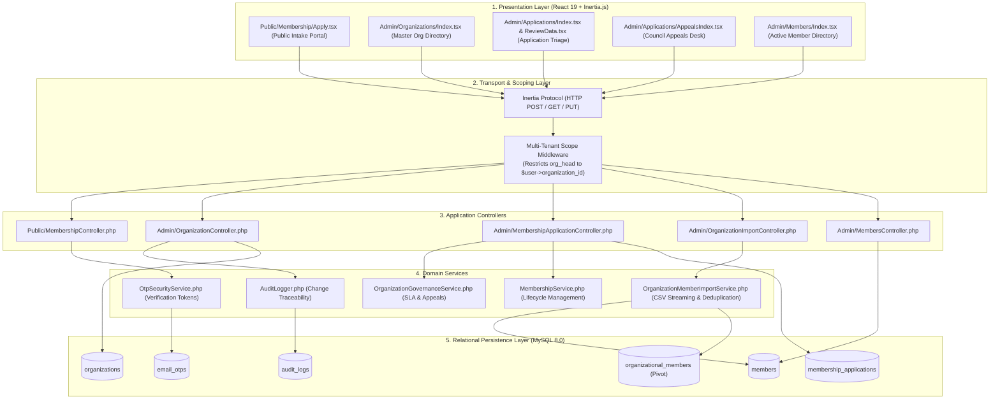
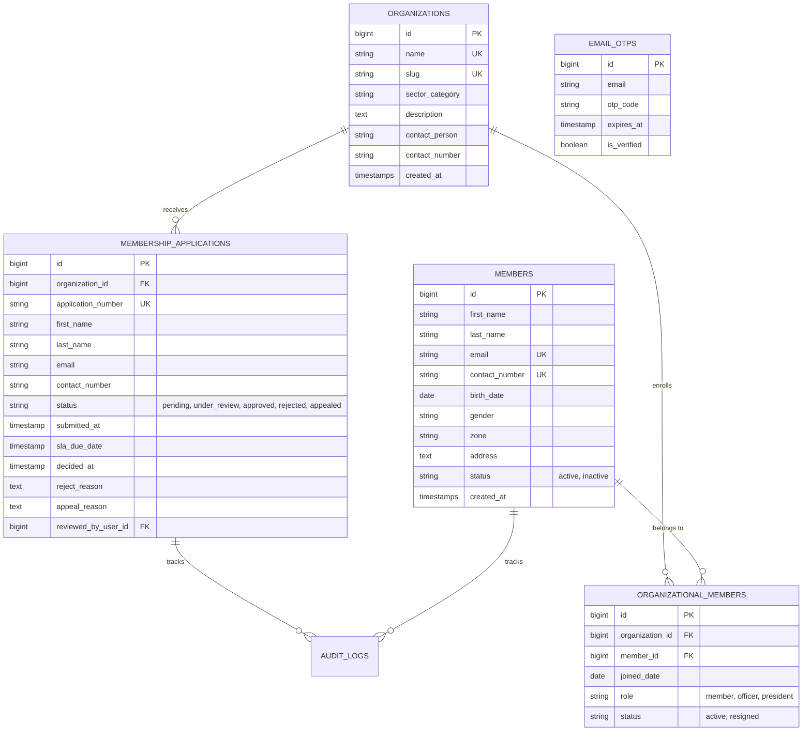

# 🏗️ Community Organizations Module: System Architecture

> **Municipal & Barangay Women and Family Protection Information System (WFPIS)**  
> **Module:** Community Organizations & Beneficiary Governance Module

---

## 🏛️ 1. Multi-Tier & Multi-Tenant Layered Architecture

The Organizations module employs role-based tenant isolation: Super Administrators have global visibility across all accredited entities, while Organization Heads are scoped strictly to their designated organization.

---

## 💾 2. Entity-Relationship Data Model

---

## ⚙️ 3. Service Layer Architecture

### `OrganizationGovernanceService.php`
- Enforces the 14-day statutory SLA policy.
- Evaluates overdue applications and dispatches escalation alerts to the Barangay Council.
- Manages the Administrative Overrule workflow, updating applicant status while logging justification into `audit_logs`.

### `OrganizationMemberImportService.php`
- Employs PHP generator pipelines to process large CSV rosters with bounded memory consumption ($< 16\text{MB}$).
- Checks duplicate indices against `members.contact_number` and `members.email`.
- Inserts new members and automatically binds them to the target organization via `organizational_members`.

### `OtpSecurityService.php`
- Generates 6-digit cryptographic tokens (`random_int(100000, 999999)`).
- Sets 10-minute expiry and tracks attempts to prevent brute-force attacks.

---

## ⚖️ 4. Appeals & Governance Command Center Architecture

### 4.1 Atomic Component Structure (Single Responsibility Principle)
Matching the modular architectural standard set by the VAWC and BCPC modules, the Appeals Command Center is broken down from a monolithic file into modular, single-responsibility components in `resources/js/pages/Admin/Applications/Partials/Appeals/`:
- **`AppealsIndex.tsx`**: Main controller and layout orchestrator. Manages page-level routing, query tabs, and modal states.
- **`AppealsKpiStats.tsx`**: Displays 4 high-contrast KPI cards with thin indicator lines (`border-l-4`), providing live counts of pending appeals, granted overrules, sustained rejections, and total resolved disputes.
- **`AppealsTable.tsx`**: Renders the simplified, high-readability queue. Employs clean columns and eliminates nested in-cell cards.
- **`AppealDossierDialog.tsx`**: Dedicated modal rendering side-by-side comparative cards (Officer Disapproval Reason vs. Resident Appeal Argument) with verbatim text and clickable document attachments.
- **`AppealConfirmDialog.tsx`**: Modal for confirming statutory actions (Overrule vs. Sustain) prior to executing state mutations.
- **`types.ts`**: Shared TypeScript contracts defining `ApplicationAppeal` and `GovernanceStats`.

### 4.2 Countering Layout Distortion from Unbounded Text
To prevent multi-paragraph resident statements or officer rationales from breaking table heights and distorting row alignments:
1. **In-Table Line-Clamping:** In `AppealsTable.tsx`, statements are clamped to a clean 2-line preview (`line-clamp-2`, `text-sm text-foreground`), ensuring row heights remain strictly uniform across any dataset volume.
2. **Dedicated Verbatim Dossier:** Clicking any row or the *"Read Full Statement & Evidence Dossier"* action opens `AppealDossierDialog.tsx`, presenting the un-truncated text inside scrollable, selectable quote blocks with attached document previews.

### 4.3 Golden Rule Typography & System Color Codings
- **Font Sizes:** Eliminates micro-fonts (`text-[10px]`, `text-[11px]`). Employs accessible, highly readable sizes: `text-3xl/4xl` for stat counters, `text-base font-bold` for applicant names, and `text-sm` for descriptions, body text, and action buttons.
- **Semantic Palette:**
  - ⚖️ **Pending Appeals / Escalations:** Amber (`amber-500` / `amber-600`)
  - 🛡️ **Executive Overrule & Approval:** Emerald (`emerald-600`)
  - 🚫 **Sustained Disapproval:** Rose (`rose-600` / `rose-700`)
  - 🏢 **Organization Identity:** Purple (`purple-600` / `purple-700`)
  - 📜 **Historical Resolution Log:** Neutral Slate (`slate-700` / `slate-900`)

