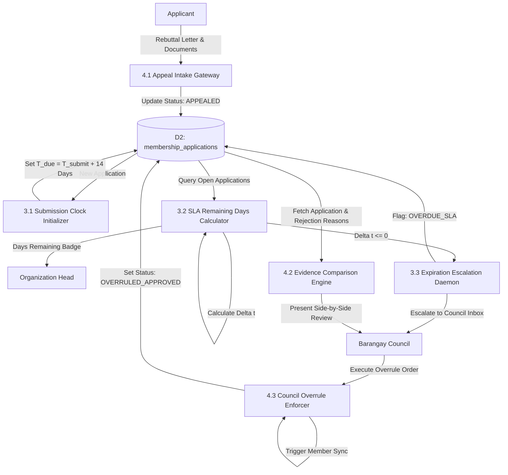

# 📊 Community Organizations Module: Data Flow Diagrams (DFD)

> **Municipal & Barangay Women and Family Protection Information System (WFPIS)**  
> **Module:** Community Organizations & Beneficiary Governance Module

---

## 1. Context Diagram (Level 0 DFD)

```mermaid
flowchart TD
    Citizen["Barangay Resident / Applicant"]
    Org_Head["Organization President"]
    Council["Barangay Council / Admin"]
    
    Org_System(("(0.0)<br/>Community Organizations &<br/>Beneficiary Governance Subsystem"))

    Citizen -->|1. Email for OTP Verification| Org_System
    Org_System -->|2. 6-Digit OTP Token| Citizen
    Citizen -->|3. Membership Application & Proof Files| Org_System
    Citizen -->|4. Formal Appeal Submission| Org_System
    Org_System -->|5. Membership Approval / Rejection Notices| Citizen

    Org_System -->|6. Scoped Applications & Member Rosters| Org_Head
    Org_Head -->|7. Application Decisions (Approve / Reject)| Org_System
    Org_Head -->|8. Organization Event Requests| Org_System

    Org_System -->|9. Overdue SLA Alerts & Appeals Docket| Council
    Council -->|10. Administrative Overrule & Council Decisions| Org_System
    Org_System -->|11. Printable Sector Masterlists & Demographics| Council
```

---

## 2. Level 1 Data Flow Diagram (Subsystem Decomposition)

```mermaid
flowchart TD
    %% Entities
    Citizen["Resident / Applicant"]
    Org_Head["Organization Head"]
    Council["Barangay Council / Admin"]

    %% Data Stores
    D1[("D1: organizations")]
    D2[("D2: membership_applications")]
    D3[("D3: members")]
    D4[("D4: organizational_members")]
    D5[("D5: email_otps")]
    D_Audit[("D_AUDIT: audit_logs")]

    %% Processes
    P1["1.0 OTP Verification & Applicant Intake"]
    P2["2.0 Organization Head Vetting & Triage"]
    P3["3.0 14-Day SLA Daemon & Overdue Tracker"]
    P4["4.0 Appeals Adjudication & Overrule Desk"]
    P5["5.0 Member Synchronization & Roster Manager"]

    Citizen -->|Email| P1
    P1 <-->|Generate & Verify OTP| D5
    Citizen -->|Completed Application| P1
    P1 -->|Create Application (Status: PENDING)| D2

    D2 -->|Filtered Applications| P2
    Org_Head -->|Review Decision (Approve / Reject)| P2
    P2 -->|Update Application Status| D2
    P2 -->|Log Decision Audit| D_Audit

    D2 -->|Monitor Submission Dates| P3
    P3 -->|Trigger Overdue Alert after Day 14| Council

    Citizen -->|Submit Rejection Appeal| P4
    P4 -->|Append Appeal Statement| D2
    Council -->|Grant Overrule Action| P4
    P4 -->|Force Status: APPROVED| D2

    D2 -->|Approved Applications| P5
    P5 -->|Sync Master Resident Data| D3
    P5 -->|Bind Organization Link| D4
```

---

## 3. Level 2 Data Flow Diagram (14-Day SLA & Appeals Process)


