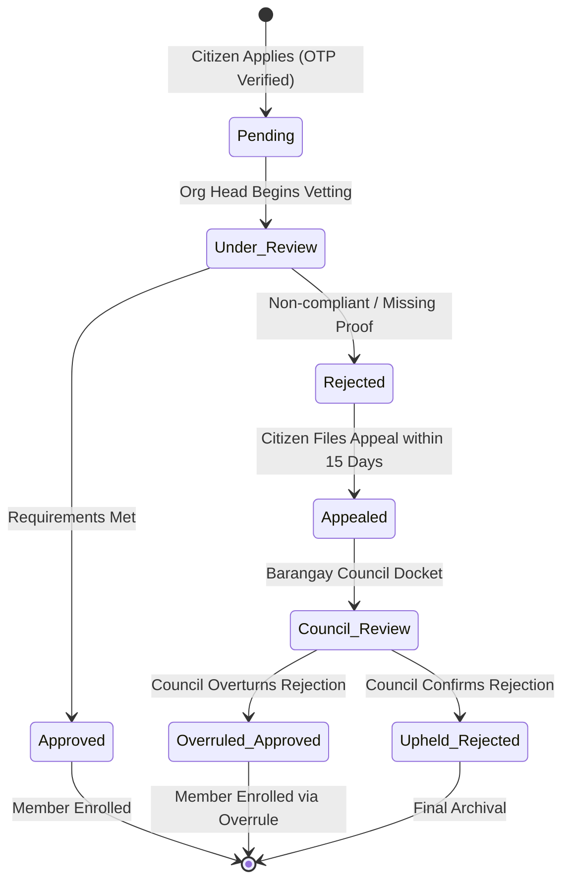

# 🧮 Community Organizations Module: Logics, Rules & Mathematical Algorithms

> **Municipal & Barangay Women and Family Protection Information System (WFPIS)**  
> **Module:** Community Organizations & Beneficiary Governance Module

---

## ⏱️ 1. 14-Day Application Processing SLA Daemon

To eliminate administrative lethargy and uphold citizen welfare rights, membership applications are governed by a **14-calendar-day Service Level Agreement (SLA)**.

### 1.1 Mathematical Formulation
Let $T_{\text{submitted}}$ be the timestamp of applicant verification:

$$T_{\text{sla\_due}} = T_{\text{submitted}} + 14\text{ days}$$

Let $T_{\text{current}}$ be the active system server time:

$$\Delta t_{\text{remaining}} = T_{\text{sla\_due}} - T_{\text{current}}$$

### 1.2 SLA State Classification
$$\text{SLA Status} = \begin{cases}
\mathbf{On-Track} & \text{if } \Delta t_{\text{remaining}} > 5\text{ days} \\
\mathbf{Expiring Soon} & \text{if } 0 < \Delta t_{\text{remaining}} \le 5\text{ days} \\
\mathbf{Overdue SLA} & \text{if } \Delta t_{\text{remaining}} \le 0 \;\land\; \text{Status} \in \{\text{pending}, \text{under\_review}\}
\end{cases}$$

When `SLA Status = Overdue SLA`:
- The application is escalated to the Barangay Council's supervisory queue.
- The Barangay Administrator is authorized to review and adjudicate the application directly.

---

## ⚖️ 2. Resident Appeal & Administrative Overrule State Machine



### Transition Rule Constraints
1. **Filing Window:** The applicant must submit their appeal within **15 calendar days** from the date of the rejection notice. After 15 days, the appeal button is permanently locked.
2. **Administrative Overrule Power:** When the Barangay Council grants an overrule (`Overruled_Approved`), the system updates `membership_applications.status = 'approved'`, sets `is_council_overrule = true`, and captures the adjudicating official's rationale into `audit_logs`.

---

## 🔒 3. OTP Cryptographic Security Algorithm

```php
// app/Services/OtpSecurityService.php
public function generateOtp(string $email): string
{
    // Generate 6-digit cryptographically secure pseudo-random number
    $code = (string) random_int(100000, 999999);
    
    EmailOtp::updateOrCreate(
        ['email' => $email],
        [
            'otp_code'    => Hash::make($code),
            'expires_at'  => Carbon::now()->addMinutes(10),
            'attempts'    => 0,
            'is_verified' => false,
        ]
    );

    return $code; // Dispatched via Email
}
```

* **Brute-Force Lockout:** If `attempts >= 3` with invalid codes, the token is destroyed and the email is throttled for 15 minutes.
* **Single-Use Enforcement:** Upon successful verification, `is_verified` is toggled to `true` and the record is purged upon application completion.

---

## 📥 4. Streaming CSV Deduplication Algorithm

When importing historical paper rosters containing hundreds of residents, duplicate detection prevents double registration across organizations:

$$\text{Duplicate Flag} = \begin{cases}
\mathbf{True} & \text{if } \exists m \in \text{Members} : (m.\text{contact} = \text{row}.\text{contact} \;\lor\; m.\text{email} = \text{row}.\text{email}) \\
\mathbf{False} & \text{otherwise}
\end{cases}$$

If `Duplicate Flag = True`:
- The system checks if the existing member is already enrolled in the target organization.
- If already enrolled: The row is skipped as a redundant entry.
- If existing as a resident but not in this specific organization: The system skips creating a new `members` record and simply inserts a new association into `organizational_members`.
