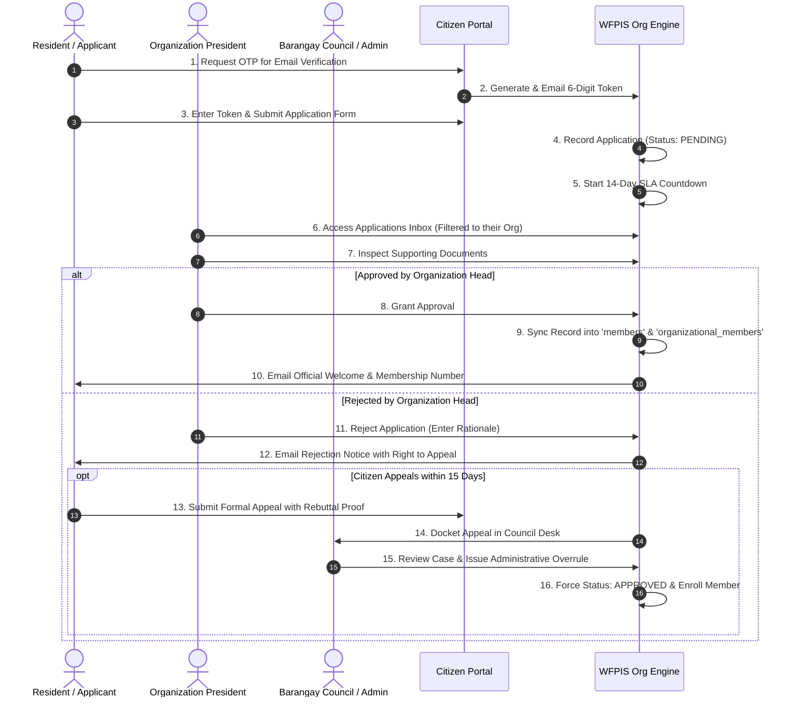

# 🔄 Community Organizations Module: Operational Process & Workflows

> **Municipal & Barangay Women and Family Protection Information System (WFPIS)**  
> **Module:** Community Organizations & Beneficiary Governance Module

---

## 🚦 End-to-End Operational Lifecycle

---

## 📋 2. Step-by-Step Operating Procedures

### Procedure 1: Public Citizen Application Flow
1. Citizen navigates to `/membership/apply`.
2. Selects target organization from dropdown (e.g., *Solo Parents Association of Barangay 183*).
3. Inputs email address -> Clicks **Send Verification Code**.
4. Retrieves 6-digit code from email and verifies within 10 minutes.
5. Fills in demographic details (Full Name, Street/Zone in Brgy 183, Date of Birth, Gender, Occupation).
6. Uploads required eligibility documents (e.g., PSA Birth Certificate of child, Affidavit of Non-Cohabitation).
7. Submits application and receives tracking code (e.g. `APP-2026-0412`).

### Procedure 2: Organization Head Review
1. Log in to the administrative portal. The system automatically scopes the view to the user's assigned organization.
2. Navigate to `/admin/applications`.
3. Click **Review** on a pending applicant row.
4. Verify attached proof documents against barangay residency records.
5. Select action:
   - **Approve:** Creates formal member profile.
   - **Reject:** Prompts for clear explanation (e.g., *"Uploaded certificate is blurred; please provide clearer copy of PWD ID"*).

### Procedure 3: Barangay Council Appeals Hearing
1. Open `/admin/applications/appeals`.
2. Filter by status: `Appealed`.
3. Review the original application, the organization president's rejection note, and the citizen's appeal letter.
4. Click **Adjudicate Appeal**:
   - **Grant Overrule:** Overrules the organization president, immediately activating membership.
   - **Uphold Rejection:** Confirms rejection and closes case.
