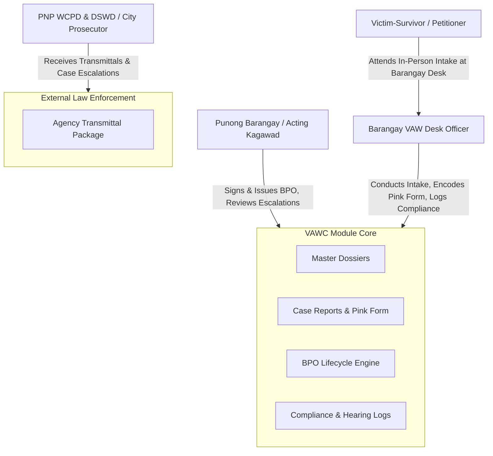

# 🛡️ Violence Against Women and Their Children (VAWC) Module

> **Municipal & Barangay Women and Family Protection Information System (WFPIS)**  
> **Barangay 183, Villamor Airbase, Pasay City**  
> **Module Identifier:** `vawc`  
> **Primary Statutory Mandates:** Republic Act No. 9262 (*Anti-Violence Against Women and Their Children Act of 2004*), Republic Act No. 7610 (*Special Protection of Children Against Abuse, Exploitation and Discrimination Act*), Republic Act No. 11313 (*Safe Spaces Act*), Republic Act No. 10173 (*Data Privacy Act of 2012*)

---

## 📌 1. Module Overview & Executive Summary

The **VAWC Management Module** is an enterprise-grade case management and legal compliance system engineered specifically for Barangay VAW Desks. It transitions the barangay from fragile, unorganized paper blotters into a deterministic, role-secured digital platform.

The system manages the entire domestic violence intake lifecycle:
1. **Master Dossier Registry ("Search First, Encode Second")**: Uncovers repeat offenders and serial perpetrators across separate incident reports while preventing data duplication.
2. **Standardized Blotter & "Pink Form" Compliance**: Captures statutory victim-survivor, respondent, and child dependent demographics in accordance with the DILG-DSWD National Barangay VAW Desk Handbook.
3. **Automated Risk Assessment (VAWC-RAVE)**: Quantifies lethal threat, weapon presence, and recurrence into a deterministic 1–12 severity score.
4. **Barangay Protection Order (BPO) Lifecycle Engine**: Digitally coordinates the ex-parte application, notice of hearing, 24-hour statutory issuance SLA, personal service tracking, and 15-day relief enforcement.
5. **Strict Jurisprudential Guardrails**: Hardcodes legal mandates including the **absolute ban on amicable conciliation** (Sec. 33, RA 9262) and immediate referral of external public crimes to the PNP Women & Children Protection Desk (WCPD).

---

## 🏛️ 2. Statutory Legal Framework

| Statute | Core Legal Principle | System Enforcement in Code |
| :--- | :--- | :--- |
| **Republic Act No. 9262 (Sec. 14)** | **24-Hour BPO SLA**: Punong Barangay / Kagawad must issue or deny a BPO within 24 hours of ex-parte application. | Backend timer calculates hours remaining; triggers UI badge alerts (`Critical (Under 6h)` / `Expired SLA`). |
| **Republic Act No. 9262 (Sec. 33)** | **Prohibition of Conciliation**: Amicable settlement or mediation between victim and abuser is strictly prohibited. | System provides **zero** mediation or settlement buttons; case closure strictly requires legal disposition. |
| **Republic Act No. 9262 (Sec. 44)** | **Confidential Informant Protection**: Immunity from libel and confidentiality for whistleblowers reporting abuse. | Informant checkbox flags identity fields; redacts confidential data from non-head exports. |
| **Republic Act No. 10173** | **Data Privacy Act**: Strict confidentiality of domestic violence and sexual abuse records. | AES-256 field encryption, RBAC restriction (only VAWC Desk Officers & Punong Barangay), and immutable audit logs. |
| **Republic Act No. 7610** | **Child Abuse Statutory Referral**: Non-domestic child abuse is non-mediable and outside barangay conciliation. | Dedicated hotline referral router to PNP WCPD & DSWD; prevents unauthorized local settlement. |

---

## 👥 3. User Roles & Stakeholders

---

## 📚 4. Module Documentation Index

For comprehensive technical and operational specifications, navigate through the specialized documentation files below:

1. [**Features Specification (`features.md`)**](./features.md) — Comprehensive functional breakdown, user privileges, intake workflows, and reporting capabilities.
2. [**System Architecture (`architecture.md`)**](./architecture.md) — Multi-tier software architecture, service layer pattern, and relational database schema.
3. [**Structured Files & Folders (`structured_files_folders.md`)**](./structured_files_folders.md) — Exact codebase file map across Laravel backend and React frontend.
4. [**Logics & Mathematical Algorithms (`logics_and_algorithms.md`)**](./logics_and_algorithms.md) — VAWC-RAVE scoring algorithm, BPO 24-hour timer, and statutory state machines.
5. [**Process & Operational Workflows (`process_and_workflows.md`)**](./process_and_workflows.md) — End-to-end operational guide from blotter reception to case disposition.
6. [**Data Flow Diagrams (DFD) (`dfd.md`)**](./dfd.md) — Context Diagram, Level 0, Level 1, and Level 2 process data flows.
7. [**Fullstack Developer Guide (`fullstack_developer_guide.md`)**](./fullstack_developer_guide.md) — API endpoints, Eloquent models, validation rules, React hooks, and unit testing.
