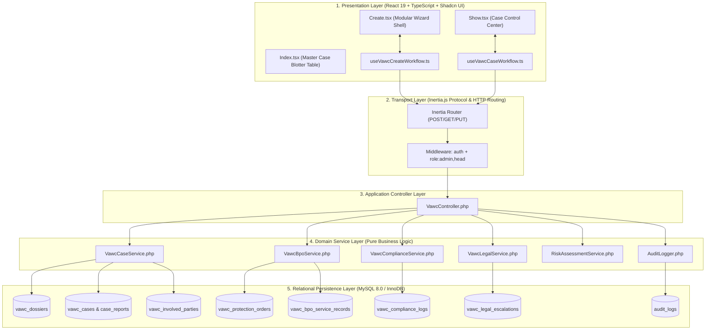
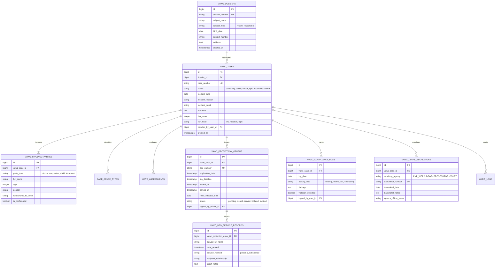

# 🏗️ VAWC Module: System Architecture

> **Municipal & Barangay Women and Family Protection Information System (WFPIS)**  
> **Module:** Violence Against Women and Their Children (VAWC) Management

---

## 🏛️ 1. Multi-Tier Layered Architecture

The VAWC module follows a strict **Service-Oriented MVC Architecture** decoupled from direct controller database interactions, adhering to the Single Responsibility Principle (SRP) and Open/Closed Principle (OCP).

---

## 💾 2. Relational Database Entity-Relationship Schema

The VAWC module is normalized to 3rd Normal Form (3NF) to preserve relational integrity across complex legal proceedings.

---

## ⚙️ 3. Service Layer Responsibilities

1. **`VawcCaseService`**:
   - Manages atomic transactions (`DB::transaction`) for case creation, party registration, and Pink Form classification.
   - Computes unique case numbers using the format `VAWC-YYYY-MM-XXXX`.
2. **`VawcBpoService`**:
   - Computes the 24-hour statutory SLA timestamp upon BPO application.
   - Validates official signatory authorization before issuing the order.
   - Computes the 15-day validity window upon service.
3. **`VawcComplianceService`**:
   - Logs monitoring activities and automatically flags BPO violation events.
4. **`VawcLegalService`**:
   - Compiles full case transmittal packages for external agencies, generating tamper-evident PDF dossiers.
5. **`RiskAssessmentService`**:
   - Executes the deterministic scoring matrix for the VAWC-RAVE algorithm.
6. **`AuditLogger`**:
   - Automatically writes state mutations (`old_values`, `new_values`, user IP, User-Agent) to `audit_logs`.
