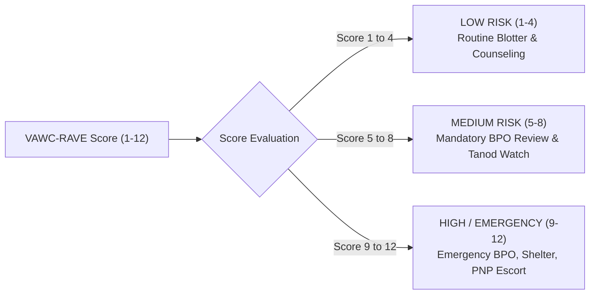

# 🧮 VAWC Module: Logics, Rules & Mathematical Algorithms

> **Municipal & Barangay Women and Family Protection Information System (WFPIS)**  
> **Module:** Violence Against Women and Their Children (VAWC) Management

---

## 1. The VAWC-RAVE Scoring Algorithm

The **Risk Assessment for Vulnerability Emergencies (VAWC-RAVE)** algorithm evaluates danger indicators to produce an objective, defensible risk tier.

### 1.1 Danger Assessment Factors & Weightings

The algorithm takes a boolean vector $\mathbf{X} = [x_1, x_2, \dots, x_{12}]$ where $x_i \in \{0, 1\}$ represents the presence of a specific danger indicator:

| Factor ID | Risk Indicator (Statutory & Clinical) | Weight ($w_i$) | Legal / Behavioral Rationale |
| :---: | :--- | :---: | :--- |
| **$x_1$** | Perpetrator possesses or has access to firearms | $1.5$ | Extreme escalation risk; lethality factor #1 |
| **$x_2$** | Direct verbal or physical threat to kill survivor | $1.5$ | Clear homicidal intent |
| **$x_3$** | Prior history of strangulation / choking | $1.5$ | Clinically proven predictor of subsequent homicide |
| **$x_4$** | Weapon used in the immediate reported incident | $1.0$ | Active physical aggression with deadly force |
| **$x_5$** | Threats or physical violence directed at children | $1.0$ | Dual violation under RA 7610 and RA 9262 |
| **$x_6$** | Perpetrator exhibits obsessive jealousy / stalking | $0.5$ | Escalating control and stalking behavior |
| **$x_7$** | Recurrence: multiple previous blotter reports | $1.0$ | Chronic serial perpetrator behavior |
| **$x_8$** | Substance / narcotics abuse by perpetrator | $0.5$ | Impaired impulse control |
| **$x_9$** | Perpetrator unemployed with economic dependency | $0.5$ | Financial stress and economic abuse multiplier |
| **$x_{10}$**| Survivor expressing acute fear for life | $1.0$ | High correlation with near-fatal incidents |
| **$x_{11}$**| Perpetrator threatened suicide if survivor leaves | $1.0$ | Murder-suicide risk flag |
| **$x_{12}$**| Violation of previous verbal or written barangay warning | $1.0$ | Contempt of authority and lack of deterrence |

### 1.2 Mathematical Formulation

$$\text{Raw Score} = \sum_{i=1}^{12} w_i \cdot x_i$$

$$\text{Final RAVE Score} = \min\left(12, \; \max\left(1, \; \operatorname{round}(\text{Raw Score})\right)\right)$$

### 1.3 Risk Tier Classification & Protocol Matrix



* **Low Risk ($1 \le \text{Score} \le 4$):** Standard desk blotter recording; schedule peaceful voluntary follow-up; provide DSWD counseling referral.
* **Medium Risk ($5 \le \text{Score} \le 8$):** Expedited BPO application; notify Barangay Tanod for localized patrol monitoring; 48-hour welfare check-in.
* **High / Emergency Risk ($9 \le \text{Score} \le 12$):** Instant emergency alert banner; immediate Punong Barangay BPO issuance within hours; immediate coordination with Pasay City Social Welfare and Development (CSWD) protective custody shelter; PNP WCPD tactical standby.

---

## ⏱️ 2. BPO Statutory 24-Hour SLA Engine

Republic Act No. 9262 Section 14 mandates that the Punong Barangay (or Kagawad in absence) must act upon an application for a Barangay Protection Order **within twenty-four (24) hours**.

### 2.1 Timeline Formulation

Let $T_{\text{applied}}$ be the ISO-8601 timestamp of formal BPO application submission:

$$T_{\text{deadline}} = T_{\text{applied}} + 24\text{ hours}$$

Let $T_{\text{now}}$ be the current system server time. The SLA status is computed as:

$$\Delta t_{\text{remaining}} = T_{\text{deadline}} - T_{\text{now}}$$

### 2.2 Status State Machine

$$\text{SLA State} = \begin{cases}
\mathbf{Critical} & \text{if } 0 < \Delta t_{\text{remaining}} \le 6\text{ hours} \\
\mathbf{Warning} & \text{if } 6 < \Delta t_{\text{remaining}} \le 12\text{ hours} \\
\mathbf{Normal} & \text{if } \Delta t_{\text{remaining}} > 12\text{ hours} \\
\mathbf{Violated / Expired SLA} & \text{if } \Delta t_{\text{remaining}} \le 0 \text{ and BPO not issued}
\end{cases}$$

---

## 📅 3. 15-Calendar-Day BPO Validity & Extension Logic

Under Section 15 of RA 9262, a Barangay Protection Order remains in effect for **fifteen (15) calendar days** starting from the date of personal service to the respondent:

$$T_{\text{bpo\_expire}} = T_{\text{served\_date}} + 15\text{ days}$$

* **Pre-Expiration Notice ($T_{\text{bpo\_expire}} - 3\text{ days}$):** The system triggers an alert to the desk officer to advise the survivor to file for a Temporary Protection Order (TPO) with the Family Court / Regional Trial Court (RTC).
* **Automatic Status Transition:** Upon reaching $T_{\text{bpo\_expire}}$ without court extension or violation, the order transitions from `SERVED` to `EXPIRED`.

---

## ⚖️ 4. Statutory Programmatic Guardrails

### 4.1 Prohibition of Conciliation Guardrail (Sec. 33, RA 9262)
```php
// app/Services/VawcCaseService.php
public function closeCase(VawcCase $case, string $resolutionReason): void
{
    $prohibitedTerms = ['amicable', 'settled', 'reconciled', 'kasunduan', 'nagkaayos'];
    
    foreach ($prohibitedTerms as $term) {
        if (str_contains(strtolower($resolutionReason), $term)) {
            throw new \DomainException(
                "Violation of RA 9262 Sec. 33: Conciliation and amicable settlement of VAWC cases are strictly prohibited by law."
            );
        }
    }
    
    // Proceed with lawful disposition...
}
```

### 4.2 Public Crime Doctrine (Loss of Local Disposition Authority)
When a case undergoes formal legal escalation (`receiving_agency = 'PNP_WCPD'` or `'PROSECUTOR'`), the system sets `is_locked = true` on the administrative record. Further modification of incident narratives or involved party details is strictly disabled to preserve evidentiary integrity for trial court subpoena.
