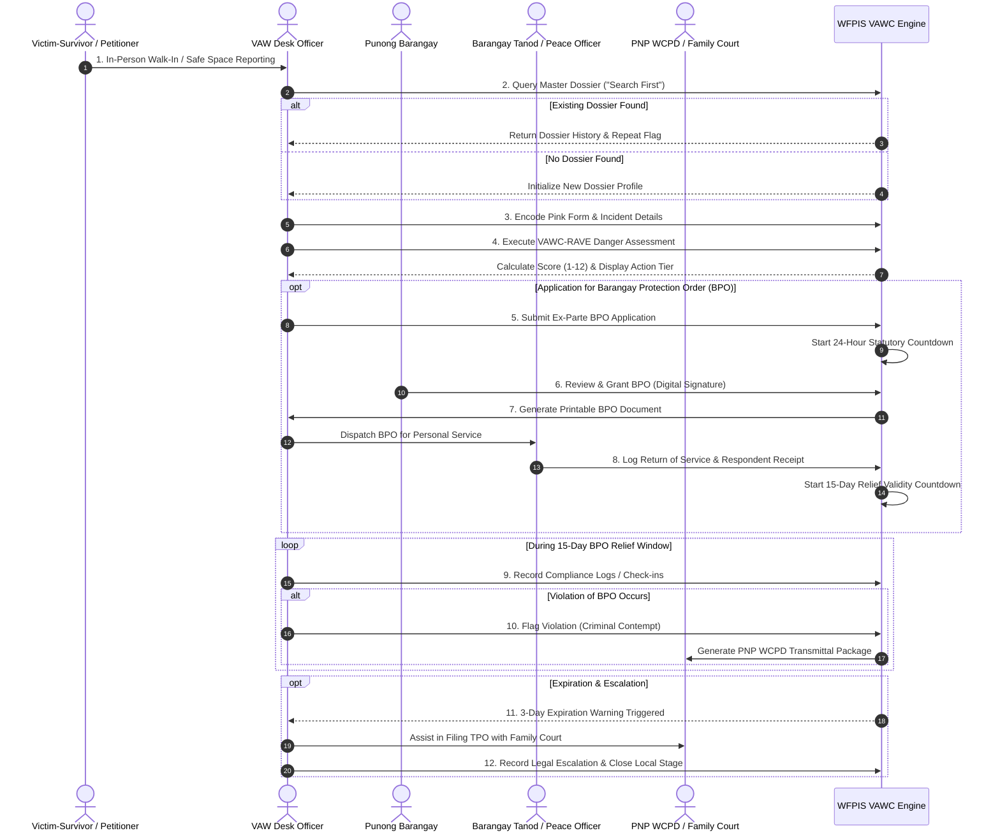

# 🔄 VAWC Module: Operational Process & Workflows

> **Municipal & Barangay Women and Family Protection Information System (WFPIS)**  
> **Module:** Violence Against Women and Their Children (VAWC) Management  
> **Statutory Reference:** DILG-DSWD Barangay VAW Desk Handbook & RA 9262 Official Protocols

---

## 🚦 End-to-End Operational Lifecycle

The diagram below illustrates the complete journey of a VAWC case from physical walk-in to formal legal disposition:

---

## 📝 2. Step-by-Step Desk Officer Manual

### Step 1: In-Person Reception & Safe Space Intake
- **Location:** Dedicated private interview room (*Barangay VAW Desk*) away from public lobby sight and audio range.
- **Physical Safety Verification:** Inspect for active physical trauma. If emergency medical care is needed, pause intake and transport immediately to Pasay City General Hospital / WCPU.
- **Legal Affidavit (*Salaysay*):** Record sworn statement in the victim's primary language (Tagalog/English).

### Step 2: Dossier Search Gateway
- Open `/admin/vawc/create`.
- Input survivor and suspected perpetrator's full name, alias, and birth year.
- **System Action:** Checks fuzzy match against historical records in `vawc_dossiers`.
- If perpetrator has active prior cases, system triggers a `REPEAT PERPETRATOR ALERT` modal.

### Step 3: Pink Form Data Entry
- Navigate through the 4-step wizard:
  1. **Survivor Demographics:** Age, employment, marital status, emergency contact.
  2. **Incident Details:** Date/time, exact street/purok in Barangay 183, narrative of events, weapons used.
  3. **Abuse Multi-Select:** Physical violence, Psychological abuse, Sexual harassment, Economic deprivation.
  4. **Respondent Profile:** Identifying marks, known whereabouts, vehicle plates.

### Step 4: VAWC-RAVE Triage
- Complete the 12-factor questionnaire.
- System locks the calculated score into `vawc_cases.risk_score`.
- If score $\ge 9$, immediately advise Punong Barangay for urgent ex-parte BPO and police standby.

### Step 5: BPO Issuance & Personal Service
- **24-Hour Statutory Clock:** System displays hours, minutes, and seconds remaining.
- Punong Barangay reviews petition and signs official BPO.
- Two Barangay Tanods execute personal service to the respondent within Barangay 183.
- Tanod files Return of Service with proof (signature or affidavit of refusal).
- Desk Officer logs service timestamp in system, starting the 15-day countdown.

### Step 6: Legal Escalation & Handover
- If victim desires to pursue criminal charges under RA 9262:
  - Click `Escalate Case` -> Select `PNP Women & Children Protection Desk`.
  - System automatically compiles `PnpTransmittal.tsx` attaching blotter extracts, sworn statements, and medical certificates.
  - Officer marks case status as `ESCALATED_TO_PNP`.
  - Local modification authority is securely locked.
