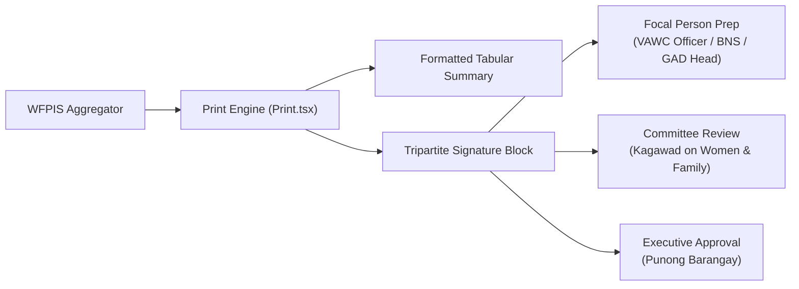

# 📈 System Analytics, Reporting & Command Center Architecture

> **Municipal & Barangay Women and Family Protection Information System (WFPIS)**  
> **Barangay 183, Villamor Airbase, Pasay City**

---

## 🏛️ 1. Real-Time Command Center Overview

The WFPIS Command Center (`/admin/analytics`) aggregates data across the four operational modules to support data-driven governance by the Punong Barangay and Committee Kagawads.

```
+-----------------------------------------------------------------------------------+
|                        EXECUTIVE COMMAND CENTER (SHADCN TABS)                     |
|           [ VAWC Tab ]         [ BCPC Nutrition Tab ]        [ GAD & Orgs Tab ]   |
+-----------------------------------------+-----------------------------------------+
                                          |
+-----------------------------------------v-----------------------------------------+
|                               ANALYTICS SERVICE LAYER                             |
|    VawcAnalyticsService   *   BcpcAnalyticsService   *   GadAnalyticsService      |
|                        Overall Orchestrator: AnalyticsService.php                  |
+-----------------------------------------+-----------------------------------------+
                                          |
+-----------------------------------------v-----------------------------------------+
|                               HIGH-SPEED AGGREGATIONS                             |
|       Indexed MySQL Queries  *  Year-over-Year Trends  *  Purok/Zone Density      |
+-----------------------------------------------------------------------------------+
```

---

## 📑 2. Tab-by-Tab Analytical Dimensions

### Tab 1: VAWC Case & Lethality Radar (`vawc`)
* **Abuse Category Distribution:** Donut and bar charts tracking occurrences of Physical, Sexual, Psychological, and Economic violence under RA 9262.
* **VAWC-RAVE Risk Tier Breakdown:** Real-time counter of Low, Medium, and High/Emergency risk cases.
* **BPO Statutory Compliance Radar:** Tracks average hours to issuance versus the 24-hour statutory deadline.
* **Purok/Zone Incident Density:** Heatmap identifying geographic hotspots across the 10 zones of Barangay 183.

### Tab 2: BCPC e-OPT Plus Nutrition Radar (`bcpc`)
* **Prevalence Rates:** Stunting (Height-for-Age), Wasting (Weight-for-Height), and Underweight (Weight-for-Age).
* **120-Day SFP Pipeline:** Enrolled, Active, Graduated, and Relapsed child counts.
* **Weight Gain Velocity Trajectory:** Average grams gained per day across feeding centers.
* **Zone Malnutrition Disparity:** Bar charts showing which zones carry the highest burden of severe acute malnutrition.

### Tab 3: GAD & Community Organizations Radar (`gad_orgs`)
* **Annual GAD Plan Execution:** Approved, rejected, and rescheduled community activities.
* **Sector Outreach Radar:** Proportion of registered Solo Parents, PWDs, Elderly, and Women actively participating in GAD programs.
* **Membership Application Processing SLA:** Percentage of applications resolved within the 14-day statutory timeline.

---

## 🖨️ 3. Executive PDF & Printable Sign-off Architecture

Government reports require formal human authentication to be accepted by the City Council, DILG, and National Nutrition Council.



* **CSS Print Optimization:** Uses `@media print` rules with explicit page breaks (`break-inside-avoid`), hiding navigation sidebars, headers, and buttons during print mode.
* **Audit-Proof Footers:** Every printed report displays generation timestamp, logged-in operator credentials, and tamper-verification checksums.
