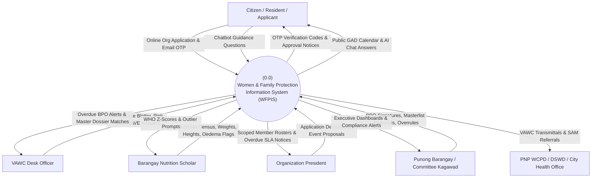
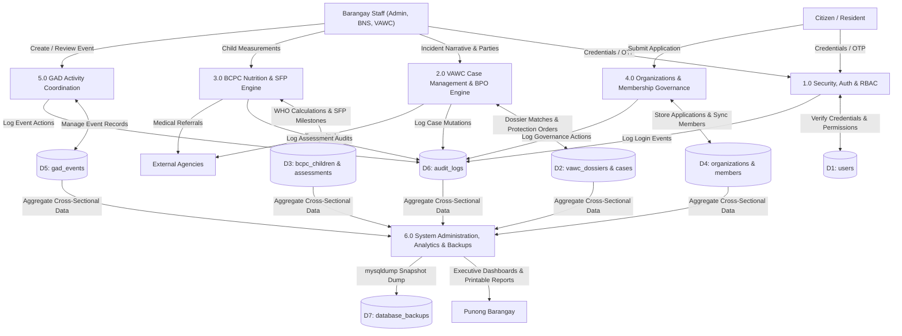

# 📊 System-Wide Data Flow Diagrams (Context & Level 1)

> **Municipal & Barangay Women and Family Protection Information System (WFPIS)**  
> **Barangay 183, Villamor Airbase, Pasay City**

---

## 1. System-Wide Context Diagram (Level 0 DFD)

The Context Diagram defines the full operational perimeter of WFPIS across all four core domains.

---

## 2. System-Wide Level 1 Data Flow Diagram

